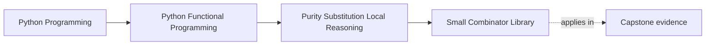

# Small Combinator Library


<!-- page-maps:start -->
## Page Maps




<!-- page-maps:end -->

This lesson is not arguing that every team needs a mini functional library. It is about
recognizing when a tiny helper layer removes repetition and when it just adds indirection.

## Start With the Design Pressure

When functional code is new in a codebase, teams often bounce between two bad extremes:

- no helpers at all, so every pipeline is rebuilt by hand
- too many helpers, so ordinary Python gets wrapped in a private framework

The goal of this page is the middle ground: a small, auditable set of helpers that make
real code clearer.

## Keep This Question In View

> **Core question:**  
> How do you build a tiny, reusable combinator library—so that complex data flows emerge from a handful of pure, curried building blocks instead of copy-pasting pipeline fragments across your codebase?

By the end of this lesson, you should be able to answer:

- which helper belongs in a shared `fp.py`
- which helper should stay local to one module
- when not to add another abstraction at all

---

## 1. Conceptual Foundation

### 1.1 The One-Sentence Rule

> **Default to a tiny, audited helper module with only the combinators your team can explain and test quickly; do not build a framework just to avoid writing plain Python.**

### 1.2 Combinator Libraries in One Precise Sentence

> A combinator library is a collection of small, pure, curried higher-order functions that obey algebraic laws and compose without friction—so that complex behavior emerges from simple glue.

### 1.3 Why This Matters Now

Combinator libraries help when the same pipeline patterns really do repeat. They hurt when
the helper names become another language you have to decode before you can understand the
business logic.

### 1.4 Why This Isn’t Just itertools

Python already gives you comprehensions, generator expressions, `itertools`, and ordinary
functions. A local helper module is justified only when it adds a clearer review surface.
Our `module-01/funcpipe-rag-01/src/funcpipe_rag/fp.py` emphasizes:

- **Composability:** `flow` threads data through a series of pure functions; `fmap`, `ffilter`, and `foldl` lift scalar helpers over collections; `Pipeline` gives an OO-friendly builder.

- **Predictability:** Core combinators (flow, fmap, ffilter, foldl, pipe, compose2, Pipeline, with_context) are pure; impure helpers like log_calls are explicitly marked and for edge/debug use only.

- **Shared laws:** `fmap` obeys identity and composition laws, proven via Hypothesis in `capstone/tests/test_laws.py`; the other helpers can be tested similarly.

- **Minimalism:** No runtime dependencies and small enough to audit in a few minutes.

Use `itertools` underneath for advanced iterators. Let `fp.py` stay a thin layer that
names the few patterns you truly repeat.

### 1.5 Purity Spectrum Table

| Level              | Description                          | Example                              |
|--------------------|--------------------------------------|--------------------------------------|
| Fully Pure         | Explicit inputs/outputs only         | `def add(x: int, y: int) -> int: return x + y` |
| Semi-Pure          | Observational taps (e.g., logging)   | `def add_with_log(x: int, y: int) -> int: log(f"Adding {x}+{y}"); return x + y` |
| Impure             | Globals/I/O/mutation                | `def read_file(path: str) -> str: ...` |

**Note on Semi-Pure:** This is a pragmatic category for functions that are observationally transparent for business logic (i.e., they behave as if pure for callers) but are still impure in the strict FP sense due to side effects like logging. Allow this only at edges or in debugging taps.

---

## 2. Mental Model: Ad-Hoc Pipeline vs Combinator Library

### 2.1 One Picture

```text
Repeated hand-written steps                 Small audited helper layer
+---------------------------+              +----------------------------+
| strip -> upper -> split   |              | clean = flow(              |
| repeated in three files   |              |   str.strip,               |
| slight variations creep in|              |   str.upper,               |
| reviews compare noise     |              |   str.split,               |
+---------------------------+              |   take(5),                 |
                                           | )                          |
                                           +----------------------------+
```

### 2.2 Contract Table

| Clause                     | Violation Example                      | Detected By                              |
|----------------------------|----------------------------------------|------------------------------------------|
| Algebraic laws             | Non-associative custom op              | Hypothesis laws                          |
| Reusability                | Copy-pasted pipeline fragment          | Code duplication metrics                 |

**Note on Policies:** Currying, zero-dependency, naming conventions (fmap vs map) are design choices, not semantic laws.

---

## 3. Running Project: Combinators in RAG Pipeline

Our **running project** (from `module-01/funcpipe-rag-01/README.md`) uses combinators for reusable RAG flows.  
- **Goal:** Replace ad-hoc pipelines with combinator-based versions.  
- **Start:** Core 1-5's pure functions.  
- **End (this core):** Combinator-enhanced `full_rag` with law properties. Semantics aligned with Core 1-5.

### 3.1 Types (Canonical)

These are defined in `module-01/funcpipe-rag-01/src/funcpipe_rag/rag_types.py` (as in Core 1) and imported as needed. No redefinition here.

### 3.2 Ad-Hoc Variants (Anti-Patterns in RAG)

Full code:

```python
from funcpipe_rag import RawDoc, CleanDoc, ChunkWithoutEmbedding, Chunk, RagEnv
import hashlib


# Ad-hoc clean (manual comprehensions)
def ad_hoc_clean_doc(doc: RawDoc) -> CleanDoc:
    abstract = " ".join(doc.abstract.strip().lower().split())
    return CleanDoc(doc.doc_id, doc.title, abstract, doc.categories)


# Ad-hoc chunk (copy-pasted generator)
def ad_hoc_chunk_doc(doc: CleanDoc, env: RagEnv) -> tuple[ChunkWithoutEmbedding, ...]:
    text = doc.abstract
    chunks = (
        ChunkWithoutEmbedding(doc.doc_id, text[i:i + env.chunk_size], i, i + len(text[i:i + env.chunk_size]))
        for i in range(0, len(text), env.chunk_size)
    )
    return tuple(chunks)


# Ad-hoc embed (manual tuple)
def ad_hoc_embed_chunk(chunk: ChunkWithoutEmbedding) -> Chunk:
    h = hashlib.sha256(chunk.text.encode("utf-8")).hexdigest()
    step = 4
    vec = tuple(int(h[i:i + step], 16) / (16 ** step - 1) for i in range(0, 64, step))
    return Chunk(chunk.doc_id, chunk.text, chunk.start, chunk.end, vec)
```

**Smells:** Repeated manual comprehensions/generators (copy-paste), no reusable abstractions, hard to extend (e.g., add debug tap). These are correct but ad-hoc; duplication grows across modules.

---

## 4. Refactor to Combinators: Reusable Abstractions in RAG

### 4.1 Combinator Core

`module-01/funcpipe-rag-01/src/funcpipe_rag/fp.py` ships the entire combinator toolkit we lean on throughout the course. Full code:

```python
from typing import Callable, Any, Iterable, Generic, TypeVar
try:
    from typing import ParamSpec, Concatenate  # 3.10+
except ImportError:  # pragma: no cover - py<3.10
    from typing_extensions import ParamSpec, Concatenate

A = TypeVar("A")
B = TypeVar("B")
C = TypeVar("C")
R = TypeVar("R")
T = TypeVar("T")
U = TypeVar("U")
Ctx = TypeVar("Ctx")
P = ParamSpec("P")

def flow(*fs: Callable[..., Any]) -> Callable[..., Any]:
    def composed(x):
        for f in fs:
            x = f(x)
        return x
    return composed

def pipe(x: Any, *fs: Callable[..., Any]) -> Any:
    for f in fs:
        x = f(x)
    return x

def fmap(f: Callable[[A], B]) -> Callable[[Iterable[A]], list[B]]:
    def inner(xs: Iterable[A]) -> list[B]:
        return [f(x) for x in xs]
    return inner

def ffilter(pred: Callable[[A], bool]) -> Callable[[Iterable[A]], list[A]]:
    def inner(xs: Iterable[A]) -> list[A]:
        return [x for x in xs if pred(x)]
    return inner

def foldl(step: Callable[[R, A], R], init: R) -> Callable[[Iterable[A]], R]:
    def inner(xs: Iterable[A]) -> R:
        acc = init
        for x in xs:
            acc = step(acc, x)
        return acc
    return inner

def compose2(f: Callable[[B], C], g: Callable[[A], B]) -> Callable[[A], C]:
    def inner(x: A) -> C:
        return f(g(x))
    return inner

class Pipeline(Generic[A, B]):
    def __init__(self, fn: Callable[[A], B]):
        self._fn = fn

    def __call__(self, x: A) -> B:
        return self._fn(x)

    def then(self, f: Callable[[B], C]) -> "Pipeline[A, C]":
        return Pipeline(compose2(f, self._fn))

# NOTE: log_calls is intentionally impure (print) – use only at edges / in debugging, 
# never inside core business logic.
def log_calls(fn: Callable[P, R]) -> Callable[P, R]:
    def wrapper(*args: P.args, **kwargs: P.kwargs) -> R:
        print(f"{fn.__name__} called with args={args} kwargs={kwargs}")
        return fn(*args, **kwargs)
    return wrapper

def with_context(ctx: Ctx, fn: Callable[Concatenate[Ctx, P], R]) -> Callable[P, R]:
    def wrapped(*args: P.args, **kwargs: P.kwargs) -> R:
        return fn(ctx, *args, **kwargs)
    return wrapped
```

Each helper is tiny, pure, and auditable; you can expand or trim the module as needed for your own codebase.

### 4.2 RAG Example Using Combinators

Full code:

```python
from funcpipe_rag import flow, fmap
from funcpipe_rag import chunk_doc, embed_chunk, structural_dedup_chunks
from funcpipe_rag import RawDoc, CleanDoc, Chunk, RagEnv
from typing import List, Tuple

# Example: building a reusable cleaning pipeline for abstracts

clean_abstract = flow(
    str.strip,
    str.lower,
    lambda s: " ".join(s.split()),
)


def clean_doc_combinatorised(doc: RawDoc) -> CleanDoc:
    return CleanDoc(
        doc.doc_id,
        doc.title,
        clean_abstract(doc.abstract),
        doc.categories,
    )


# And a tiny combinatorised full_rag, using fmap:
def full_rag(docs: List[RawDoc], env: RagEnv) -> Tuple[Chunk, ...]:
    cleaned = fmap(clean_doc_combinatorised)(docs)
    chunks = [
        chunk
        for doc in cleaned
        for chunk in chunk_doc(doc, env)
    ]
    embedded = fmap(embed_chunk)(chunks)
    return tuple(structural_dedup_chunks(embedded))
```

### 4.3 Impure Shell (Edge Only)

The shell from Core 1 remains; combinators focus on core.

### 4.4 Extended Combinators (Appendix)

For advanced use, extend module-01/funcpipe-rag-01/src/funcpipe_rag/fp.py with the following. The following definitions live in the same fp.py and reuse the T and U type variables defined above.

Full code:

```python
from typing import Callable, Iterable, List, Any

# NOTE: tap is observational / semi-pure; use at edges or for debugging.
def tap(side: Callable[[T], Any]) -> Callable[[T], T]:
    def inner(x: T) -> T:
        side(x)
        return x
    return inner

def when(pred: Callable[[T], bool], f: Callable[[T], T]) -> Callable[[T], T]:
    def inner(x: T) -> T:
        return f(x) if pred(x) else x
    return inner

def branch(pred: Callable[[T], bool], if_true: Callable[[T], U], if_false: Callable[[T], U]) -> Callable[[T], U]:
    def inner(x: T) -> U:
        return if_true(x) if pred(x) else if_false(x)
    return inner

def take(n: int) -> Callable[[Iterable[T]], List[T]]:
    def inner(xs: Iterable[T]) -> List[T]:
        return list(xs)[:n]
    return inner

def unique() -> Callable[[Iterable[T]], List[T]]:
    def inner(xs: Iterable[T]) -> List[T]:
        seen = set()
        result = []
        for x in xs:
            if x not in seen:
                seen.add(x)
                result.append(x)
        return result
    return inner
```

These are useful but optional; the minimum kit above suffices for most pipelines.

### 4.5 Payoff: Side-by-Side Comparison

Raw for-loop (imperative):

```python
def double_evens(xs: list[int]) -> list[int]:
    res = []
    for x in xs:
        if x % 2 == 0:
            res.append(x * 2)
    return res
```

Builtin map/filter (HO, lazy):

```python
def double_evens(xs: list[int]) -> list[int]:
    return list(map(lambda x: x * 2, filter(lambda x: x % 2 == 0, xs)))
```

Combinator library (curried, composable):

```python
from funcpipe_rag import flow, ffilter, fmap

double_evens = flow(ffilter(lambda x: x % 2 == 0), fmap(lambda x: x * 2))
# Usage: double_evens(xs)
```

**Wins:** Combinators are reusable (e.g., evens = ffilter(lambda x: x % 2 == 0); doubles = fmap(lambda x: x * 2); pipeline = flow(evens, doubles)).

---

## What comes next

Leave this lesson with a small toolkit you can actually read and reuse. The
next question is whether the toolkit survives law-based review and whether it stays worth
the extra abstraction under real maintenance pressure.

Continue with [Combinator Laws and Trade-Offs](combinator-laws-and-tradeoffs.md) before
you move into [Typed Pipelines](typed-pipelines.md).
