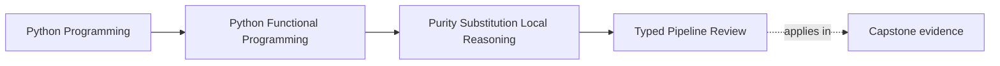
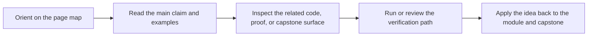

# Typed Pipeline Review


<!-- page-maps:start -->
## Page Maps




<!-- page-maps:end -->

Read the first diagram as a placement map: this page is one concept inside its parent module, not a detached essay, and the capstone is the pressure test for whether the idea holds. Read the second diagram as the working rhythm for the page: name the problem, study the example, identify the boundary, then carry one review question forward.

This lesson closes the typed-pipeline hotspot. Adding type parameters is not the win by
itself. The win is a pipeline surface that becomes easier to review, harder to misuse,
and still equivalent to the simpler untyped baseline.

## Review questions

- Which type variables actually protect the pipeline from the wrong intermediate values?
- Which helper signatures stay readable enough for another engineer to maintain?
- Which dynamic boundaries should remain dynamic instead of being forced through `Any`
  or fake generic precision?

## Equivalence route

When the typed form and the untyped form claim to do the same work, compare them on the
same input and demand the same result. The simplest route is:

1. run the typed pipeline
2. run the untyped baseline
3. confirm they return the same value for the same docs and environment
4. stop if the typed version only adds ceremony without preventing a real mistake

## Property-based review

Useful properties for this lesson include:

- stage functions remain deterministic
- chunking still covers the whole cleaned abstract
- embedding stays stable for the same chunk
- the typed full pipeline and the untyped baseline stay equivalent

### Bad refactor example

The easiest mistake is to pass the wrong intermediate type through a visually similar
pipeline step.

```python
from typing import List, Tuple

from funcpipe_rag import RawDoc, Chunk, RagEnv, chunk_doc, clean_doc, embed_chunk


def bad_full_rag(docs: List[RawDoc], env: RagEnv) -> Tuple[Chunk, ...]:
    return tuple(
        embed_chunk(doc)
        for doc in docs
        for chunk in chunk_doc(clean_doc(doc), env)
    )
```

That code looks pipeline-shaped, but the intermediate value is wrong. The type surface is
only earning its keep if it helps you detect exactly that class of error.

## When typed pipelines are worth it

Keep the typed layer when:

- higher-order helpers are reused across the module or capstone
- the wrong intermediate type is a realistic maintenance bug
- the signature is still readable after adding the type parameters
- the team uses static checking as part of normal review

Do not force it when:

- the boundary is inherently dynamic and is better protected by validation
- the type expression is harder to understand than the code itself
- the proof still depends entirely on runtime tests and the type adds no signal

## Capstone check

Before moving on, compare the typed lesson with the module endpoint:

1. inspect `capstone/_history/worktrees/module-01/src/funcpipe_rag/fp.py`
2. inspect `capstone/_history/worktrees/module-01/tests/test_laws.py`
3. decide whether the typed helper surface is preventing a real class of mistakes

## Reflection

- Which helper in your own codebase needs stronger typing because it crosses too many stages?
- Which helper would be clearer with a plain concrete type instead of a generic?
- Which problem is better solved by validation than by more type machinery?

**Continue with:** [Isolating Side Effects](isolating-side-effects.md)
