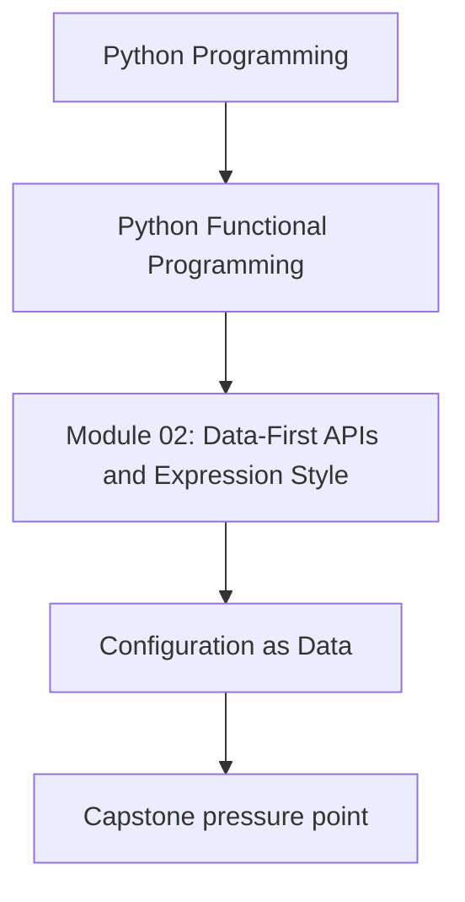
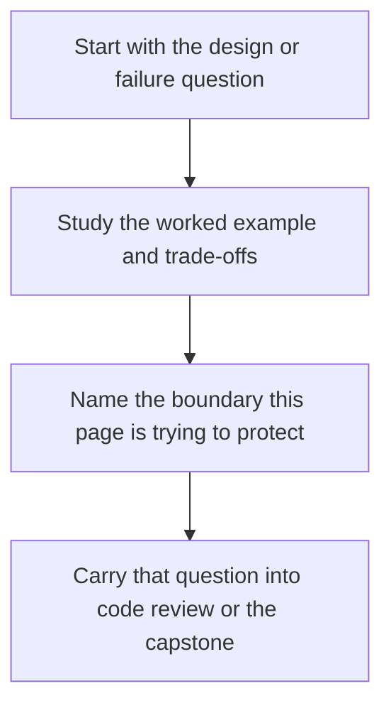

# Configuration as Data


<!-- page-maps:start -->
## Concept Position




<!-- page-maps:end -->

Read the first diagram as a placement map: this page is one concept inside its parent module, not a detached essay, and the capstone is the pressure test for whether the idea holds. Read the second diagram as the working rhythm for the page: name the problem, study the example, identify the boundary, then carry one review question forward.

## Progression Note
By the end of Module 2, you'll master first-class functions for configurability, expression-oriented code, and debugging taps. This prepares for lazy iteration in Module 3. See the series progression map in the repo root for full details.

Here's a snippet from the progression map:

| Module | Focus | Key Outcomes |
|--------|-------|--------------|
| 1: Foundational FP Concepts | Purity, contracts, refactoring | Spot impurities, write pure functions, prove equivalence with Hypothesis |
| 2: First-Class Functions & Expressive Python | Closures, partials, composable configurators | Configure pure pipelines without globals |
| 3: Lazy Iteration & Generators | Streaming/lazy pipelines | Efficient data processing without materializing everything |


> **Core question:**  
> How do you turn raw settings from env, files, or CLI into immutable, validated data (frozen dataclasses or dicts) that drive behaviour via partial and closures—so pipelines from M02C01–M02C05 are deterministic and testable?

This core introduces **configuration-as-data** in Python:  
- Parse raw sources (env, files, CLI) into **immutable data** at M02C05 boundaries.  
- Use frozen dataclasses for self-documenting config, bound via M02C01 partial/closures.  
- Validate at edges, ensuring core sees only typed, complete data.  

We extend the **running project** from `m02-rag.md`—the FuncPipe RAG Builder—evolving from leaky globals/env to validated immutable data that preserves Module 1 equivalence.

**Audience:** Developers from M02C05 with sealed boundaries but still using globals, env leaks, or mutable config that break determinism.  
**Outcome:**  
1. Identify config smells (globals, env leaks) and explain their impact on testing.  
2. Refactor raw sources to validated immutable data + binding.  
3. Write Hypothesis properties proving config-driven behaviour, with a shrinking example.

---

## 1. Conceptual Foundation

### 1.1 Configuration-as-Data in One Precise Sentence

> Configuration-as-data parses raw sources into immutable, validated values (frozen dataclasses or dicts) at boundaries, bound via partial or closures—ensuring behaviour is explicit, deterministic, and composable.

### 1.2 The One-Sentence Rule

> **Parse raw config (env, files, CLI) into frozen data at M02C05 boundaries; bind via partial/closures and pass explicitly—never use globals or env in core.**

### 1.3 Why This Matters Now

M02C05 sealed effects at boundaries, but globals or env leaks introduce hidden state. Config-as-data makes settings explicit values from raw sources, enabling full M02C01–M02C05 power with testable variants.

### 1.4 Config-as-Data as Values in 5 Lines

Config as first-class enables dynamic variants:

```python
from dataclasses import dataclass
from collections.abc import Callable
from functools import partial


# Toy example. In the project, see `capstone/src/funcpipe_rag/api/clean_cfg.py`.
@dataclass(frozen=True)
class ToyCleanConfig:
    rule_names: tuple[str, ...] = ("strip", "lower")


RULES: dict[str, Callable[[str], str]] = {
    "strip": str.strip,
    "lower": str.lower,
    "upper": str.upper,
}

configs: dict[str, ToyCleanConfig] = {
    "standard": ToyCleanConfig(),
    "minimal": ToyCleanConfig(rule_names=()),
}


def clean_abstract(text: str, cfg: ToyCleanConfig) -> str:
    for name in cfg.rule_names:
        text = RULES[name](text)
    return text


cleaners: dict[str, Callable[[str], str]] = {
    "standard": partial(clean_abstract, cfg=configs["standard"]),
    "minimal": partial(clean_abstract, cfg=configs["minimal"]),
}
```

Immutable config data, bound via partial, allows storage in dicts, composition with M02C01 partials, and testing as values—explicit and mutation-free.

**Note:** Raw dicts from env/CLI live only at the boundary; inside, configuration is always represented as frozen dataclasses (possibly stored in dict lookups). Configs should be serializable data (strings, ints, enums); functions come from registries, not from raw config.

---

## 2. Mental Model: Leaky Globals vs Immutable Data

### 2.1 One Picture

```text
Leaky Globals (Flaky)                   Immutable Data (Deterministic)
+-----------------------+               +------------------------------+
| global CHUNK_SIZE     |               | @dataclass(frozen=True)      |
| CHUNK_SIZE = 512      |               | class RagConfig:             |
| # Mutated elsewhere?  |               |     chunk_size: int = 512    |
| rag() # Hidden dep    |               | rag_fn = partial(rag,        |
+-----------------------+               |     cfg=RagConfig())         |
   ↑ Non-deterministic                  +------------------------------+
                                           ↑ Explicit, Testable
```

### 2.2 Contract Table

| Aspect            | Leaky Globals              | Immutable Data               |
|-------------------|------------------------------|------------------------------|
| Dependencies      | Hidden globals/env         | Explicit dataclass params    |
| Determinism       | Breaks (mutations)         | Safe (frozen)                |
| Testing           | Flaky (mock globals)       | Safe (pass fake config)      |
| Composability     | Races / scattered          | Flows like values            |
| Validation        | Scattered checks           | At boundary only             |
| Mutable Defaults in Partials | Breaks Determinism | Use frozen dataclasses or immutable types for configs |

**Note on Leaky Choice:** Use globals/mutables only in trivial scripts; always freeze for reuse.

---

## 3. Running Project: FuncPipe RAG Builder

We extend the FuncPipe RAG Builder from `m02-rag.md`:  
- **Dataset:** 10k arXiv CS abstracts (`arxiv_cs_abstracts_10k.csv`).  
- **Goal:** Turn leaky globals/env into validated immutable config data.  
- **Start:** Leaky version with globals/env (`core6_start.py`).  
- **End:** Validated immutable data bound via partial, preserving equivalence.

### 3.1 Types (Canonical, Used Throughout)

Extend with config data:

```python
from dataclasses import replace

from funcpipe_rag import (
    CleanConfig,
    Err,
    Ok,
    RagBoundaryDeps,
    RagConfig,
    RagCoreDeps,
    RagEnv,
    Reader,
    Result,
)
```

### 3.2 Leaky Start (Anti-Pattern)

```python
# core6_start.py: Leaky config with globals/env
from dataclasses import replace
import os

from funcpipe_rag import Err, Ok, RagBoundaryDeps, RagEnv, boundary_rag_config, full_rag_api_path

GLOBAL_CHUNK_SIZE = int(os.getenv("CHUNK_SIZE", "512"))  # Leaky env
GLOBAL_CLEAN_RULES: list[str] = ["strip", "lower"]  # Mutable global


def leaky_full_rag_api_path(
    path: str,
    raw_cfg: dict[str, object],
    deps: RagBoundaryDeps,
):
    global GLOBAL_CLEAN_RULES
    GLOBAL_CLEAN_RULES.append("upper")  # Mutation!

    raw = dict(raw_cfg)
    raw["chunk_size"] = GLOBAL_CHUNK_SIZE
    raw["clean_rules"] = list(GLOBAL_CLEAN_RULES)

    cfg_res = boundary_rag_config(raw)
    if isinstance(cfg_res, Err):
        return cfg_res

    return full_rag_api_path(path, cfg_res.value, deps)
```

**Smells:**  
- Env leak (`os.getenv`).  
- Mutable list (`append`).  
- Global override.  
**Problem:** Breaks determinism; hard to trace/test.

---

## 4. Refactor to Config-as-Data: Validated Immutable Data + Binding

To strengthen pedagogy, here's a concrete before/after example for redesigning an unfriendly API:

```python
import os
from dataclasses import dataclass
from typing import Dict

# Before: Unfriendly API with implicit context
def foo(data: Dict[str, int]) -> int:
    threshold = int(os.environ.get('THRESHOLD', '5'))  # Hidden env dep
    return sum(v for v in data.values() if v > threshold)  # Non-deterministic if env changes

@dataclass(frozen=True)
class FooConfig:
    threshold: int

# After: FP-Friendly with explicit deps
def foo(data: Dict[str, int], *, config: FooConfig) -> int:
    return sum(v for v in data.values() if v > config.threshold)  # Pure: Depends only on inputs
```

This makes the function testable (inject mock config) and composable—no surprises from environment variables.

### 4.1 Parametric Core (Driven by Config Data)

Updated M02C05 core with config data:

```python
from funcpipe_rag import RagConfig, RagEnv, get_deps, iter_rag_core

config = RagConfig(env=RagEnv(512))
deps = get_deps(config)
chunks_iter = iter_rag_core(docs, config, deps)  # streaming core (no boundary effects)
```

**Properties:**  
- Parametric over immutable config data.  
- Lazy: Builds on M02C03.

### 4.2 Post-Clean Sub-Core

Internal sub-core:

```python
from funcpipe_rag import iter_chunks_from_cleaned

chunks_iter = iter_chunks_from_cleaned(cleaned_docs, config, deps.embedder)
```

**Properties:**  
- Parametric over config.

### 4.3 Config Boundary (Parse Raw to Validated Data)

Parse raw to immutable config:

```python
from funcpipe_rag import Err, Ok, boundary_rag_config

res = boundary_rag_config({"chunk_size": 512, "clean_rules": ["strip", "lower", "collapse_ws"]})
assert isinstance(res, Ok)
```

**Properties:**  
- Thin: Validates at boundary (M02C05). Config parsing is the only place where we convert from untyped external data to typed internal data.  
- Result: Explicit errors, consistent with M02C05.  
- Frozen: Immutable output.

### 4.4 Public API (Edge, Uses Config Data)

From M02C05, with config data:

```python
from funcpipe_rag import full_rag_api_docs, full_rag_api_path

chunks, obs = full_rag_api_docs(docs, config, deps)
res = full_rag_api_path("arxiv_cs_abstracts_10k.csv", config, boundary_deps)
```

**Properties:**  
- Passes immutable config data.  
- Matches Module 1 with default config.

### 4.5 Configurator Tie-In (M02C01, with Closures)

```python
from functools import partial
from funcpipe_rag import CleanConfig, RagConfig, RagEnv, full_rag_api_docs, get_deps, make_rag_fn

test_clean_cfg = CleanConfig(rule_names=("strip",))
config = RagConfig(env=RagEnv(512), clean=test_clean_cfg)
deps = get_deps(config)

# Bind a configured API shape (docs -> (chunks, obs))
rag_docs_fn = partial(full_rag_api_docs, config=config, deps=deps)

# Or use the canonical configurator helper (recommended)
rag_fn = make_rag_fn(chunk_size=512, clean_cfg=test_clean_cfg)
```

**Wins:** Config data bound via partial/closures; variants via replace. Composes with M02C01.

**Advanced Note:** If you know about Codensity, you’ll recognise the spirit here; otherwise ignore this.

---

## What comes next

The main lesson should leave you able to replace globals and mutable settings with
explicit data. The next step is to test that contract and decide where validation belongs
so the model does not turn into decorative ceremony.

Continue with [Configuration Review and Validation](configuration-review-and-validation.md)
before you move into [Callbacks to Combinators](callbacks-to-combinators.md).
