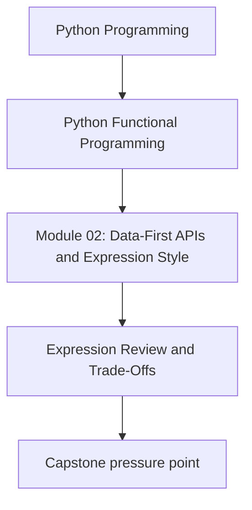
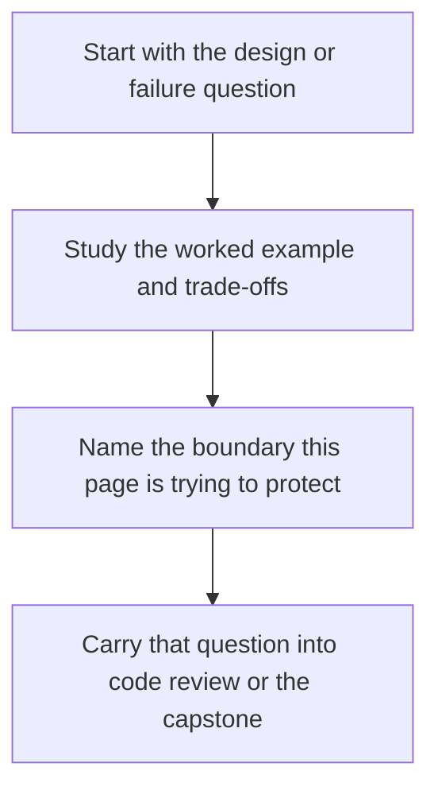

# Expression Review and Trade-Offs


<!-- page-maps:start -->
## Concept Position




<!-- page-maps:end -->

Read the first diagram as a placement map: this page is one concept inside its parent module, not a detached essay, and the capstone is the pressure test for whether the idea holds. Read the second diagram as the working rhythm for the page: name the problem, study the example, identify the boundary, then carry one review question forward.

This lesson exists to answer the question the main lesson leaves open: when does an
expression-oriented rewrite actually improve the code, and how do you prove that the
behavior did not change?

## Review route

Use this sequence whenever you turn flags and loops into expressions:

1. write the imperative baseline
2. write the expression version
3. compare them on the same input
4. reject the rewrite if it shortens the code but hides the decision path

Expression style is only useful if it makes the dataflow more obvious than the flags it
replaced.

## Good proof questions

- does the expression version return the same chunks as the baseline pipeline?
- are observation counters still aligned with the data that passed the rule?
- did the rewrite remove mutable poison state instead of merely moving it?
- can another engineer explain the filter condition without stepping through a loop?

## Property-based check

The most valuable property here is equivalence between the new expression-shaped API and
the simpler baseline built from the pure stages.

```python
from hypothesis import given

from funcpipe_rag import RagConfig, full_rag_api_docs, get_deps
from tests.conftest import doc_list_strategy, env_strategy


@given(docs=doc_list_strategy(), env=env_strategy())
def test_expression_pipeline_matches_baseline(docs, env):
    config = RagConfig(env=env)
    deps = get_deps(config)
    expressive, _ = full_rag_api_docs(docs, config, deps)
    assert expressive == baseline_full_rag(docs, env)
```

The point is not to celebrate Hypothesis for its own sake. The point is to keep the
rewrite honest when the expression form feels cleaner than the loop.

## Failure mode to remember

The classic bug here is cumulative mutable state:

- one document fails the rule
- a shared flag stays false
- every later valid document is dropped

Expression-style filtering prevents that entire class of mistake because the condition is
local to each element instead of stored in poisoned state.

## When expression style is worth it

Keep the expression form when:

- the predicate is local and readable
- the rewrite removes mutable state or sentinel flags
- the result composes naturally with later stages
- the team can still debug the dataflow from the code alone

Do not force it when:

- the branching logic is too rich for a compact expression
- naming the intermediate results is clearer than compressing them
- the rewrite hides work that matters for debugging or observability

## Capstone check

Before moving on:

1. inspect the module-02 API endpoint under `capstone/_history/worktrees/module-02/src/funcpipe_rag/api/`
2. compare the expression route with the simpler stage-built baseline
3. decide whether the new shape made rule selection and filtering easier to review

## Reflection

- Which flag-driven rewrite in your own codebase is ready for an expression form?
- Which one still needs named intermediate values instead?
- Which one would become harder to debug if you compressed it too far?

**Continue with:** [Introducing Laziness](introducing-laziness.md)
