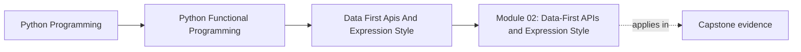

# Module 02: Data-First APIs and Expression Style

<!-- page-maps:start -->
## Page Maps

<!-- page-maps:end -->

This module turns purity from a local refactoring habit into a reusable design style.
The focus is on configuration, expression-oriented code, and APIs that compose without
leaking globals or control flags.

## What this module teaches

- how closures and partial application create configurable pure behavior
- how expression-oriented Python keeps dataflow visible
- how to design APIs that stay small, explicit, and testable
- how to represent configuration and rules as data instead of ambient behavior

## Lesson map

- [Closures and Partials](closures-and-partials.md)
- [Expression-Oriented Python](expression-oriented-python.md)
- [Expression Review and Trade-Offs](expression-review-and-tradeoffs.md)
- [Introducing Laziness](introducing-laziness.md)
- [FP-Friendly APIs](fp-friendly-apis.md)
- [Effect Boundaries](effect-boundaries.md)
- [Configuration as Data](configuration-as-data.md)
- [Callbacks to Combinators](callbacks-to-combinators.md)
- [Tiny Function DSLs](tiny-function-dsls.md)
- [Debugging Compositions](debugging-compositions.md)
- [Imperative to FP Refactor](imperative-to-fp-refactor.md)
- [Refactoring Guide](refactoring-guide.md)

## Capstone checkpoints

- Locate the configuration values that shape the pipeline without mutating globals.
- Compare a raw callback chain with the combinator-based version.
- Inspect whether debugging helpers expose intermediate values without collapsing the design.

## Before moving on

You should be able to explain how data-first APIs stay configurable without turning into
dependency soup, and where laziness starts to become a design obligation rather than an
implementation trick. Use [Refactoring Guide](refactoring-guide.md) and compare against
`capstone/_history/worktrees/module-02` before moving forward.
