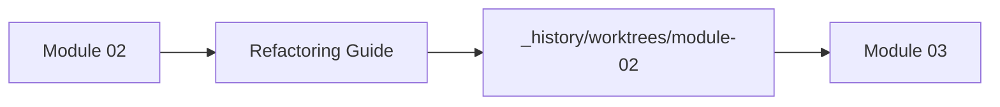
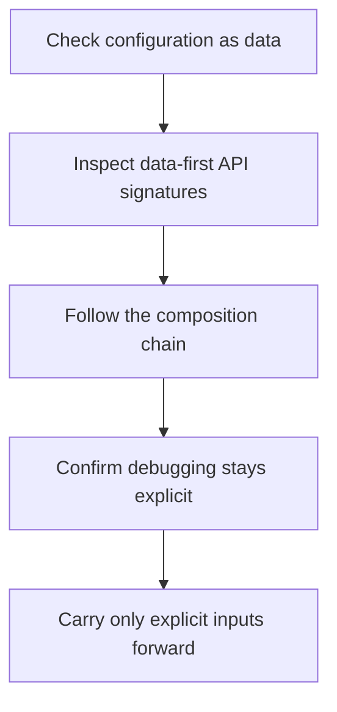

# Module 02 Refactoring Guide

<!-- page-maps:start -->
## Page Maps

<!-- page-maps:end -->

This guide closes Module 02. The goal is to make configuration and composition explicit
enough that changing behavior does not require hidden globals or callback archaeology.

## Stable comparison route

1. run `make PROGRAM=python-programming/python-functional-programming history-refresh`
2. open `capstone/_history/worktrees/module-02/src/funcpipe_rag/api/`
3. compare `config.py`, `core.py`, and `types.py`
4. read `capstone/_history/worktrees/module-02/tests/test_rag_api.py` and `test_fp.py`

## What to refactor toward

- function signatures that accept data directly instead of fishing values out of globals
- closures and partial application only when they make configuration clearer
- composition helpers that expose intermediate values without mutating flow
- tests that show the public API contract, not only the internal helper sequence

## Exit standard

Before Module 03, you should be able to show where configuration enters, how it flows,
and why the API stays inspectable under change.
