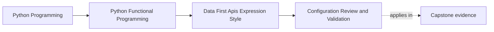
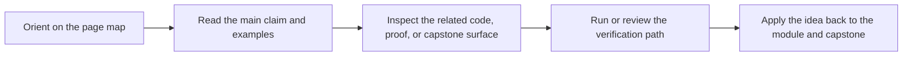

# Configuration Review and Validation


<!-- page-maps:start -->
## Page Maps




<!-- page-maps:end -->

Read the first diagram as a placement map: this page is one concept inside its parent module, not a detached essay, and the capstone is the pressure test for whether the idea holds. Read the second diagram as the working rhythm for the page: name the problem, study the example, identify the boundary, then carry one review question forward.

This lesson closes the configuration hotspot. The main lesson explains how to turn hidden
settings into explicit data. This companion page explains how to test that contract and
how to decide whether the extra modeling work is justified.

## Review route

Ask these questions whenever configuration enters a pipeline:

- is the config immutable after construction?
- does parsing and validation happen at the boundary instead of inside the core?
- do equal config values imply equal behavior?
- can a test replace the real boundary dependencies without rewriting the pipeline?

## Property-based checks

Good properties for this lesson include:

- the docs API and the boundary-driven API return the same chunks
- a streamed prefix matches the eager prefix for the same config
- invalid raw configuration fails at the boundary
- equal config values produce equal behavior
- repeated calls with the same config remain idempotent

```python
from dataclasses import replace

from hypothesis import given

from funcpipe_rag import RagConfig, full_rag_api_docs, get_deps
from tests.conftest import doc_list_strategy, env_strategy


@given(docs=doc_list_strategy(), env=env_strategy())
def test_equal_config_values_mean_equal_behaviour(docs, env):
    config1 = RagConfig(env=env)
    config2 = replace(config1)
    deps = get_deps(config1)
    out1, _ = full_rag_api_docs(docs, config1, deps)
    out2, _ = full_rag_api_docs(docs, config2, deps)
    assert out1 == out2
```

The point of a property like this is simple: configuration should behave like data, not
like a bag of hidden process state.

## Failure mode to remember

The easiest way to lie to yourself here is to keep a mutable global and pretend the
pipeline is still config-driven. Once one call mutates the global, the same input no
longer guarantees the same output.

That is exactly the kind of bug the immutable config route is supposed to remove.

## When config-as-data is worth it

Keep the modeled config when:

- the pipeline needs real variants
- tests need to swap behavior cleanly
- multiple boundaries must agree on the same settings
- a reviewer needs to see what can change without reading globals

Do not force it when:

- the script is truly one-shot and not reused
- the boundary is so small that a plain parameter is clearer than a config object
- the model is growing fields nobody can explain

## Capstone check

Before moving on:

1. inspect `capstone/_history/worktrees/module-02/src/funcpipe_rag/api/config.py`
2. inspect the matching config-sensitive tests under `capstone/_history/worktrees/module-02/tests/`
3. decide whether the config model makes change safer or just more formal

## Reflection

- Which setting in your own codebase still lives in a global because nobody named it well?
- Which setting deserves a dedicated model because it changes review behavior?
- Which one is simple enough to stay a direct function argument?

**Continue with:** [Callbacks to Combinators](callbacks-to-combinators.md)
