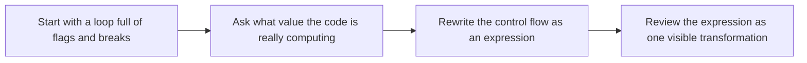

# Expression-Oriented Python


<!-- page-maps:start -->
## Lesson Map


<!-- page-maps:end -->

This lesson is about exposing the value a piece of code is trying to compute. When you can name that value, flags and mutation stop looking necessary and expression-oriented rewrites become much easier to justify.

## Start With the Review Smell

Most imperative code in this module is not wrong because it uses a loop. It is hard to review because the important result is buried under control variables, scattered exits, and temporary state.

- If the code introduces `found`, `done`, or `valid`, ask what final value those names are trying to summarize.
- If the loop mixes selection, transformation, and stopping rules, the logic is probably easier to read as nested expressions.
- If a reviewer has to simulate state changes mentally, the expression boundary is still missing.

## Keep This Question In View

> **Core question:**  
> How do you replace statement-heavy imperative code (loops + flags + breaks) with expressions, comprehensions, and data-driven conditionals—so control flow becomes explicit, composable, and easy to reason about?

This lesson introduces the expression-oriented mindset in the form you actually use:

- treat core logic as value-producing expressions rather than a sequence of state updates
- use comprehensions and built-ins like `any`, `all`, and `next` when they say the result directly
- remove mutable control flags from the core path so dataflow stays visible

The running project matters here because expression style is not just "shorter Python." It is a way to make filtering, selection, and branching reviewable inside a configurable pipeline.

Use this when you understand purity and configurators but still write loops like:

```python
found = False
for x in xs:
    if pred(x):
        found = True
        break
```

**Outcome:**

1. Spot control flags (`found`, `valid`, `done`) and explain why they obscure logic.
2. Refactor a 10–20 line loop into comprehensions / `any` / `next` while preserving semantics.
3. Write a Hypothesis property that proves equivalence to the baseline and exposes a real flag-based bug.

---

## Runnability Note (Module 01 Snapshot vs Module 02 End-State)

Some “before” snippets in this core are **hypothetical pre-refactor** examples used for contrast. They are labeled accordingly and are not meant to exactly match a real snapshot. We refactor these shapes into the real Module 02 API as the module progresses.

For a **real, runnable Module 01 codebase**, refresh the generated history route first:

- `make PROGRAM=python-programming/python-functional-programming history-refresh`
- Module 01 path: `capstone/_history/worktrees/module-01/`
- Import path for Module 01: `capstone/_history/worktrees/module-01/src/`

## 1. Conceptual Foundation

### 1.1 Expression-Oriented Python in One Precise Sentence

> Expression-oriented programming treats control flow as compositions of value-producing expressions instead of stepwise mutation—so code reads as “data -> data” rather than “state -> state”.

### 1.2 The One-Sentence Rule

> **In core logic, do not use mutable flags (`found`, `valid`, `done`) or manual `break`/`continue` for control; use comprehensions, conditional expressions, and built-ins that return values—flags and `break` may be acceptable inside encapsulated low-level helpers with pure signatures.**

### 1.3 Why This Matters Now

Closures gave us a clean way to build configured variants, but the inside of those variants can still be messy. A function may be pure and still force you to trace flags, breaks, and partially updated locals. Expression-oriented code improves the inside of the function: it turns "change state until we get the answer" into "compute the answer directly." That shift makes later refactors, proofs, and reviews much safer.

### 1.4 Expressions as Values in 5 Lines

The point of the next example is not brevity. It is to make the chosen predicate and the returned collection visible in one place.

```python
from collections.abc import Callable
from funcpipe_rag import RawDoc


def has_long_abstract(d: RawDoc) -> bool:
    return len(d.abstract) >= 100


def is_cs_category(d: RawDoc) -> bool:
    return d.categories.startswith("cs.")


DocPred = Callable[[RawDoc], bool]

predicates: dict[str, DocPred] = {
    "long_abstract": has_long_abstract,
    "cs_only": is_cs_category,
}


def filter_docs(key: str, docs: list[RawDoc]) -> list[RawDoc]:
    return [d for d in docs if predicates[key](d)]
```

The key point:

* `filter_docs` is a **single expression** (`[...]`) mapping docs to docs.
* Control flow (“if this doc satisfies predicate P, keep it”) is encoded as data: `predicates[key]`.

No flags, no `break`; everything is composable and easy to test.

---

## 2. Mental Model: Imperative Flags vs Expressions

### 2.1 One Picture

```text
Imperative Flags (Mutable)              Expression-Oriented (Pure)
+-----------------------+               +------------------------------+
| found = False         |               |   found = any(pred(x)        |
| for x in xs:          |               |               for x in xs)   |
|     if pred(x):       |               |                              |
|         found = True  |               |   # Single expression        |
|         break         |               |   # No flags, no break       |
+-----------------------+               +------------------------------+
   ↑ Scattered control                         ↑ Control is data
   ↑ Subtle state coupling                     ↑ Easy to compose / test
```

### 2.2 Contract Table

| Aspect       | Imperative Flags                   | Expression-Oriented                           |
| ------------ | ---------------------------------- | --------------------------------------------- |
| Dependencies | Hidden in loop structure           | Explicit in predicates and expressions        |
| Control Flow | Flags + `break`/`continue`         | Comprehensions, `any`/`all`/`next`, ternaries |
| Reasoning    | Global: “what happens to `found`?” | Local: “what does this expression compute?”   |
| Refactoring  | Easy to introduce non-local bugs   | Equational: refactor expression ↔ expression  |
| Testing      | Need to inspect loop behavior      | Test expressions as pure functions            |


```python
# Imperative: flag + break to get first matching doc
first_long = None
for d in docs:
    if has_long_abstract(d):
        first_long = d
        break

# Expression-oriented: next() with default
first_long = next(
    (d for d in docs if has_long_abstract(d)),
    None,  # default if no doc matches
)
```

While comprehensions promote expression-oriented code, prioritize readability: If a comprehension becomes nested or complex (e.g., 3+ layers), refactor to named helper functions or consider a simple loop inside a trivial pure wrapper. Purity matters, but so does maintainability.

---

## 3. Running Project: FuncPipe RAG Builder

We continue the FuncPipe RAG Builder from `m02-rag.md`.

* **Baseline:** a pure stages composition (clean → chunk → embed → dedup).
* **Module 2 Core 1:** `make_rag_fn(...)` – closure-based configurators.
* **This core:** We refactor the **internal implementation** of the RAG API from imperative loops to expression-based code while preserving equivalence to the baseline.

### 3.1 Types (Canonical, Used Throughout)

We rely on the types defined in `capstone/src/funcpipe_rag/rag_types.py` and `capstone/src/funcpipe_rag/api/types.py`:

```python
from funcpipe_rag import DocRule, Observations, RagTaps
from funcpipe_rag import RawDoc, CleanDoc, Chunk, RagEnv
```

These are pure data containers; expression orientation will sit **on top** of them.

---

## 4. Imperative Start: Loops and Flags

We begin with a **hypothetical pre-refactor** implementation of the extended RAG pipeline. It’s semantically correct, but filled with flags and stepwise loops, and it is not intended to be run as-is in the end-of-Module-02 checkout.

```python
# core2_start.py (hypothetical pre-refactor; illustration only)
from funcpipe_rag import RawDoc, CleanDoc, ChunkWithoutEmbedding, Chunk, RagEnv
from funcpipe_rag import DocRule, Observations, RagTaps
from funcpipe_rag import any_doc
from funcpipe_rag import clean_doc  # baseline stage
from funcpipe_rag import embed_chunk, structural_dedup_chunks


def imperative_full_rag_api(
        docs: list[RawDoc],
        env: RagEnv,
        cleaner: Callable[[RawDoc], CleanDoc],
        *,
        keep: DocRule | None = None,
        taps: RagTaps | None = None,
) -> tuple[list[Chunk], Observations]:
    rule = keep if keep is not None else any_doc

    # 1) Filter docs using per-doc flag
    kept_docs: list[RawDoc] = []
    for d in docs:
        is_kept = rule(d)  # Flag; local, but unnecessary
        if is_kept:
            kept_docs.append(d)
    if taps and taps.docs:
        taps.docs(tuple(kept_docs))

    # 2) Clean docs using explicit accumulation
    cleaned: list[CleanDoc] = []
    for d in kept_docs:
        cd = cleaner(d)
        cleaned.append(cd)
    if taps and taps.cleaned:
        taps.cleaned(tuple(cleaned))

    # 3) Chunk each cleaned doc using index + while loop
    chunk_we: list[ChunkWithoutEmbedding] = []
    for cd in cleaned:
        text = cd.abstract
        i = 0
        while i < len(text):
            s = text[i:i + env.chunk_size]
            if s:
                chunk_we.append(
                    ChunkWithoutEmbedding(cd.doc_id, s, i, i + len(s))
                )
            i += env.chunk_size

    # 4) Embed chunks
    embedded: list[Chunk] = []
    for c in chunk_we:
        embedded.append(embed_chunk(c))

    # 5) Deduplicate structurally (baseline stage helper)
    chunks = structural_dedup_chunks(embedded)
    if taps and taps.chunks:
        taps.chunks(tuple(chunks))

    obs = Observations(
        total_docs=len(docs),
        total_chunks=len(chunks),
        kept_docs=len(kept_docs),
        cleaned_docs=len(cleaned),
        sample_doc_ids=tuple(d.doc_id for d in kept_docs[:5]),
        sample_chunk_starts=tuple(c.start for c in chunks[:5]),
    )
    return chunks, obs
```

Key points:

* This function is **pure** and deterministic.
* But control flow is encoded as:

  * Per-doc flags (`is_kept`),
  * Manual accumulation loops,
  * Explicit index management (`i` + `while`).

It works, but it doesn’t read as “data -> data” so much as “do X, then Y, then Z”.

---

## 5. Refactor to Expressions: Comprehensions & Conditionals

We now introduce a small helper and an expression-oriented RAG core.

### 5.1 Side-Effect Taps as an Expression Primitive

We define `_tap` as the **only side-effect primitive** allowed in this core:

```python
from typing import TypeVar, Callable

T = TypeVar("T")

def _tap(xs: list[T], h: Callable[[tuple[T, ...]], None] | None) -> list[T]:
    """
    Observational tap: if h is provided, call h(tuple(xs)) for side effects,
    then return xs unchanged.

    Contract: For all xs and h, the *return value* of _tap(xs, h) equals xs.
    All value-level behavior of the pipeline is unchanged; only side effects differ.
    """
    if h:
        h(tuple(xs))
    return xs
```

This preserves the **value semantics** of the pipeline while allowing optional metrics/logging at the edges.

### 5.2 Expression-Oriented RAG Core

We now rewrite the RAG core in an expression style. This is an **illustration-only** refactor; the runnable end-of-Module-02 implementation lives in `capstone/src/funcpipe_rag/rag/rag_api.py` (`full_rag_api_docs` / `full_rag_api`) with the frozen config and dependency wiring in `capstone/src/funcpipe_rag/rag/config.py`.

```python
# core2_refactor_demo.py (illustration only; not the canonical Module-02 API)
from collections.abc import Callable

from funcpipe_rag import RawDoc, CleanDoc, ChunkWithoutEmbedding, Chunk, RagEnv
from funcpipe_rag import DocRule, Observations, RagTaps
from funcpipe_rag import any_doc
from funcpipe_rag import embed_chunk, structural_dedup_chunks


def toy_gen_chunk_doc(cd: CleanDoc, env: RagEnv) -> list[ChunkWithoutEmbedding]:
    """
    Pure helper: chunk a cleaned document into fixed-size pieces.
    """
    text = cd.abstract
    return [
        ChunkWithoutEmbedding(cd.doc_id, chunk_text, start, start + len(chunk_text))
        for start in range(0, len(text), env.chunk_size)
        if (chunk_text := text[start:start + env.chunk_size])
    ]


def toy_full_rag_api(
        docs: list[RawDoc],
        env: RagEnv,
        cleaner: Callable[[RawDoc], CleanDoc],
        *,
        keep: DocRule | None = None,
        taps: RagTaps | None = None,
) -> tuple[list[Chunk], Observations]:
    rule = keep if keep is not None else any_doc  # conditional expression

    kept_docs = _tap(
        [d for d in docs if rule(d)],  # filter
        taps.docs if taps else None,
    )

    cleaned = _tap(
        [cleaner(d) for d in kept_docs],  # map
        taps.cleaned if taps else None,
    )

    chunk_we = [
        c
        for cd in cleaned
        for c in toy_gen_chunk_doc(cd, env)  # flatMap
    ]

    embedded = [embed_chunk(c) for c in chunk_we]
    chunks = _tap(
        structural_dedup_chunks(embedded),
        taps.chunks if taps else None,
    )

    obs = Observations(
        total_docs=len(docs),
        total_chunks=len(chunks),
        kept_docs=len(kept_docs),
        cleaned_docs=len(cleaned),
        sample_doc_ids=tuple(d.doc_id for d in kept_docs[:5]),
        sample_chunk_starts=tuple(c.start for c in chunks[:5]),
    )
    return chunks, obs
```

Properties:

* No mutable flags (`is_kept`, `found_chunk`, `done`).
* Control flow is now **encoded as expressions**:

  * Filtering: `[d for d in docs if rule(d)]`
  * Mapping: `[cleaner(d) for d in kept_docs]`
  * Chunk flattening: `for cd in cleaned for c in gen_chunk_doc(cd, env)`
* `_tap` is the *only* place where side effects may occur, and it preserves the values.

This is now a direct “data -> data” description of the pipeline.

### 5.3 Expression Partial (Core 1 Tie-In)

```python
from functools import partial
from funcpipe_rag import CleanConfig, make_rag_fn, any_doc

has_long_abstract = lambda d: len(d.abstract) >= 100
has_valid_doc = lambda d: any_doc(d) and has_long_abstract(d)  # Logical and as expression
# In the end-of-Module-02 codebase, `make_rag_fn` captures frozen config.
rag_fn = make_rag_fn(chunk_size=512, clean_cfg=CleanConfig())
# Expression-oriented filtering still composes cleanly:
filtered_docs = [d for d in docs if has_valid_doc(d)]
chunks, obs = rag_fn(filtered_docs)
```

**Wins:** Data-driven filtering without flags; composes with Core 1. make_rag_fn is canonical configurator wrapping this expression-based pipeline.

---

## What comes next

The main expression lesson should leave you able to rewrite loops and flags into a clearer
dataflow. The next step is to review when that rewrite is genuinely better and how to
prove it preserved behavior.

Continue with [Expression Review and Trade-Offs](expression-review-and-tradeoffs.md)
before you move into [Introducing Laziness](introducing-laziness.md).
