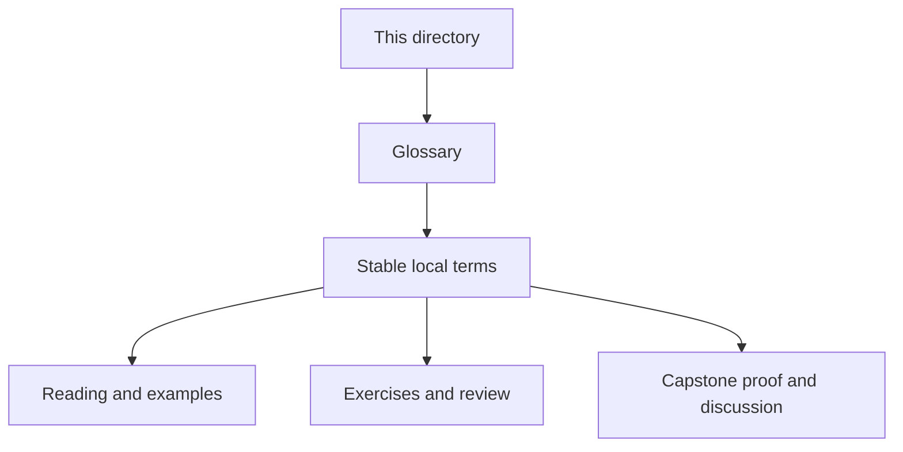
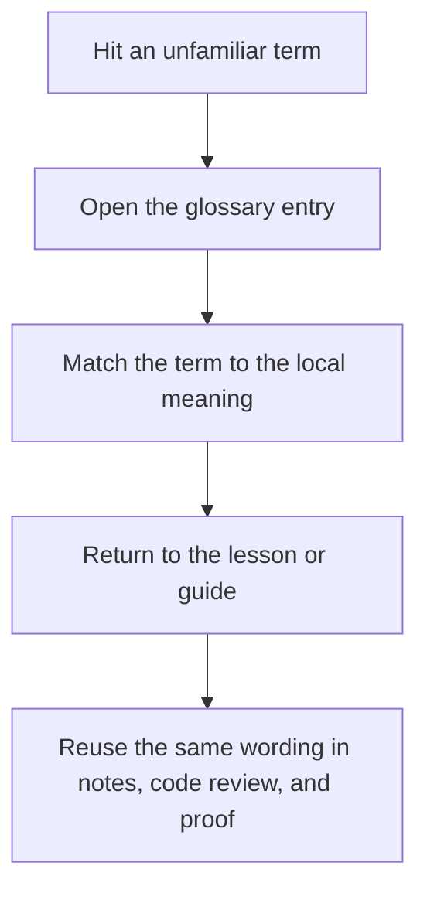

# Module Glossary

<!-- page-maps:start -->
## Glossary Fit

<!-- page-maps:end -->

This glossary belongs to **Module 02: Data-First APIs and Expression Style** in **Python Functional Programming**. It keeps the language of this directory stable so the same ideas keep the same names across reading, practice, review, and capstone proof.

## How to use this glossary

Read the directory index first, then return here whenever a page, command, or review discussion starts to feel more vague than the course intends. The goal is stable language, not extra theory.

## Terms in this directory

| Term | Meaning in this directory |
| --- | --- |
| Callbacks to Combinators | the module's treatment of callbacks to combinators, used to make the module's main design claim concrete in design work, refactoring, and capstone evidence. |
| Closures & Partials | the module's treatment of closures & partials, used to make the module's main design claim concrete in design work, refactoring, and capstone evidence. |
| Configuration as Data | the module's treatment of configuration as data, used to make the module's main design claim concrete in design work, refactoring, and capstone evidence. |
| Configuration Review and Validation | the review surface that pressure-tests the module after the first read so you can check judgment, not just recall. |
| Debugging Compositions | the module's treatment of debugging compositions, used to make the module's main design claim concrete in design work, refactoring, and capstone evidence. |
| Effect Boundaries | the module's treatment of effect boundaries, used to make the module's main design claim concrete in design work, refactoring, and capstone evidence. |
| Expression Review and Trade-Offs | the review surface that pressure-tests the module after the first read so you can check judgment, not just recall. |
| Expression-Oriented Python | the module's treatment of expression-oriented python, used to make the module's main design claim concrete in design work, refactoring, and capstone evidence. |
| FP-Friendly APIs | the module's treatment of fp-friendly apis, used to make the module's main design claim concrete in design work, refactoring, and capstone evidence. |
| Imperative to FP Refactor | the module's treatment of imperative to fp refactor, used to make the module's main design claim concrete in design work, refactoring, and capstone evidence. |
| Introducing Laziness | the module's treatment of introducing laziness, used to make the module's main design claim concrete in design work, refactoring, and capstone evidence. |
| Module 02 Refactoring Guide | the repair route for applying the module's main design claim to existing code without losing behavior, clarity, or proof. |
| Tiny Function DSLs | the module's treatment of tiny function dsls, used to make the module's main design claim concrete in design work, refactoring, and capstone evidence. |
