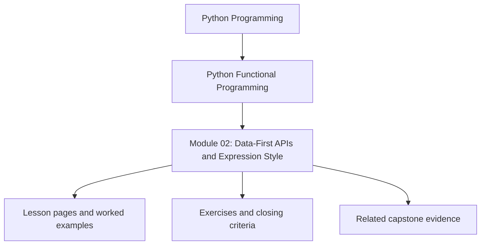
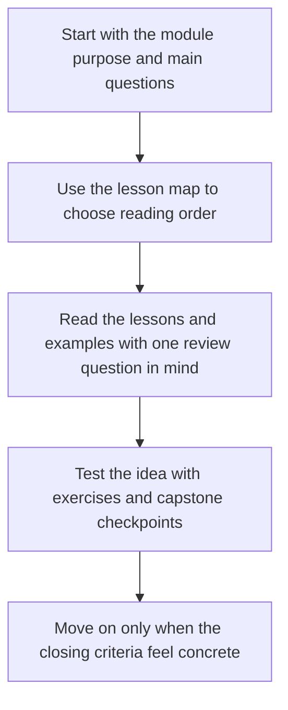

# Module 02: Data-First APIs and Expression Style

<!-- page-maps:start -->
## Module Position

<!-- page-maps:end -->

Read the first diagram as a placement map: this page sits between the course promise, the lesson pages listed below, and the capstone surfaces that pressure-test the module. Read the second diagram as the study route for this page, so the diagrams point you toward the `Lesson map`, `Exercises`, and `Closing criteria` instead of acting like decoration.

## Keep These Pages Open

Use these support surfaces while reading so data-first design stays connected to explicit
configuration and composition pressure:

- [First-Contact Map](../module-00-orientation/first-contact-map.md) for the foundation route through the first three modules
- [Module Promise Map](../guides/module-promise-map.md) for the module contract in one place
- [Practice Map](../guides/practice-map.md) for the read-inspect-prove rhythm
- [Capstone Map](../capstone/capstone-map.md) for the configured pipeline surfaces in FuncPipe

Carry this question into the module:

> What should become explicit data so the pipeline composes honestly instead of hiding choices inside control flow?

This module turns purity from a local refactoring habit into a reusable design style.
The focus is on configuration, expression-oriented code, and APIs that compose without
leaking globals or control flags.

## Learning outcomes

- how closures and partial application create configurable pure behavior
- how expression-oriented Python keeps dataflow visible
- how to design APIs that stay small, explicit, and testable
- how to represent configuration and rules as data instead of ambient behavior

## Lesson map

- [Closures and Partials](closures-and-partials.md)
- [Expression-Oriented Python](expression-oriented-python.md)
- [Expression Review and Trade-Offs](expression-review-and-tradeoffs.md)
- [Introducing Laziness](introducing-laziness.md)
- [FP-Friendly APIs](fp-friendly-apis.md)
- [Effect Boundaries](effect-boundaries.md)
- [Configuration as Data](configuration-as-data.md)
- [Configuration Review and Validation](configuration-review-and-validation.md)
- [Callbacks to Combinators](callbacks-to-combinators.md)
- [Tiny Function DSLs](tiny-function-dsls.md)
- [Debugging Compositions](debugging-compositions.md)
- [Imperative to FP Refactor](imperative-to-fp-refactor.md)
- [Refactoring Guide](refactoring-guide.md)

## Exercises

- Refactor one callback-heavy path into a data-first pipeline and name the configuration value that should stay explicit.
- Trace one closure or partial application example and explain what behavior is being fixed at construction time.
- Review one API surface and state whether it exposes configuration as data or hides it in control flow.

## Capstone checkpoints

- Locate the configuration values that shape the pipeline without mutating globals.
- Compare a raw callback chain with the combinator-based version.
- Inspect whether debugging helpers expose intermediate values without collapsing the design.

## Before moving on

You should be able to explain how data-first APIs stay configurable without turning into
dependency soup, and where laziness starts to become a design obligation rather than an
implementation trick. Use [Refactoring Guide](refactoring-guide.md) and compare against
`capstone/_history/worktrees/module-02` before moving forward.

## Closing criteria

- You can explain why a data-first API composes more predictably than one driven by ambient flags.
- You can identify where laziness starts to influence interface design instead of remaining an internal optimization.
- You can review a configuration path and explain how overrides stay explicit and testable.

## Directory glossary

Use [Glossary](glossary.md) when you want the recurring language in this module kept stable while you move between lessons, exercises, and capstone checkpoints.
