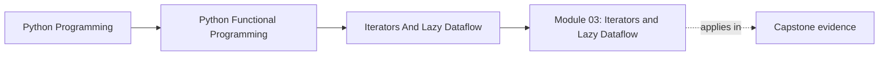
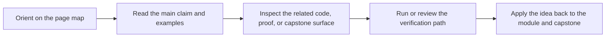

# Module 03: Iterators and Lazy Dataflow

<!-- page-maps:start -->
## Page Maps

<!-- page-maps:end -->

This module makes streaming a first-class part of the course architecture. The learner
moves from pure transforms over finite collections to deliberate control over when work
happens, how much memory is used, and where materialization becomes a conscious choice.

## What this module teaches

- how iterators and generators model on-demand dataflow in Python
- how `itertools` and custom iterators support reusable streaming stages
- how to reason about chunking, fan-in, fan-out, and bounded traversal
- how to add observability to lazy pipelines without destroying laziness

## Lesson map

- [Iterator Protocol and Generators](iterator-protocol-and-generators.md)
- [Generators vs Comprehensions](generators-vs-comprehensions.md)
- [itertools Composition](itertools-composition.md)
- [Chunking and Windowing](chunking-and-windowing.md)
- [Infinite Sequences Safely](infinite-sequences-safely.md)
- [Reusable Pipeline Stages](reusable-pipeline-stages.md)
- [Fan-In and Fan-Out](fan-in-and-fan-out.md)
- [Time-Aware Streaming](time-aware-streaming.md)
- [Custom Iterators](custom-iterators.md)
- [Streaming Observability](streaming-observability.md)
- [Refactoring Guide](refactoring-guide.md)

## Capstone checkpoints

- Identify where FuncPipe stays lazy and where it deliberately materializes.
- Inspect how streaming helpers preserve metadata instead of hiding it.
- Review whether observability helpers measure the pipeline without mutating its core behavior.

## Before moving on

You should be able to explain why laziness changes error handling, resource management,
and review strategy before the course introduces typed failures and resilience patterns.
Use [Refactoring Guide](refactoring-guide.md) and compare against
`capstone/_history/worktrees/module-03` before moving forward.
