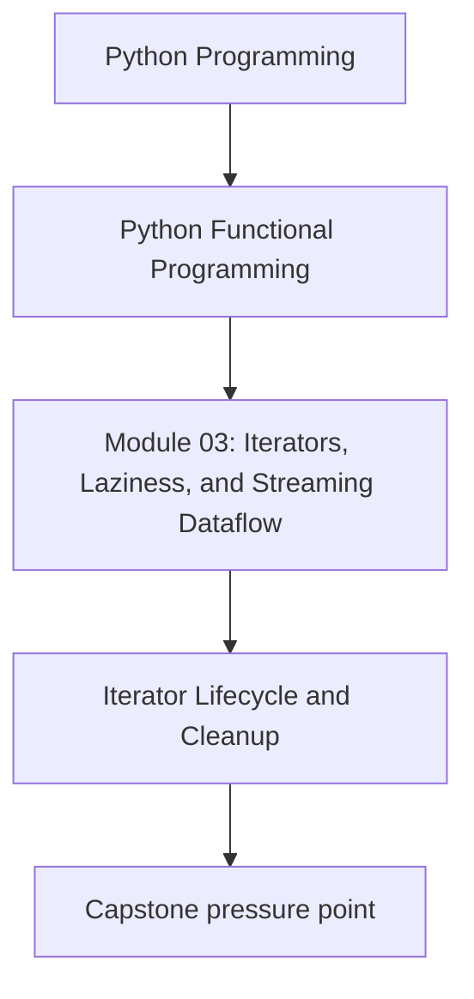
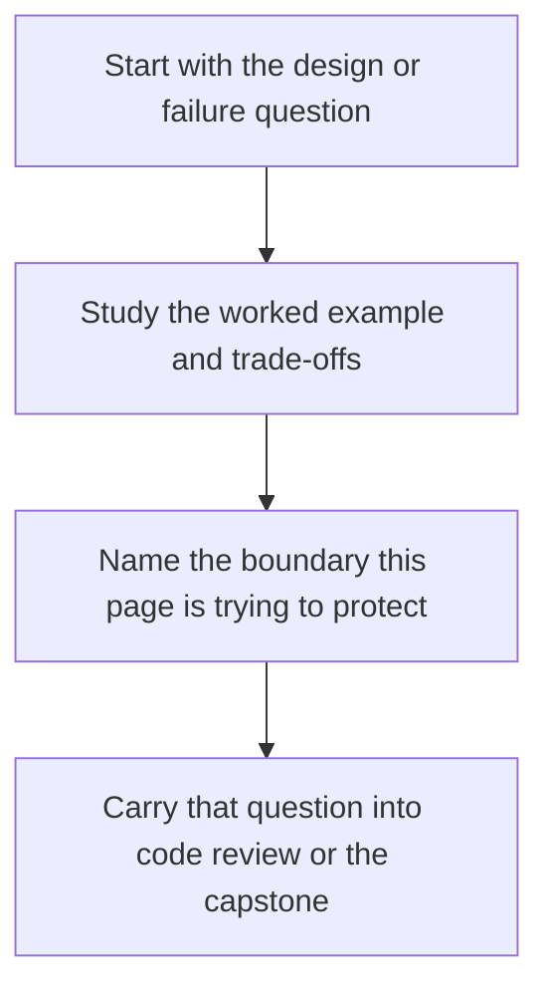

# Iterator Lifecycle and Cleanup


<!-- page-maps:start -->
## Concept Position




<!-- page-maps:end -->

Read the first diagram as a placement map: this page is one concept inside its parent module, not a detached essay, and the capstone is the pressure test for whether the idea holds. Read the second diagram as the working rhythm for the page: name the problem, study the example, identify the boundary, then carry one review question forward.

This lesson closes the custom-iterator hotspot. The main lesson should teach you how to
build the cursor and factory pair. This companion page explains how to review the
lifecycle rules and when a custom iterator is a better choice than a plain generator.

## Lifecycle checklist

For every custom iterator, check these rules:

- iterables return a fresh cursor from `__iter__`
- iterators return `self` from `__iter__`
- exhausted iterators stay exhausted
- resources are released on exhaustion, `close()`, or context exit
- two fresh cursors over the same source behave independently

If one of those rules is false, the class is probably carrying state in a way the caller
cannot trust.

## Useful properties

Custom iterators should satisfy:

- iterator parity: `iter(it) is it`
- iterable freshness: `iter(src) is not iter(src)`
- equivalence with the simpler generator baseline where one exists
- cleanup on early stop for resource-backed cursors

```python
from hypothesis import given
import hypothesis.strategies as st


@given(st.lists(st.text(), max_size=40))
def test_iterable_returns_fresh_cursors(lines):
    src = MyIterable(lines)
    a = iter(src)
    b = iter(src)
    assert a is not b
    assert list(a) == list(b) == lines
```

The important part is not the exact helper name. The important part is the contract: a
reusable iterable must not secretly be a one-shot cursor.

## When a class iterator is worth it

Use the class form when:

- the lifecycle matters and must be explicit
- the iterator carries meaningful state across `next()` calls
- cleanup or context management is part of the contract
- the generator version would hide important mutable cursor state

Stay with a generator when:

- the logic is simple and single-pass
- there is no resource lifecycle to manage
- the class adds more ceremony than clarity

## Capstone check

Before moving on:

1. inspect the module-03 iterator endpoint under `capstone/_history/worktrees/module-03/`
2. compare the iterator design with the generator alternative
3. decide whether the class form improved lifecycle clarity enough to justify itself

## Reflection

- Which iterator in your own codebase really needs explicit cleanup?
- Which one should collapse back into a generator?
- Which review bug would appear if the iterable returned itself instead of a fresh cursor?

**Continue with:** [Streaming Observability](streaming-observability.md)
