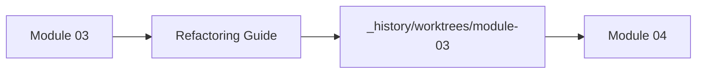
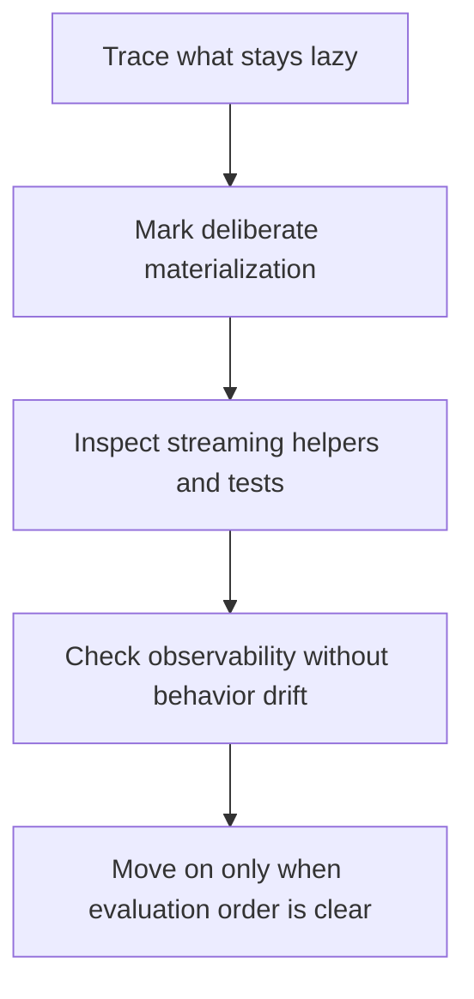

# Module 03 Refactoring Guide

<!-- page-maps:start -->
## Page Maps

<!-- page-maps:end -->

This guide closes Module 03. The point is not to celebrate generators on their own. The
point is to know when computation happens, when memory grows, and how to observe a stream
without quietly destroying laziness.

## Stable comparison route

1. run `make PROGRAM=python-programming/python-functional-programming history-refresh`
2. open `capstone/_history/worktrees/module-03/src/funcpipe_rag/`
3. compare the streaming helpers in `api/core.py`, `pipeline_stages.py`, and related iterator utilities
4. read `capstone/_history/worktrees/module-03/tests/test_streaming.py`

## What to refactor toward

- iterators and generators that expose demand clearly
- bounded chunking and fan-out choices that are visible in code and tests
- observability helpers that wrap streams without mutating yielded values
- explicit materialization points with a stated reason

## Exit standard

Before Module 04, you should be able to explain where work starts, where it pauses, and
which tests prove that the stream contract survives refactoring.
