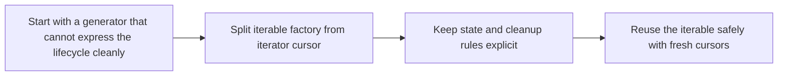

# Custom Iterators


<!-- page-maps:start -->
## Lesson Map


<!-- page-maps:end -->

This lesson should not make class-based iterators feel like the default. It should make them feel justified. Leave generators behind only when you need more explicit control over state, reuse, or cleanup than a simple generator can provide cleanly.

## Start With the Generator Limit

Generators solve most streaming problems in this module. That is exactly why this lesson needs a careful opening. Learn when a custom iterator is warranted; do not treat classes as automatically more advanced and therefore better.

- If a stream needs explicit cleanup, restartable iteration, or more structured state handling, a class may be the clearer design.
- If the same object is both iterable and iterator by accident, reuse and consumption semantics become easy to blur.
- If the lifecycle is hidden, reviewers cannot tell when resources are released or whether iteration can safely restart.

## Keep This Question In View

> **Core question:**  
> How do you design custom iterator classes that implement `__iter__` and `__next__` for complex stateful logic, ensuring purity, laziness, and equivalence while enabling reuse beyond simple generators?

This lesson introduces custom iterators as an explicit lifecycle pattern:

- separate the reusable iterable from the single-pass cursor
- keep state transitions and cleanup obligations visible in the class design
- preserve laziness while giving you a clearer story about restartability and resource control

The running and cross-domain examples matter because custom iterators should feel like a practical response to a real lifecycle need, not like ceremony for its own sake.

Use this when you have hit the limits of generators for reusable, stateful, or resource-aware streams.

**Outcome:**
1. Spot generator limits like no reuse.
2. Build class iterator in < 15 lines.
3. Prove iter laws with Hypothesis.

**Laws (frozen, used across this core):**
- E1 — Equivalence: iter(class_factory(S)) == gen_equiv(S).
- P1 — Purity: No globals; explicit state.
- R1 — Reusability: For any iterable X, iter(X) is not iter(X) and both iterators produce identical sequences.
- I1a — Iterator parity: iter(it) is it and after exhaustion, next(it) raises immediately.
- I1b — Iterable parity: iter(X) is not iter(X) and list(iter(X)) == list(iter(X)).
- CL1 — Cleanup: Resources released on `.close()` or `__exit__`.
- DTR — Determinism: Equal init/state → equal outputs.
- FR — Freshness: Factory calls independent.

**Iterator vs Iterable in Python (memorise):**
- **Iterable**: Has `__iter__` returning an iterator (may be self or fresh cursor). Supports `for x in obj:` and `iter(obj)`.
- **Iterator**: Has `__next__` (raise StopIteration at end) and `__iter__` returning self. Single-pass; exhausted after consumption.

Factories are Iterable; cursors are Iterator.

---

## 1. Conceptual Foundation

### 1.1 The One-Sentence Rule

> **Use separate Iterable factories and Iterator cursors for stateful, reusable iterators with explicit cleanup, when generators lack control.**

### 1.2 Custom Iter in One Precise Sentence

> Iterable factories return fresh Iterators; iterators implement `__next__` logic, `__iter__` return self.

In this series, enables resources; preserves laziness.

### 1.3 Why This Matters Now

Up to this point, generators have been enough for almost every lesson. That is a feature, not a problem. This page matters because it marks the boundary where a generator stops being the clearest representation. Recognize that boundary so you can choose a custom iterator intentionally rather than out of habit or novelty.

### 1.4 Custom Iter in 5 Lines

The next snippet matters because it separates "object you can iterate over again" from "cursor currently walking the data."

```python
class MyIterable:
    def __init__(self, data):
        self.data = data
    def __iter__(self):
        return MyIter(self.data)

class MyIter:
    def __init__(self, data):
        self.data = data
        self.i = 0
    def __iter__(self): return self
    def __next__(self):
        if self.i >= len(self.data): raise StopIteration
        val = self.data[self.i]; self.i += 1; return val
```

Reusable.

### 1.5 Minimal Iter Harness (Extends Core 8)

Build on Core 8; add class patterns:

```python
from typing import Iterator, Iterable, TypeVar
T = TypeVar("T")

class BaseIterable(Iterable[T]):
    def __iter__(self) -> Iterator[T]:
        raise NotImplementedError

class BaseIter(Iterator[T]):
    def __iter__(self) -> 'BaseIter[T]':
        return self
    def __next__(self) -> T:
        raise NotImplementedError
    def close(self):
        pass
```

Use as base; e.g., class MyIterable(BaseIterable[T]): ...

---

## 2. Mental Model: Generator vs Class Iter

### 2.1 One Picture

```text
Generators (Simple)                     Class Iters (Powerful)
+-----------------------+               +------------------------------+
| one-shot, no reuse    |               | stateful, reusable           |
|        ↓              |               |        ↓                     |
| no cleanup control    |               | .close() resources, errors   |
| lightweight           |               | testable, composable         |
+-----------------------+               +------------------------------+
   ↑ Limited / Stateless                   ↑ Flexible / Stateful
```

### 2.2 Behavioral Contract

| Aspect | Generators | Class Iters |
|-------------------|------------------------------|------------------------------|
| Reuse | No (exhausted) | Yes (reset state) |
| Cleanup | Auto | Explicit .close() |
| State | Suspended | Explicit attrs |
| Equivalence | Simple | Via properties |

**Note on Generator Choice:** Simple logic; else class.

**When Not to Class:** No state; use gen.

**Known Pitfalls:**
- Forgotten __iter__ return self.
- State mutation leaks.

**Forbidden Patterns:**
- For iterators: __iter__ not returning self.
- For iterables: __iter__ returning self (violates R1/I1b).
- Enforce with type checks.

**Building Blocks Sidebar:**
- For iterators: __iter__ return self.
- For iterables: __iter__ return fresh cursor.
- __next__ logic/raise.
- .close() cleanup.

**Resource Semantics:** Classes handle close in .close().

**Error Model:** Raise in __next__; cleanup always.

**Purity Note:** Sources (files/APIs/logs) are effectful; purity claims apply to transforms. Cleanup is explicit via .close()/context managers.

---

## 3. Cross-Domain Examples: Proving Scalability

Production-grade examples using the harness. Each stateful, clean.

### 3.1 Example 1: Stateful CSV Reader (Class Iter)

```python
from __future__ import annotations
from typing import Iterator, Iterable, Dict
import csv
from io import TextIOBase

class CsvRows(Iterable[Dict[str, str]]):
    """DictReader: first row becomes header keys."""
    def __init__(self, path: str, *, dialect: str = "excel"):
        self._path = path
        self._dialect = dialect

    def __iter__(self) -> Iterator[Dict[str, str]]:
        return _CsvRowsIter(self._path, self._dialect)

class _CsvRowsIter(Iterator[Dict[str, str]]):
    def __init__(self, path: str, dialect: str):
        self._path = path
        self._dialect = dialect
        self._f: TextIOBase | None = None
        self._rdr: csv.DictReader | None = None

    def __iter__(self) -> "_CsvRowsIter":
        return self

    def __enter__(self):
        self._open()
        return self

    def __exit__(self, exc_type, exc, tb):
        self.close()

    def _open(self) -> None:
        if self._f is None:
            self._f = open(self._path, newline="")
            self._rdr = csv.DictReader(self._f, dialect=self._dialect)

    def __next__(self) -> Dict[str, str]:
        if self._rdr is None:
            self._open()
        try:
            return next(self._rdr)  # type: ignore[arg-type]
        except StopIteration:
            self.close()
            raise

    def close(self) -> None:
        if self._f is not None:
            self._f.close()
            self._f = None
            self._rdr = None
```

**Why it's good:** Cleanup on early stop/close; lazy open in __next__ means plain iteration works.

Usage with guaranteed cleanup:

```python
# Plain iteration (closes on natural exhaustion)
for row in CsvRows("data.csv"):
    process(row)

# Early-stop guaranteed cleanup
with iter(CsvRows("data.csv")) as rows:
    for row in rows:
        process(row)
        if done: break
```

### 3.2 Example 2: Stateful Log Follower (Class Iter)

```python
import io, os, time
from typing import Iterator

class LogFollower(Iterable[str]):
    def __init__(self, path: str, poll: float = 0.2):
        self.path = path
        self.poll = poll

    def __iter__(self) -> Iterator[str]:
        return _LogFollowerIter(self.path, self.poll)

class _LogFollowerIter(Iterator[str]):
    def __init__(self, path: str, poll: float):
        self.path = path
        self.poll = poll
        self._f: io.TextIOBase | None = None
        self._ino: int | None = None

    def __iter__(self) -> "_LogFollowerIter":
        return self

    def __enter__(self):
        self._open()
        return self

    def __exit__(self, exc_type, exc, tb):
        self.close()

    def _open(self):
        self._f = open(self.path, "r", encoding="utf8", errors="replace")
        self._f.seek(0, io.SEEK_END)
        self._ino = os.fstat(self._f.fileno()).st_ino

    def __next__(self) -> str:
        if self._f is None:
            self._open()
        while True:
            line = self._f.readline()
            if line:
                return line.rstrip("\n")
            time.sleep(self.poll)
            try:
                if os.stat(self.path).st_ino != self._ino:
                    self._f.close()
                    self._open()
            except FileNotFoundError:
                pass

    def close(self):
        if self._f is not None:
            self._f.close()
            self._f = None
```

**Why it's good:** Stateful rotation/cleanup.

### 3.3 Example 3: Stateful API Pager

```python
from typing import Iterator, Callable, Any, Optional

class ApiPager(Iterable[dict[str, Any]]):
    def __init__(self, fetch_page: Callable[[Optional[str]], dict[str, Any]]):
        self._fetch_page = fetch_page

    def __iter__(self) -> Iterator[dict[str, Any]]:
        return _ApiPagerIter(self._fetch_page)

class _ApiPagerIter(Iterator[dict[str, Any]]):
    def __init__(self, fetch_page: Callable[[Optional[str]], dict[str, Any]]):
        self._fetch_page = fetch_page
        self._token: Optional[str] = None
        self._current_items: list[dict[str, Any]] = []
        self._idx: int = 0
        self._done: bool = False

    def __iter__(self) -> "_ApiPagerIter":
        return self

    def __next__(self) -> dict[str, Any]:
        while self._idx >= len(self._current_items):
            if self._done:
                raise StopIteration
            page = self._fetch_page(self._token)
            self._current_items = page.get("items", [])
            self._idx = 0
            self._token = page.get("next")
            if not self._token:
                self._done = True
            if not self._current_items and self._done:
                raise StopIteration

        item = self._current_items[self._idx]
        self._idx += 1
        return item
```

**Why it's good:** Stateful token + intra-page cursor; no item loss or duplicate pages.

### 3.4 Example 4: Stateful Telemetry Window

```python
from collections import deque

class RollingAvgSource(Iterable[dict]):
    def __init__(self, src: Iterable[dict], w: int):
        self._src = src
        self._w = w

    def __iter__(self):
        return RollingAvgIter(self._src, self._w)

class RollingAvgIter(Iterator[dict]):
    def __init__(self, src: Iterable[dict], w: int):
        self._src = iter(src)
        self._w = w
        self._buf = deque(maxlen=w)

    def __iter__(self):
        return self

    def __next__(self) -> dict:
        if len(self._buf) < self._w:
            while len(self._buf) < self._w:
                self._buf.append(next(self._src))
        else:
            self._buf.append(next(self._src))
        avg = sum(d["value"] for d in self._buf) / self._w
        return {"avg": avg, "end_ts": self._buf[-1]["ts"]}
```

**Why it's good:** Stateful buffer; fresh on each iter(RollingAvgSource(...)).

### 3.5 Example 5: Stateful FS Walker

```python
import os

class FsWalker(Iterable[str]):
    def __init__(self, root: str):
        self.root = root

    def __iter__(self):
        return _FsWalkerIter(self.root)

class _FsWalkerIter(Iterator[str]):
    def __init__(self, root: str):
        self.walk = os.walk(root)
        self.dirpath = None
        self.files = []

    def __iter__(self):
        return self

    def __next__(self) -> str:
        while not self.files:
            self.dirpath, _, self.files = next(self.walk)
        fn = self.files.pop(0)
        return os.path.join(self.dirpath, fn)
```

**Why it's good:** Stateful walk; fresh on each iter(FsWalker(...)).

### 3.6 Example 6: Stateful N-Gram

```python
class NGramSource(Iterable[tuple[str, ...]]):
    def __init__(self, toks_iterables: Iterable[list[str]], n: int):
        self._toks_iterables = toks_iterables
        self._n = n

    def __iter__(self):
        return NGramIter(self._toks_iterables, self._n)

class NGramIter(Iterator[tuple[str, ...]]):
    def __init__(self, toks_iterables: Iterable[list[str]], n: int):
        self._outer = iter(toks_iterables)
        self._n = n
        self._buf: list[str] = []
        self._i = 0  # sliding index within buffer

    def __iter__(self):
        return self

    def __next__(self) -> tuple[str, ...]:
        while self._i + self._n > len(self._buf):
            self._buf.extend(next(self._outer))
        gram = tuple(self._buf[self._i:self._i + self._n])
        self._i += 1
        if self._i > 1024:
            self._buf = self._buf[self._i:]
            self._i = 0
        return gram
```

**Why it's good:** Stateful overlap; fresh on each iter(NGramSource(...)).

### 3.7 Running Project: Stateful RAG Chunker

Extend RAG with class chunker:

```python
class RagChunks(Iterable[ChunkWithoutEmbedding]):
    def __init__(self, docs: Iterable[RawDoc], env: RagEnv, max_chunks: int):
        self._docs = docs
        self._env = env
        self._max = max_chunks

    def __iter__(self):
        return RagChunker(self._docs, self._env, self._max)

class RagChunker(Iterator[ChunkWithoutEmbedding]):
    def __init__(self, docs: Iterable[RawDoc], env: RagEnv, max_chunks: int):
        self._docs = iter(docs)
        self._env = env
        self._max = max_chunks
        self._emitted = 0
        self._cur: Iterator[ChunkWithoutEmbedding] | None = None

    def __iter__(self):
        return self

    def __next__(self) -> ChunkWithoutEmbedding:
        if self._emitted >= self._max:
            raise StopIteration
        while True:
            if self._cur is None:
                d = next(self._docs)                     # may raise StopIteration
                self._cur = gen_overlapping_chunks(d.doc_id, d.abstract, k=self._env.chunk_size, o=self._env.overlap, tail_policy=self._env.tail_policy)
            try:
                ch = next(self._cur)
                self._emitted += 1
                return ch
            except StopIteration:
                self._cur = None
```

**Wins:** Stateful count/cleanup; fresh on each iter(RagChunks(...)).

---

## What comes next

The main lesson should leave you able to separate an iterable factory from its cursor and
build a resource-aware iterator when you need one. The next step is to review the
lifecycle rules and decide whether the class form is really better than a generator here.

Continue with [Iterator Lifecycle and Cleanup](iterator-lifecycle-and-cleanup.md) before
you move into [Streaming Observability](streaming-observability.md).
