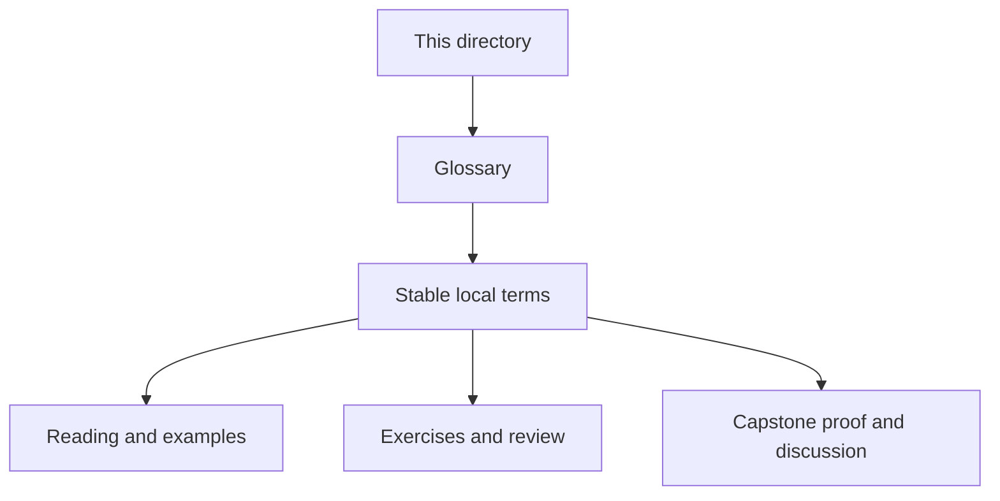
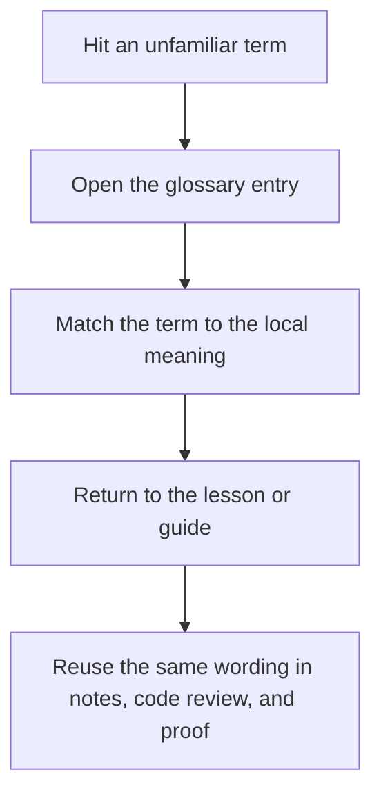

# Module Glossary

<!-- page-maps:start -->
## Glossary Fit

<!-- page-maps:end -->

This glossary belongs to **Module 03: Iterators, Laziness, and Streaming Dataflow** in **Python Functional Programming**. It keeps the language of this directory stable so the same ideas keep the same names across reading, practice, review, and capstone proof.

## How to use this glossary

Read the directory index first, then return here whenever a page, command, or review discussion starts to feel more vague than the course intends. The goal is stable language, not extra theory.

## Terms in this directory

| Term | Meaning in this directory |
| --- | --- |
| Chunking and Windowing | the module's treatment of chunking and windowing, used to make the module's main design claim concrete in design work, refactoring, and capstone evidence. |
| Custom Iterators | the module's treatment of custom iterators, used to make the module's main design claim concrete in design work, refactoring, and capstone evidence. |
| Fan-In and Fan-Out | the module's treatment of fan-in and fan-out, used to make the module's main design claim concrete in design work, refactoring, and capstone evidence. |
| Generators vs Comprehensions | the module's treatment of generators vs comprehensions, used to make the module's main design claim concrete in design work, refactoring, and capstone evidence. |
| Infinite Sequences Safely | the module's treatment of infinite sequences safely, used to make the module's main design claim concrete in design work, refactoring, and capstone evidence. |
| Iterator Lifecycle and Cleanup | the module's treatment of iterator lifecycle and cleanup, used to make the module's main design claim concrete in design work, refactoring, and capstone evidence. |
| Iterator Protocol and Generators | the module's treatment of iterator protocol and generators, used to make the module's main design claim concrete in design work, refactoring, and capstone evidence. |
| itertools Composition | the module's treatment of itertools composition, used to make the module's main design claim concrete in design work, refactoring, and capstone evidence. |
| Module 03 Refactoring Guide | the repair route for applying the module's main design claim to existing code without losing behavior, clarity, or proof. |
| Pipeline Stage Review and Reuse | the review surface that pressure-tests the module after the first read so you can check judgment, not just recall. |
| Reusable Pipeline Stages | the module's treatment of reusable pipeline stages, used to make the module's main design claim concrete in design work, refactoring, and capstone evidence. |
| Streaming Observability | the module's treatment of streaming observability, used to make the module's main design claim concrete in design work, refactoring, and capstone evidence. |
| Time-Aware Streaming | the module's treatment of time-aware streaming, used to make the module's main design claim concrete in design work, refactoring, and capstone evidence. |
