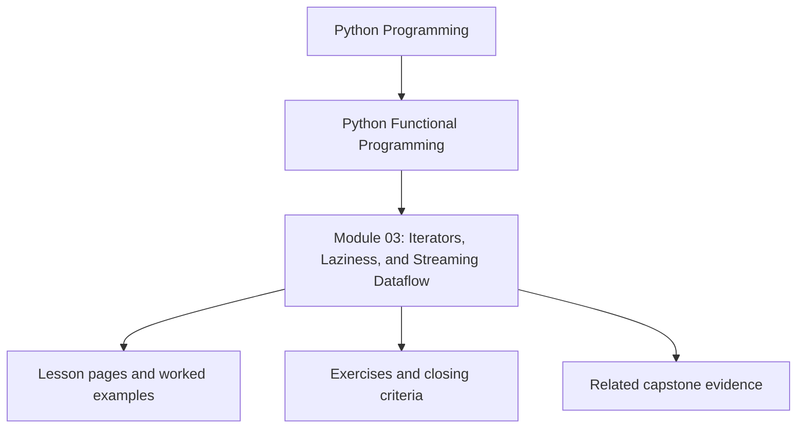
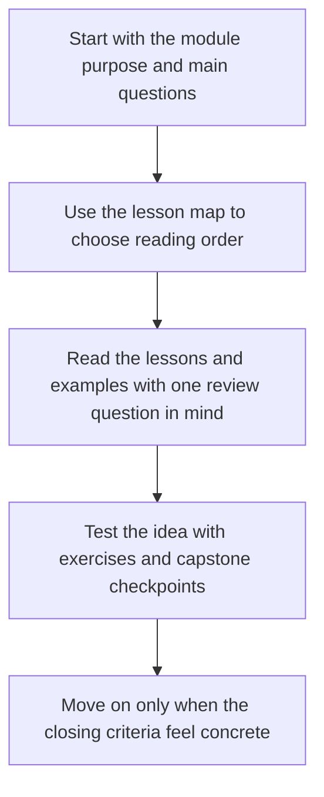

# Module 03: Iterators, Laziness, and Streaming Dataflow

<!-- page-maps:start -->
## Module Position

<!-- page-maps:end -->

Read the first diagram as a placement map: this page sits between the course promise, the lesson pages listed below, and the capstone surfaces that pressure-test the module. Read the second diagram as the study route for this page, so the diagrams point you toward the `Lesson map`, `Exercises`, and `Closing criteria` instead of acting like decoration.

## Keep These Pages Open

Use these support surfaces while reading so laziness stays tied to execution timing,
materialization, and proof instead of becoming stream vocabulary on its own:

- [First-Contact Map](../module-00-orientation/first-contact-map.md) for the full foundation route that ends here
- [Start Here](../guides/start-here.md) for the paced route through Modules 01 to 03
- [Proof Matrix](../guides/proof-matrix.md) for the smallest honest evidence route
- [Capstone Map](../capstone/capstone-map.md) for the streaming and tree-fold surfaces in FuncPipe

Carry this question into the module:

> When does work happen, where does materialization occur, and how can I make that timing visible enough to review?

This module makes streaming a first-class part of the course architecture. The learner
moves from pure transforms over finite collections to deliberate control over when work
happens, how much memory is used, and where materialization becomes a conscious choice.

## Learning outcomes

- how iterators and generators model on-demand dataflow in Python
- how `itertools` and custom iterators support reusable streaming stages
- how to reason about chunking, fan-in, fan-out, and bounded traversal
- how to add observability to lazy pipelines without destroying laziness

## Lesson map

- [Iterator Protocol and Generators](iterator-protocol-and-generators.md)
- [Generators vs Comprehensions](generators-vs-comprehensions.md)
- [itertools Composition](itertools-composition.md)
- [Chunking and Windowing](chunking-and-windowing.md)
- [Infinite Sequences Safely](infinite-sequences-safely.md)
- [Reusable Pipeline Stages](reusable-pipeline-stages.md)
- [Pipeline Stage Review and Reuse](pipeline-stage-review-and-reuse.md)
- [Fan-In and Fan-Out](fan-in-and-fan-out.md)
- [Time-Aware Streaming](time-aware-streaming.md)
- [Custom Iterators](custom-iterators.md)
- [Iterator Lifecycle and Cleanup](iterator-lifecycle-and-cleanup.md)
- [Streaming Observability](streaming-observability.md)
- [Refactoring Guide](refactoring-guide.md)

## Exercises

- Identify one place where laziness is valuable and one place where materialization is the honest choice, then justify both.
- Sketch a small chunking or windowing pipeline and explain what memory or ordering contract it relies on.
- Review one observability helper and state whether it preserves lazy behavior or forces hidden evaluation.

## Capstone checkpoints

- Identify where FuncPipe stays lazy and where it deliberately materializes.
- Inspect how streaming helpers preserve metadata instead of hiding it.
- Review whether observability helpers measure the pipeline without mutating its core behavior.

## Before moving on

You should be able to explain why laziness changes error handling, resource management,
and review strategy before the course introduces typed failures and resilience patterns.
Use [Refactoring Guide](refactoring-guide.md) and compare against
`capstone/_history/worktrees/module-03` before moving forward.

## Closing criteria

- You can explain when work happens in a pipeline instead of only what data moves through it.
- You can review a streaming helper and spot hidden materialization, cleanup leaks, or ordering surprises.
- You can justify the boundary between reusable lazy stages and explicit materialization.

## Directory glossary

Use [Glossary](glossary.md) when you want the recurring language in this module kept stable while you move between lessons, exercises, and capstone checkpoints.
