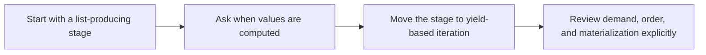

# Iterator Protocol and Generators


<!-- page-maps:start -->
## Lesson Map


<!-- page-maps:end -->

This lesson is where Module 03 really starts. You do not need a history lesson about iterators first. You need one clear question: when does the work happen? Once that question is visible, `yield`, `next`, and the iterator protocol stop feeling magical and start feeling like execution tools you can reason about.

## Start With the Timing Problem

Teams often write pure pipeline stages and still pay huge memory costs because every step finishes all its work before the next step begins. Make that hidden timing visible here.

- If a stage returns a list, the pipeline has already crossed a memory boundary.
- If the consumer only needs a prefix, eager production is doing more work than the result requires.
- If you cannot say when a value is computed, you do not yet understand the behavior you are reviewing.

## Keep This Question In View

> **Core question:**  
> How do you use `yield` and the iterator protocol (`__iter__` / `__next__`) to transform eager list-based transforms into lazy, memory-efficient generators that only compute on demand — and why does this unlock everything else in Module 3?

This lesson introduces iterator foundations in the way you actually need them:

- treat a pipeline stage as something that can produce values gradually instead of all at once
- use `yield` to make demand visible without changing the meaning of the transform
- preserve equivalence to the eager version while gaining control over timing and memory

The running FuncPipe examples matter because they show laziness as an explicit boundary choice, not a vague performance trick.

Use this when you have pure configurable pipelines but still materialize full collections, hit memory ceilings, or compute data that the caller never uses.

**Outcome:**
1. Spot eagerness in code and explain exactly how much memory it wastes.
2. Refactor a 10–20 line eager function to a lazy generator using `yield` in < 5 minutes.
3. Write a Hypothesis property proving equivalence (including shrinking) and exact bounded traversal.

**Text Slicing Policy:** Chunks are code-point slices; grapheme clusters may be split (same as Python’s native slicing).

---

## 1. Conceptual Foundation

### 1.1 The One-Sentence Rule

> **Write generator functions by default for any pipeline stage that produces a sequence: use `yield` to produce values lazily, only when pulled, and never build the full list unless you explicitly materialise at a boundary.**

### 1.2 Iterator Protocol in One Precise Sentence

> An iterator is any object that implements `__iter__` (returns itself) and `__next__` (returns the next value or raises `StopIteration`); generator functions are the idiomatic way to create them because `yield` automatically handles the protocol and resumable state.

### 1.3 Why This Matters Now

Module 02 showed how to make behavior explicit and configurable. This lesson shows how to make execution timing explicit too. A pipeline can be beautifully pure and still do unnecessary work if every stage insists on completing before the next one starts. Generators are the first tool that changes that execution model without abandoning functional clarity.

### 1.4 Generators as Lazy Values in 5 Lines

The next snippet matters because it shows the whole behavioral shift in a tiny example: defining the generator does not do the work, consuming it does.

```python
from collections.abc import Iterator

def lazy_range(n: int) -> Iterator[int]:
    i = 0
    while i < n:
        yield i
        i += 1

gen = lazy_range(10**9)          # ← Nothing computed yet! Zero memory allocated.
print(next(gen))                 # Only now does it compute the first value → 0
print(next(gen))                 # → 1 (state was preserved)
```

Because the function is resumable, the generator is effectively a lazy, single-use stream — exactly what we need for RAG pipelines.

---

## 2. Mental Model: Eager Lists vs Lazy Generators

### 2.1 One Picture

```text
Eager Lists (Materialize All)          Lazy Generators (On-Demand)
+---------------------------+          +------------------------------+
| docs → [clean(doc) for doc]          | docs → (clean(doc) for doc in docs)
|           ↓                          |           ↓
| full list in memory                  | yield only when next() is called
| always computes everything           | short-circuit with break/islice
+---------------------------+          +------------------------------+
   ↑ OOM on 100k+ docs                   ↑ Constant memory, stream-safe
```

### 2.2 Contract Table

| Aspect            | Eager Lists                     | Lazy Generators                     |
|-------------------|---------------------------------|-------------------------------------|
| Memory            | O(n) immediately                | O(1) until consumed                 |
| Computation       | All items upfront               | Only what is pulled                 |
| Short-circuit     | Impossible                      | Native (`break`, `islice`, `next`)  |
| Re-iterability    | Yes                             | No (single-use) — use `tee` if needed |
| Equivalence       | Trivial                         | Proven with Hypothesis (exact laws) |

**Note on Eager Choice:** Only for tiny, repeatedly accessed data (≤ 10 k items). Everything else → generator.

---

## 3. Running Project: Lazy Chunking in RAG

- **Dataset:** 10k arXiv CS abstracts (`arxiv_cs_abstracts_10k.csv`).
- **Goal:** Lazily clean → chunk → embed → dedup (dedup added later).
- **Start:** Eager list-based version.
- **End (this core):** Single-stage lazy chunking with tight, verified laws.

### 3.1 Types (Canonical, Used Throughout)

```python
from dataclasses import dataclass
from collections.abc import Iterator

@dataclass(frozen=True)
class CleanDoc:
    doc_id: str
    title: str
    abstract: str
    categories: str

@dataclass(frozen=True)
class ChunkWithoutEmbedding:
    doc_id: str
    text: str
    start: int
    end: int

@dataclass(frozen=True)
class RagEnv:
    chunk_size: int
```

### 3.2 Eager Start (Anti-Pattern + Reference)

```python
def chunk_doc(cd: CleanDoc, env: RagEnv) -> list[ChunkWithoutEmbedding]:
    """Eager reference implementation – used only for equivalence proofs."""
    text = cd.abstract
    step = env.chunk_size
    n = len(text)
    chunks: list[ChunkWithoutEmbedding] = []
    i = 0
    while i < n:
        j = min(i + step, n)
        segment = text[i:j]
        if segment:
            chunks.append(ChunkWithoutEmbedding(cd.doc_id, segment, i, j))
        i = j
    return chunks
```

**Smells:** Allocates the entire chunk list even if the caller only needs the first 10 chunks.

---

## 4. Refactor to Lazy: Generator Functions in RAG

### 4.1 Lazy Core – The One True Implementation

```python
from collections.abc import Iterator
from dataclasses import replace
import math

def gen_chunk_doc(cd: CleanDoc, env: RagEnv) -> Iterator[ChunkWithoutEmbedding]:
    """
    Tight laws (enforced exactly by Hypothesis):
      L1: list(gen_chunk_doc(cd, env)) == chunk_doc(cd, env)                  # equivalence
      L2: ∀c → c.end - c.start == len(c.text)                               # length invariant
      L3: ''.join(c.text for c in gen_chunk_doc(cd, env)) == cd.abstract   # perfect coverage
      L4: chunk.starts are strictly increasing                              # order invariant
      L5: cd.abstract.__getitem__ called exactly
          (len(cd.abstract) + step - 1) // step times                       # exact bounded traversal

    """
    step = env.chunk_size
    if not isinstance(step, int) or step < 1:
        raise ValueError(f"chunk_size must be positive integer (got {step!r})")
    
    text = cd.abstract
    n = len(text)
    i = 0
    while i < n:
        j = min(i + step, n)
        segment = text[i:j]
        if segment:
            yield ChunkWithoutEmbedding(cd.doc_id, segment, i, j)
        i = j

# Preferred zero-copy variant (downstream decides when to materialise text)
def gen_chunk_spans(cd: CleanDoc, env: RagEnv) -> Iterator[tuple[int, int]]:
    """
    Same preconditions and laws L1–L5 as gen_chunk_doc, except:
      - Yields (start, end) offsets only
      - Law L1 becomes: [cd.abstract[i:j] for i,j in gen_chunk_spans(...)] == [c.text for c in gen_chunk_doc(...)]
    """
    step = env.chunk_size
    if not isinstance(step, int) or step < 1:
        raise ValueError(f"chunk_size must be positive integer (got {step!r})")
    
    text = cd.abstract
    n = len(text)
    i = 0
    while i < n:
        j = min(i + step, n)
        if i < j:                                   # only yield non-empty spans
            yield (i, j)
        i = j
```

**Wins:**  
- Constant memory regardless of document size.  
- Short-circuitable: `next(gen)` computes only one chunk.  
- Proven equivalent to eager version via Hypothesis with exact bounds.

**Re-iterability Warning (once per module):**  
Generators are single-use. Never iterate twice. Safe patterns:

```python
# Bounded prefix tap
from itertools import islice, chain
def tap_prefix(it, n, hook):
    head = tuple(islice(it, n))
    hook(head)
    return chain(head, it)

# Unbounded parallel (use sparingly)
from itertools import tee
a, b = tee(it, 2)   # memory = lag between consumers
```

---

## 5. Equational Reasoning: Substitution Exercise

```text
gen_chunk_doc(cd, env)
≡ iterator that yields ChunkWithoutEmbedding(...) in exact chunk_doc order
≡ list(gen_chunk_doc(cd, env)) == chunk_doc(cd, env)    # L1, proven exactly
```

Because the generator is pure and deterministic, `list(gen_chunk_doc(cd, env))` is substitutable for the old eager list — equational reasoning holds perfectly.

---

## 6. Property-Based Testing: Proving Equivalence & Laws

### 6.1 Custom Strategy + Helpers

```python
import hypothesis.strategies as st
from dataclasses import replace

class CountingStr(str):
    def __new__(cls, value):
        obj = super().__new__(cls, value)
        obj.calls = 0
        return obj
    def __getitem__(self, key):
        self.calls += 1
        return super().__getitem__(key)

clean_doc_st = st.builds(
    CleanDoc,
    doc_id=st.text(min_size=1, max_size=20),
    title=st.text(max_size=100),
    abstract=st.text(max_size=10_000),    # stress real slicing
    categories=st.text(max_size=50),
)
env_st = st.builds(RagEnv, chunk_size=st.integers(1, 2048))
```

### 6.2 Full Suite (All Laws Enforced Exactly)

```python
from hypothesis import given

@given(clean_doc_st, env_st)
def test_equivalence(cd, env):
    assert list(gen_chunk_doc(cd, env)) == chunk_doc(cd, env)

@given(clean_doc_st, env_st)
def test_laws_l2_l3_l4(cd, env):
    chunks = list(gen_chunk_doc(cd, env))
    assert "".join(c.text for c in chunks) == cd.abstract                    # L3
    for c in chunks:
        assert c.end - c.start == len(c.text)                                # L2
    starts = [c.start for c in chunks]
    assert starts == sorted(starts) and len(starts) == len(set(starts))     # L4: strictly increasing

@given(clean_doc_st, env_st)
def test_exact_bounded_traversal(cd, env):
    text = CountingStr(cd.abstract)
    cd = replace(cd, abstract=text)
    list(gen_chunk_doc(cd, env))                                             # consume
    expected = (len(text) + env.chunk_size - 1) // env.chunk_size
    assert text.calls == expected                                            # L5 exact

@given(clean_doc_st, env_st)
def test_spans_equivalence_and_l2(cd, env):
    spans = list(gen_chunk_spans(cd, env))
    chunks = list(gen_chunk_doc(cd, env))
    assert len(spans) == len(chunks)
    for (i, j), c in zip(spans, chunks):
        assert c.text == cd.abstract[i:j]
        assert j - i == len(c.text)
```

### 6.3 Shrinking Demo: Catching a Real Bug

Bad version (yields empty chunks when length % step == 0):

```python
def bad_gen_chunk_doc(cd: CleanDoc, env: RagEnv):
    i = 0
    text = cd.abstract
    while i <= len(text):                    # wrong condition
        segment = text[i:i + env.chunk_size]
        yield ChunkWithoutEmbedding(cd.doc_id, segment, i, i + len(segment))
        i += env.chunk_size
```

Property fails and shrinks to:

```
Falsifying example:
cd=CleanDoc(doc_id='a', abstract='aaaa', categories=''),
env=RagEnv(chunk_size=4)
```

→ Bad version yields final empty chunk; Hypothesis finds it in < 0.1 s.

---

## 7. When Laziness Isn’t Worth It

Only for:
- Tiny sequences you will definitely iterate multiple times.
- When you need random access (use list).

Everything else → generator.

---

## 8. Pre-Core Quiz

1. `list(gen()) == eager()` always? → **Yes, by exact law L1.**  
2. `next(gen)` computes everything? → **No — only one item.**  
3. Can you iterate a generator twice? → **No — single-use.**  
4. How to safely peek at first 10 items? → `tap_prefix` or `islice` + `chain`.  
5. Global inside generator? → **Breaks purity — isolate or inject explicitly.**

## 9. Post-Core Reflection & Exercise

**Reflect:** Find one list comprehension in your codebase that builds > 10 k items. Refactor to generator. Add the exact equivalence + bounded-traversal properties.

**Project Exercise:** Run the lazy chunker on the full 10k arXiv dataset. Measure peak memory (should be ~10–20 MB instead of 500+ MB eager).

**Continue with:** [Generators vs Comprehensions](../module-03-iterators-laziness-streaming-dataflow/generators-vs-comprehensions.md)

You now own the single most important primitive in all of Module 3. Everything else is just composing these lazy streams.
