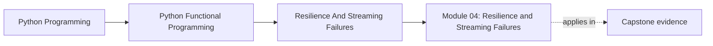
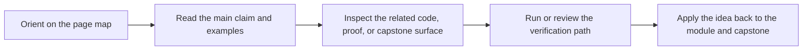

# Module 04: Resilience and Streaming Failures

<!-- page-maps:start -->
## Page Maps

<!-- page-maps:end -->

This module turns lazy pipelines into production-minded pipelines. Once computation is
streaming, failures, retries, cleanup, and error aggregation can no longer be treated as
afterthoughts.

## What this module teaches

- how to turn recursion and reductions into explicit, reviewable pipeline behavior
- how to model record-level failures without collapsing whole streams
- how to choose between fail-fast and accumulate-many error strategies
- how to keep retries and resource cleanup explicit in streaming code

## Lesson map

- [Structural Recursion and Iteration](structural-recursion-and-iteration.md)
- [Folds and Reductions](folds-and-reductions.md)
- [Memoization](memoization.md)
- [Result and Option Failures](result-and-option-failures.md)
- [Streaming Error Handling](streaming-error-handling.md)
- [Error Aggregation](error-aggregation.md)
- [Circuit Breakers](circuit-breakers.md)
- [Resource-Aware Streams](resource-aware-streams.md)
- [Functional Retries](functional-retries.md)
- [Structured Error Reports](structured-error-reports.md)
- [Refactoring Guide](refactoring-guide.md)

## Capstone checkpoints

- Inspect how per-record failures become data rather than hidden exceptions.
- Review where retries are policy decisions instead of ad hoc loops.
- Verify that early termination still releases resources cleanly.

## Before moving on

You should be able to explain which failures belong in the stream, which should stop the
pipeline, and what evidence proves that cleanup still happens under both paths. Use
[Refactoring Guide](refactoring-guide.md) and compare against
`capstone/_history/worktrees/module-04` before moving forward.
