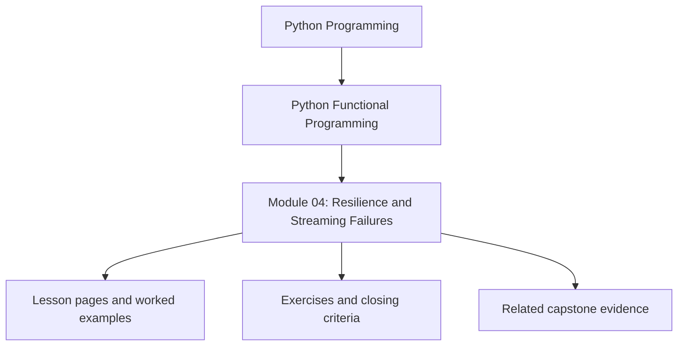
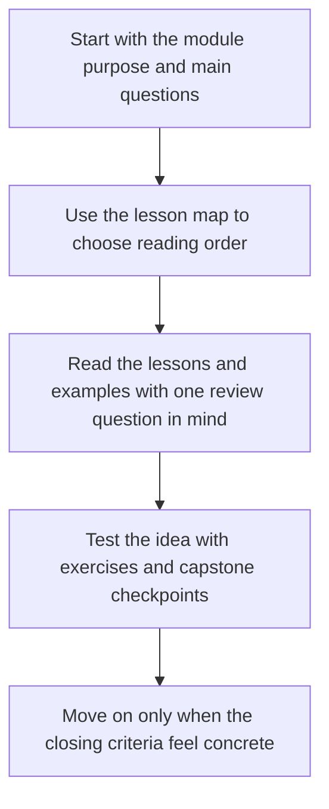

# Module 04: Resilience and Streaming Failures

<!-- page-maps:start -->
## Module Position

<!-- page-maps:end -->

Read the first diagram as a placement map: this page sits between the course promise, the lesson pages listed below, and the capstone surfaces that pressure-test the module. Read the second diagram as the study route for this page, so the diagrams point you toward the `Lesson map`, `Exercises`, and `Closing criteria` instead of acting like decoration.

This module turns lazy pipelines into production-minded pipelines. Once computation is
streaming, failures, retries, cleanup, and error aggregation can no longer be treated as
afterthoughts.

## Learning outcomes

- how to turn recursion and reductions into explicit, reviewable pipeline behavior
- how to model record-level failures without collapsing whole streams
- how to choose between fail-fast and accumulate-many error strategies
- how to keep retries and resource cleanup explicit in streaming code

## Lesson map

- [Structural Recursion and Iteration](structural-recursion-and-iteration.md)
- [Folds and Reductions](folds-and-reductions.md)
- [Memoization](memoization.md)
- [Result and Option Failures](result-and-option-failures.md)
- [Streaming Error Handling](streaming-error-handling.md)
- [Error Aggregation](error-aggregation.md)
- [Circuit Breakers](circuit-breakers.md)
- [Resource-Aware Streams](resource-aware-streams.md)
- [Functional Retries](functional-retries.md)
- [Structured Error Reports](structured-error-reports.md)
- [Refactoring Guide](refactoring-guide.md)

## Exercises

- Classify one failure path as stream-local, pipeline-fatal, or retryable, then justify the classification.
- Compare a fail-fast and accumulate-many design for the same input set and explain which evidence each path should emit.
- Trace one cleanup path and state what proof would show that resources are released under early termination.

## Capstone checkpoints

- Inspect how per-record failures become data rather than hidden exceptions.
- Review where retries are policy decisions instead of ad hoc loops.
- Verify that early termination still releases resources cleanly.

## Before moving on

You should be able to explain which failures belong in the stream, which should stop the
pipeline, and what evidence proves that cleanup still happens under both paths. Use
[Refactoring Guide](refactoring-guide.md) and compare against
`capstone/_history/worktrees/module-04` before moving forward.

## Closing criteria

- You can defend an error strategy in terms of stream semantics, not personal preference.
- You can point to where retries, circuit breaking, and cleanup are encoded as policy instead of scattered control flow.
- You can review resilience code and explain what evidence proves it under both success and failure.
