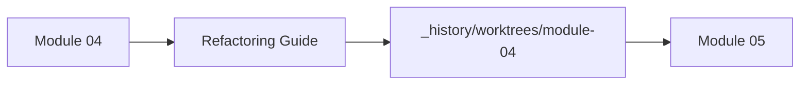
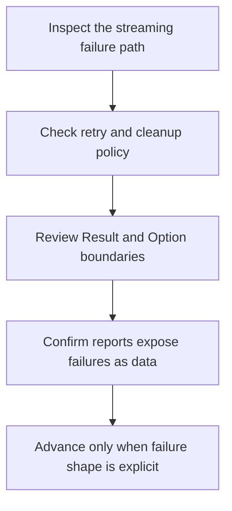

# Module 04 Refactoring Guide

<!-- page-maps:start -->
## Page Maps

<!-- page-maps:end -->

This guide closes Module 04. The goal is to leave the module knowing how a streaming
pipeline fails, retries, and cleans up without making those choices invisible.

## Stable comparison route

1. run `make PROGRAM=python-programming/python-functional-programming history-refresh`
2. open `capstone/_history/worktrees/module-04/src/funcpipe_rag/`
3. compare `result.py`, `policies/`, and the streaming helpers
4. read `capstone/_history/worktrees/module-04/tests/test_result_option.py`, `test_retries.py`, and `test_resources.py`

## What to refactor toward

- failures represented as values instead of hidden exceptions
- retry and cleanup rules expressed as policy, not scattered loops
- stream-level error handling that preserves evidence for each record
- reports that help a reviewer see what failed and why

## Exit standard

Before Module 05, you should be able to name which failures travel in the stream, which
stop the pipeline, and what code proves that cleanup still happens.
