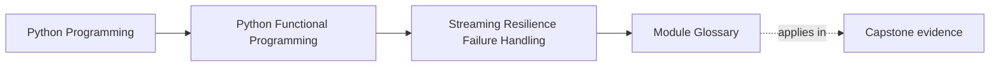
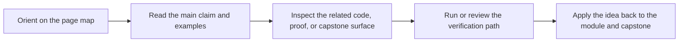

# Module Glossary

<!-- page-maps:start -->
## Page Maps

<!-- page-maps:end -->

This glossary belongs to **Module 04: Streaming Resilience and Failure Handling** in **Python Functional Programming**. It keeps the language of this directory stable so the same ideas keep the same names across reading, practice, review, and capstone proof.

## How to use this glossary

Read the directory index first, then return here whenever a page, command, or review discussion starts to feel more vague than the course intends. The goal is stable language, not extra theory.

## Terms in this directory

| Term | Meaning in this directory |
| --- | --- |
| Circuit Breakers | the module's treatment of circuit breakers, used to make the module's main design claim concrete in design work, refactoring, and capstone evidence. |
| Error Aggregation | the module's treatment of error aggregation, used to make the module's main design claim concrete in design work, refactoring, and capstone evidence. |
| Folds and Reductions | the module's treatment of folds and reductions, used to make the module's main design claim concrete in design work, refactoring, and capstone evidence. |
| Functional Retries | the module's treatment of functional retries, used to make the module's main design claim concrete in design work, refactoring, and capstone evidence. |
| Memoization | the module's treatment of memoization, used to make the module's main design claim concrete in design work, refactoring, and capstone evidence. |
| Module 04 Refactoring Guide | the repair route for applying the module's main design claim to existing code without losing behavior, clarity, or proof. |
| Resource-Aware Streams | the module's treatment of resource-aware streams, used to make the module's main design claim concrete in design work, refactoring, and capstone evidence. |
| Result and Option Failures | the module's treatment of result and option failures, used to make the module's main design claim concrete in design work, refactoring, and capstone evidence. |
| Streaming Error Handling | the module's treatment of streaming error handling, used to make the module's main design claim concrete in design work, refactoring, and capstone evidence. |
| Structural Recursion and Iteration | the module's treatment of structural recursion and iteration, used to make the module's main design claim concrete in design work, refactoring, and capstone evidence. |
| Structured Error Reports | the module's treatment of structured error reports, used to make the module's main design claim concrete in design work, refactoring, and capstone evidence. |
