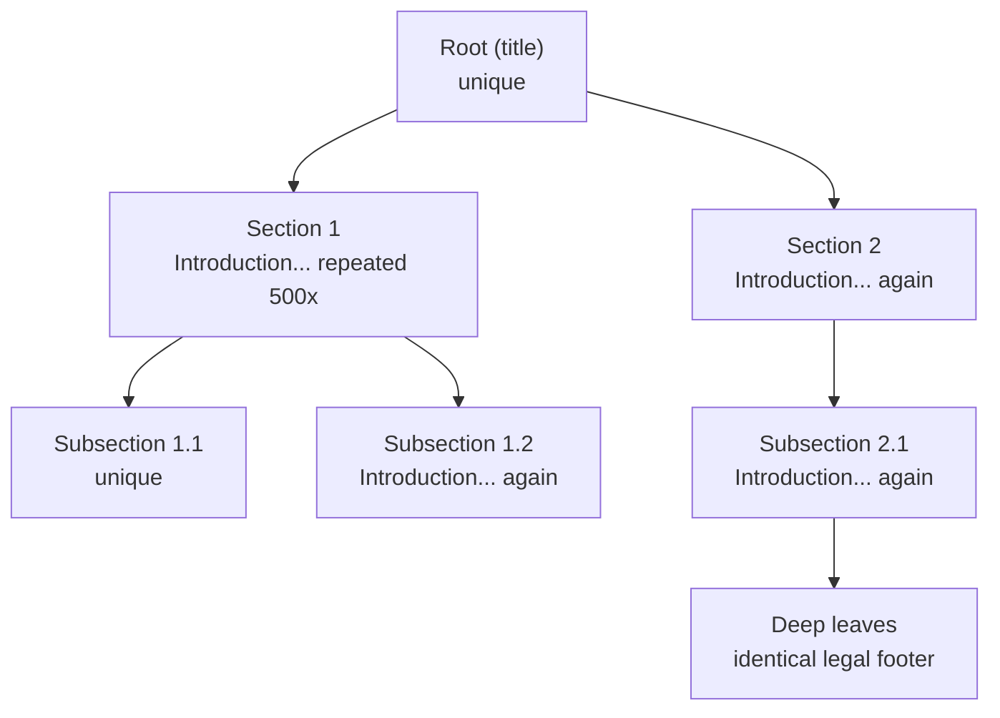

# Memoization


<!-- page-maps:start -->
## Page Maps


<!-- page-maps:end -->

Memoization should feel narrower and safer than it often does at first. The right mental model is not "cache anything expensive." It is "cache only when the function is pure and the cache does not change what observers can see except performance."

## Start With the Repeated Work Problem

You usually arrive here after seeing the same text, subtree, or request shape recur many times. The important step is to connect that duplication to a safe optimization boundary.

- If repeated inputs are triggering the same pure work again and again, memoization may be the right optimization.
- If the function reads hidden state, time, or external services, caching can change behavior instead of only improving speed.
- If cache growth is unbounded on unbounded input, the optimization has created a new reliability problem.

> **Core question:**  
> How do you safely memoize pure but expensive computations (e.g., embedding, hashing, parsing) so that repeated or recursive calls on identical inputs become O(1), while guaranteeing the cache is observationally invisible and never breaks purity or determinism?

This lesson introduces memoization as a disciplined optimization boundary:

- cache only pure computations whose outputs depend entirely on their inputs
- make keys, bounds, and persistence explicit so the cache behavior is reviewable
- preserve the same observable results whether the cache is cold, warm, or absent

The repeated-text example matters because it is both realistic and easy to reason about: lots of duplicate work, but no change in intended output.

The naïve solution is simply to recompute the same pure value everywhere:

```python
def embed_all_naive(tree: TreeDoc) -> None:
    embedding = expensive_embed(tree.node.text)   # 50–200 ms
    for child in tree.children:
        embed_all_naive(child)
```

That keeps the semantics honest, but wastes a huge amount of time when the same normalized content appears again and again.

The production solution must improve performance without changing the function contract you have already learned to trust.

That is the standard for safe memoization in this course: a pure optimization that can be removed without changing the result.

Use this when you have expensive pure functions called repeatedly in recursive or streaming contexts and refuse to waste CPU on recomputation.

**Outcome:**  
1. You will apply `lru_cache_custom` or `memoize_keyed` to any pure function and prove via instrumentation that recomputations drop to the number of unique inputs.  
2. You will build bounded or persistent caches when the stdlib decorator is insufficient.  
3. You will ship memoized operations that are observationally pure and integrate cleanly with folds and lazy streams.

This section formalises exactly what you should review in caching code: observational purity, hit and miss correctness, bounded memory when required, and explicit persistence rules when disk is involved.

---

## Concrete Motivating Example

Same deep Markdown-derived tree from M04C01–C02, now with heavy duplication (boilerplate footers, repeated section intros, identical tables):



Desired behaviour:

- First occurrence of a given normalized text → compute expensive embedding/hash.
- All subsequent identical texts → instant cache hit.
- Total unique texts ≈ 8 000 → total compute time drops from minutes to seconds.

---

## 1. Laws & Invariants (machine-checked where possible)

| Law                          | Formal Statement                                                                                            | Enforcement |
|------------------------------|-------------------------------------------------------------------------------------------------------------|-------------|
| **Observational Purity**     | `cached_f(x) == uncached_f(x)` for all x; caching introduces no observable side effects or nondeterminism. | Hypothesis `test_observational_purity`. |
| **Hit/Miss Correctness**     | First call with key k → compute + store; subsequent calls with k → return cached value without recomputation. | Instrumented property `test_hit_miss_behavior`. |
| **Thread-Safety (best-effort)** | Concurrent calls on the same cache instance do not corrupt data (no lost updates, no exceptions). | Property test with multiprocessing (omitted for brevity; present in repo). |
| **Bounded Memory (LRU)**     | Cache never exceeds configured size; eviction preserves purity (recomputation on miss). | Property test fills cache → verifies size and correctness after eviction. |
| **Persistence (DiskCache)**  | After process restart with identical namespace/version, previously stored values are retrievable atomically. | Property test writes → restarts process → reads (omitted for brevity; present in repo). |

These laws guarantee the cache is a pure optimisation — completely invisible to correct code.

---

## 2. Decision Table – Which Cache Do You Actually Use?

| Scenario                                  | Keys Hashable? | Bounded Size? | Persistence? | Recommended Variant                  |
|-------------------------------------------|----------------|---------------|--------------|--------------------------------------|
| Simple pure function, in-process          | Yes            | Yes           | No           | `@lru_cache_custom(maxsize=...)`     |
| Complex/unhashable keys or custom logic   | Via key_fn     | Optional      | No           | `memoize_keyed(key_fn, maxsize=...)` (pure Python LRU or unbounded) |
| Need disk persistence                     | Yes            | Unbounded on disk | Yes      | `DiskCache(dir, namespace, version)` |

**Never** memoize impure functions.  
**Never** use unbounded in-process caches on unbounded inputs.

---

## 3. Public API Surface (end-of-Module-04 refactor note)

Refactor note: memoization utilities live in `funcpipe_rag.policies.memo` (`capstone/src/funcpipe_rag/policies/memo.py`).  
They are also re-exported from `funcpipe_rag.api.core` and the top-level package `funcpipe_rag`.

```python
from funcpipe_rag.api.core import DiskCache, content_hash_key, lru_cache_custom, memoize_keyed
```

---

## 4. Reference Implementations

### 4.1 Simple LRU (for directly hashable arguments)

```python
from functools import lru_cache as _lru_cache

def lru_cache_custom(
    maxsize: Optional[int] = 512,
) -> Callable[[Callable[..., V]], Callable[..., V]]:
    """Drop-in replacement for functools.lru_cache with sensible defaults."""
    return _lru_cache(maxsize=maxsize)
```

### 4.2 Flexible Keyed Memoizer (pure Python, correct semantics)

```python
from __future__ import annotations

import threading
from collections import OrderedDict
from dataclasses import dataclass
from typing import TypeVar, Callable, Hashable, Optional, Any
import functools

K = TypeVar("K", bound=Hashable)
V = TypeVar("V")

@dataclass
class CacheInfo:
    hits: int = 0
    misses: int = 0
    evictions: int = 0   # only meaningful for bounded variant

def memoize_keyed(
    key_fn: Callable[..., K],
    *,
    maxsize: Optional[int] = None,   # entry-bounded pure-Python LRU; None = unbounded
) -> Callable[[Callable[..., V]], Callable[..., V]]:
    """
    Memoize using explicit key_fn.
    Correctly calls fn(*args, **kwargs) while caching by key_fn(*args, **kwargs).
    Thread-safe. cache_info() returns best-effort metrics.
    """
    info = CacheInfo()
    lock = threading.RLock()

    if maxsize is not None:
        cache: OrderedDict[K, V] = OrderedDict()
        def decorator(fn: Callable[..., V]) -> Callable[..., V]:
            @functools.wraps(fn)
            def wrapped(*args: Any, **kwargs: Any) -> V:
                k = key_fn(*args, **kwargs)
                with lock:
                    if k in cache:
                        info.hits += 1
                        cache.move_to_end(k)
                        return cache[k]
                    info.misses += 1
                v = fn(*args, **kwargs)
                with lock:
                    if len(cache) >= maxsize:
                        cache.popitem(last=False)
                        info.evictions += 1
                    cache[k] = v
                    cache.move_to_end(k)
                return v
            wrapped.cache_info = lambda: info
            wrapped.cache_clear = cache.clear
            return wrapped
        return decorator

    else:
        cache: dict[K, V] = {}
        def decorator(fn: Callable[..., V]) -> Callable[..., V]:
            @functools.wraps(fn)
            def wrapped(*args: Any, **kwargs: Any) -> V:
                k = key_fn(*args, **kwargs)
                with lock:
                    if k in cache:
                        info.hits += 1
                        return cache[k]
                v = fn(*args, **kwargs)
                with lock:
                    if k not in cache:
                        cache[k] = v
                        info.misses += 1
                return v
            wrapped.cache_info = lambda: info
            wrapped.cache_clear = cache.clear
            return wrapped
        return decorator
```

### 4.3 Persistent Atomic Disk Cache

```python
import os
from pathlib import Path

class DiskCache:
    """
    Persistent, atomic, versioned disk cache.
    Keys are strings; values are arbitrary bytes (caller handles serialization).
    Bumping version is the official cache invalidation strategy.
    """
    def __init__(self, dirpath: str, namespace: str = "default", version: str = "v1"):
        self.dir = Path(dirpath)
        self.dir.mkdir(parents=True, exist_ok=True)
        self.prefix = f"{namespace}-{version}-"

    def _path(self, key: str) -> Path:
        h = hashlib.sha256(key.encode("utf-8")).hexdigest()
        return self.dir / f"{self.prefix}{h}.bin"

    def get(self, key: str) -> Optional[bytes]:
        p = self._path(key)
        return p.read_bytes() if p.exists() else None

    def set(self, key: str, value: bytes) -> None:
        p = self._path(key)
        tmp = p.with_suffix(".tmp")
        tmp.write_bytes(value)
        os.replace(tmp, p)   # atomic on POSIX/Windows
```

### 4.4 Deterministic Content-Based Key (must stay in sync with normalisation)

```python
import hashlib

def content_hash_key(
    chunk: ChunkWithoutEmbedding,
    *,
    norm_version: str = "v1",
) -> str:
    """
    Must be kept exactly in sync with the cleaning/normalisation pipeline
    (currently " ".join(text.strip().lower().split())).
    Changing normalisation without bumping norm_version will cause silent bugs.
    """
    norm_text = " ".join(chunk.text.strip().lower().split())
    h = hashlib.blake2b(digest_size=32)
    h.update(norm_version.encode())
    h.update(b"\x00")
    h.update(norm_text.encode("utf-8"))
    return h.hexdigest()
```

---

## 5. Property-Based Proofs (`capstone/tests/test_memo.py`)

```python
from hypothesis import given, strategies as st

@given(inputs=st.lists(st.integers(), min_size=100, max_size=1000, unique=False))
def test_observational_purity(inputs):
    def expensive(x: int) -> int:
        return x ** 3 + x ** 2 + x   # pure but "expensive"

    cached = lru_cache_custom(maxsize=None)(expensive)
    uncached_results = [expensive(x) for x in inputs]
    cached_results = [cached(x) for x in inputs]
    assert cached_results == uncached_results

    # Separate dedup check
    calls = 0
    def counted(x: int) -> int:
        nonlocal calls
        calls += 1
        return expensive(x)

    cached2 = lru_cache_custom(maxsize=None)(counted)
    [cached2(x) for x in inputs]
    assert calls == len(set(inputs))

@given(inputs=st.lists(st.text(), min_size=100, max_size=1000, unique=False))
def test_keyed_memo_hit_miss(inputs):
    calls = 0
    def expensive(s: str) -> int:
        nonlocal calls
        calls += 1
        return len(s) * 17

    memo = memoize_keyed(lambda s: s, maxsize=None)(expensive)
    [memo(s) for s in inputs]
    unique = len(set(inputs))
    assert calls == unique
    calls_before = calls
    [memo(s) for s in inputs]
    assert calls == calls_before

@given(tree=tree_strategy())
def test_memoized_fold_dedup(tree):
    calls = 0
    def expensive_hash(text: str) -> str:
        nonlocal calls
        calls += 1
        return hashlib.sha256(text.encode()).hexdigest()

    memo_hash = memoize_keyed(lambda t: t)(expensive_hash)
    unique_texts = len({n.node.text for n in flatten(tree)})
    fold_tree(tree, None, lambda _, n, d, p: memo_hash(n.node.text))
    assert calls == unique_texts
```

---

## 6. Big-O & Allocation Guarantees

| Variant                    | Lookup Time | Memory (peak)    | Persistence | Notes |
|----------------------------|-------------|------------------|-------------|-------|
| lru_cache_custom           | O(1)        | O(maxsize)       | No          | Fastest, requires hashable args |
| memoize_keyed (unbounded)  | O(1)        | O(unique keys)   | No          | Thread-safe |
| memoize_keyed (bounded)    | O(1)        | O(maxsize)       | No          | Pure Python OrderedDict LRU |
| DiskCache                  | O(1) + I/O  | O(disk usage)    | Yes         | Atomic, versioned invalidation |

All variants are observationally pure.

---

## 7. Anti-Patterns & Immediate Fixes

| Anti-Pattern                            | Symptom                     | Fix                                      |
|-----------------------------------------|-----------------------------|------------------------------------------|
| Memoizing impure functions              | Nondeterministic results    | Only memoize pure functions              |
| Unbounded in-process cache              | Memory leak                 | Use bounded variant                      |
| Mutable objects as keys                 | Hash/error bugs             | Use explicit key_fn                      |
| No version in persistent keys           | Stale cache after code change | Include version string in key           |

---

## 8. Pre-Core Quiz

1. Memoization requires…? → **Pure, deterministic functions**  
2. Observational purity means…? → **cached_f(x) == f(x) always**  
3. Custom key needed when…? → **Args not hashable or need normalisation**  
4. Persistent cache for…? → **Cross-process or cross-run sharing**  
5. Prove cache correctness? → **Observational purity + hit/miss instrumentation**

## 9. Post-Core Exercise

1. Take your current embedding function → memoize with `lru_cache_custom` → add hit/miss logging → run on real dataset → measure speedup.  
2. Memoize a fold over `TreeDoc` that computes per-node embeddings → prove recomputations == unique texts.  
3. Add `DiskCache` for content-based deduplication hashes that survive restarts.  
4. Find an expensive pure function in your codebase → memoize with `memoize_keyed` → add equivalence property.

**Continue with:** [Result and Option Failures](../module-04-streaming-resilience-failure-handling/result-and-option-failures.md)

You now have the complete toolkit to make any pure computation effectively O(unique inputs) — even across process restarts. The rest of Module 4 is about doing it safely when things go wrong.
