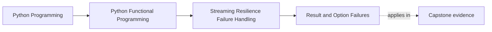
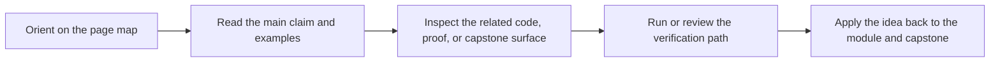
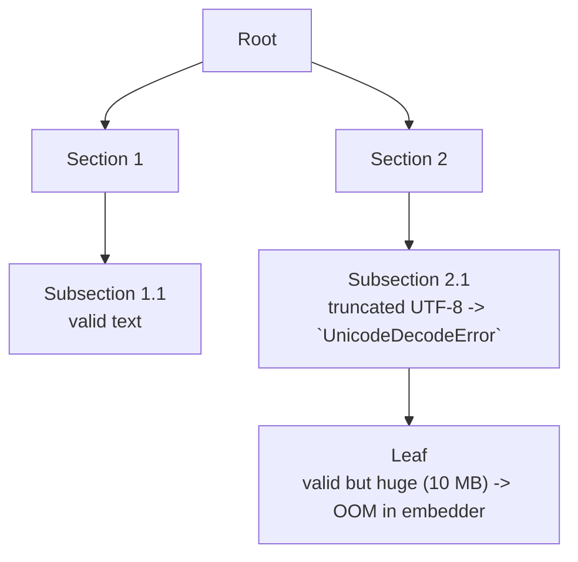

# Result and Option Failures


<!-- page-maps:start -->
## Page Maps




<!-- page-maps:end -->

This lesson is where failure handling becomes a data-modeling problem instead of a control-flow habit. Keep a sharp distinction in mind: `Option` is for absence without explanation, `Result` is for failure with information that matters later.

## Start With the Failure Boundary

Before this lesson, bad items often appear as raised exceptions, skipped records, or vague `None` values. The page needs to make those tradeoffs explicit instead of letting them blur together.

- If a value may simply be missing and no further explanation is needed, `Option` is usually enough.
- If later stages need cause, path, or stage metadata, you need `Result` rather than a silent absence.
- If exceptions are still being used for ordinary per-record control flow, the stream contract is too implicit to compose safely.

> **Core question:**  
> How do you turn per-record failures (bad text, parsing errors, embedding crashes) into ordinary values so that a lazy streaming pipeline can continue processing the good records while faithfully collecting every error for later analysis?

This lesson introduces `Option` and `Result` as explicit failure containers in streams:

- use `Option` when the story is only "present or absent"
- use `Result` when the story includes structured reasons and provenance
- keep good records flowing while turning bad records into values that later stages can inspect, route, or aggregate

The motivating chunk failures matter because they show why real pipelines overwhelmingly need `Result`: the reason and location of failure are part of the downstream work.

The naïve solution is try/except around every operation:

```python
def embed_all_naive(chunks):
    results = []
    for c in chunks:
        try:
            results.append(embed_chunk(c))
        except Exception as e:
            log.error(f"Failed on chunk {c.doc_id}: {e}")
            # …and what now? Skip? Crash? Continue?
    return results
```

This is the failure-handling trap the lesson needs to eliminate: halting unexpectedly, dropping records silently, and scattering provenance across log messages instead of values.

The production solution treats success and failure as ordinary values so the pipeline can keep the same streaming shape it had before errors were introduced.

Use this when you process real-world messy data and refuse to lose records or halt pipelines just because one item is bad.

**Outcome:**  
1. You will model any per-item failure as `Result` or `Option` and prove via Hypothesis that the typed pipeline is equivalent to try/except but never loses data.  
2. You will compose `.map()`, `.bind()`, `.recover()`, and streaming combinators to handle mixed good/bad streams elegantly.  
3. You will ship a RAG pipeline that processes 99 % of chunks even when 1 % fail, collecting rich structured errors for reporting.

This section formalises exactly what you should be able to defend here: lawful mapping and binding, bounded work, faithful equivalence to wrapped try/except behavior, and complete containment of per-record failures.

---

## Concrete Motivating Example

Same deep `TreeDoc` from previous cores, but now some nodes contain malformed text:



Desired behaviour in a lazy stream:

```python
chunks: Iterator[ChunkWithoutEmbedding] = flatten(tree)
embedded: Iterator[Result[Chunk, ErrInfo]] = map_result_iter(safe_embed, chunks)
```

- Valid chunks → `Ok(Chunk(...))`
- Malformed chunk → `Err(ErrInfo(code="UNICODE", path=(1,0), cause=...))`
- Huge chunk → `Err(ErrInfo(code="OOM", path=(1,0,0), ...))`

The stream continues flowing; nothing is lost; errors are collected with full provenance (tree path!).

---

## Option vs Result – When to Use Which?

| Situation                              | Use Option                          | Use Result                                      |
|----------------------------------------|-------------------------------------|-------------------------------------------------|
| Value may be absent, no reason needed  | `Option[T]` (Some / Nothing)        | –                                               |
| Failure has a reason / structured info | –                                   | `Result[T, ErrInfo]` (Ok / Err)                 |
| You need to recover or chain           | `bind` works, but limited           | `bind` + `recover` + `map_err` for rich handling|
| Simplicity matters                     | Prefer Option                       | Use Result only when error details are useful   |

In RAG we overwhelmingly reach for `Result` because we want full provenance (tree path, stage, cause) for every failure.

**Small Option example (presence/absence):**

```python
def find_legal_footer(chunk: ChunkWithoutEmbedding) -> Option[str]:
    if LEGAL_FOOTER in chunk.text:
        return Some(LEGAL_FOOTER)
    return Nothing()
```

---

## 1. Laws & Invariants (machine-checked)

| Law                          | Formal Statement                                                                                            | Enforcement |
|------------------------------|-------------------------------------------------------------------------------------------------------------|-------------|
| **Functor**                  | `map(id, r) == r` <br> `map(f ∘ g, r) == map(f, map(g, r))` <br> Same for Option.                        | `test_result_functor_laws`, `test_option_functor_laws` |
| **Monad**                    | Left identity: `bind(unit, r) == r` <br> Right identity: `bind(f, unit(x)) == f(x)` <br> Associativity: `bind(g, bind(f, r)) == bind(lambda x: bind(g, f(x)), r)` | `test_result_monad_laws`, `test_option_monad_laws` |
| **Observational Equivalence**| Typed pipeline with `safe_op` produces same successful outputs as try/except version (errors differ in form but are present). | `test_safe_vs_try_except_equivalence` |
| **Bounded-Work**             | `list(islice(map_result_iter(op, xs), k))` performs exactly k applications of `op`.                    | `test_result_stream_bounded_work` |
| **Error Containment**        | No exception escapes a properly wrapped operation; every failure becomes an `Err`.                     | `test_error_containment_no_leak` |

These laws are directly verified by the Hypothesis suite below.

---

## 2. Decision Table – Result vs Option vs Exceptions

| Scenario                               | Recommended Approach                          | Why |
|----------------------------------------|-----------------------------------------------|-----|
| Optional field (may be missing)        | `Option[T]`                                   | Simple presence/absence |
| Operation can fail with reason         | `Result[T, ErrInfo]`                          | Rich structured error |
| You need to recover or fallback        | `Result` + `.recover()` / `.bind()`           | Composable recovery |
| You want to aggregate all errors       | `Result` stream + `partition_results`         | Collect everything lazily |
| Legacy code / one-off script           | try/except                                    | Only when composing isn’t needed |
| Streaming over millions of records     | `Result` in lazy iterator                     | Never halt on one bad record |

**Never** use bare exceptions for per-record control flow in streams.

---

## 3. Public API Surface (end-of-Module-04 refactor note)

Refactor note: the Result/Option ADTs live in `funcpipe_rag.result.types` (`capstone/src/funcpipe_rag/result/types.py`) and the
stream helpers live in `funcpipe_rag.result.stream` (`capstone/src/funcpipe_rag/result/stream.py`).  
`funcpipe_rag.result` re-exports everything, and `funcpipe_rag.api.core` re-exports the same names as a stable façade.

```python
from funcpipe_rag.api.core import (
    Err,
    ErrInfo,
    Nothing,
    Ok,
    Option,
    Result,
    Some,
    bind_option,
    bind_result,
    filter_err,
    filter_ok,
    is_err,
    is_nothing,
    is_ok,
    is_some,
    make_errinfo,
    map_err,
    map_option,
    map_result,
    map_result_iter,
    partition_results,
    recover,
    to_option,
    unwrap_or,
    unwrap_or_else,
)
```

---

## 4. Reference Implementations (method versions shown; free functions are thin wrappers)

```python
# Result methods
class Result(Generic[T, E]):
    def map(self, f: Callable[[T], U]) -> Result[U, E]:
        return map_result(f, self)

    def map_err(self, f: Callable[[E], F]) -> Result[T, F]:
        return map_err(f, self)

    def bind(self, f: Callable[[T], Result[U, E]]) -> Result[U, E]:
        return bind_result(f, self)

    def recover(self, f: Callable[[E], T]) -> Result[T, E]:
        """On Err(e) returns Ok(f(e)). Errors are healed; E becomes phantom."""
        return recover(f, self)

    def unwrap_or(self, default: T) -> T:
        return unwrap_or(self, default)

    def to_option(self) -> Option[T]:
        return to_option(self)

# Option methods
class Option(Generic[T]):
    def map(self, f: Callable[[T], U]) -> Option[U]:
        return map_option(f, self)

    def bind(self, f: Callable[[T], Option[U]]) -> Option[U]:
        return bind_option(f, self)

    def unwrap_or_else(self, default: Callable[[], T]) -> T:
        return unwrap_or_else(self, default)
```

### 4.1 Real-World Chaining Example

```python
def embed_or_fallback(chunk: ChunkWithoutEmbedding, path: tuple[int, ...]) -> Chunk:
    return (
        safe_embed(chunk, path)
        .recover(lambda e: fallback_embed(chunk.text))
        .unwrap_or(default_chunk(chunk.doc_id))
    )
```

### 4.2 Safe Embed with Full Provenance

```python
def safe_embed(chunk: ChunkWithoutEmbedding, path: tuple[int, ...]) -> Result[Chunk, ErrInfo]:
    try:
        return Ok(embed_chunk(chunk))
    except UnicodeDecodeError as e:
        return Err(ErrInfo("UNICODE", str(e), "embed", path, e))
    except MemoryError as e:
        return Err(ErrInfo("OOM", "chunk too large", "embed", path, e))
    except Exception as e:
        return Err(ErrInfo("EMBED/UNKNOWN", str(e), "embed", path, e))
```

### 4.3 Full Safe Pipeline

```python
def embed_all_safe(tree: TreeDoc) -> Iterator[Result[Chunk, ErrInfo]]:
    chunks_with_path = (
        (chunk, chunk.metadata["path"])
        for chunk in flatten(tree)  # from M04C01 (chunks carry metadata)
    )
    return map_result_iter(safe_embed, chunks_with_path)
```

---

## 5. Property-Based Proofs (`capstone/tests/test_result_option.py`)

```python
from hypothesis import given, strategies as st

@given(x=st.integers())
def test_result_functor_laws(x):
    r: Result[int, str] = Ok(x)
    assert r.map(lambda v: v) == r                                           # identity
    f = lambda v: v + 1
    g = lambda v: v * 2
    assert r.map(lambda v: f(g(v))) == r.map(g).map(f)                        # composition

@given(x=st.integers())
def test_result_monad_laws(x):
    unit = Ok
    f = lambda v: Ok(v + 1)
    g = lambda v: Ok(v * 2)
    assert unit(x).bind(f) == f(x)                                           # left identity
    r: Result[int, str] = unit(x)
    assert r.bind(unit) == r                                                 # right identity
    assert r.bind(f).bind(g) == r.bind(lambda v: f(v).bind(g))               # associativity

@given(x=st.one_of(st.none(), st.integers()))
def test_option_functor_laws(x):
    opt: Option[int] = Some(x) if x is not None else Nothing()
    assert opt.map(lambda v: v) == opt
    f = lambda v: v + 1
    g = lambda v: v * 2
    assert opt.map(lambda v: f(g(v))) == opt.map(g).map(f)

@given(x=st.integers())
def test_option_monad_laws_for_some(x):
    unit = Some
    f = lambda v: Some(v + 1)
    g = lambda v: Some(v * 2)

    o = unit(x)
    assert o.bind(f) == f(x)                                     # left identity
    assert o.bind(unit) == o                                     # right identity
    assert o.bind(f).bind(g) == o.bind(lambda v: f(v).bind(g))   # associativity

def test_option_monad_laws_for_nothing():
    o: Option[int] = Nothing()
    unit = Some
    f = lambda v: Some(v + 1)

    assert o.bind(f) == o
    assert o.bind(unit) == o

@given(items=st.lists(st.integers()))
def test_safe_vs_try_except_equivalence(items):
    def safe_div(x: int) -> Result[int, str]:
        try:
            return Ok(100 // x)
        except ZeroDivisionError:
            return Err("div0")

    safe_results = list(map_result_iter(safe_div, items))

    except_results = []
    for x in items:
        try:
            except_results.append(Ok(100 // x))
        except ZeroDivisionError:
            except_results.append(Err("div0"))

    assert safe_results == except_results

def test_error_containment_no_leak(tree):
    for r in embed_all_safe(tree):
        assert isinstance(r, (Ok, Err))   # no exception escapes
```

---

## 6. Big-O & Allocation Guarantees

| Operation                    | Time per item | Heap per item | Laziness |
|------------------------------|---------------|---------------|----------|
| map / bind (method or fn)    | O(1)          | O(1)          | Yes      |
| map_result_iter              | O(1)          | O(1)          | Yes      |
| partition_results            | O(1)          | O(N) total    | No       |

All streaming operations are truly lazy and O(1) per item.

---

## 7. Anti-Patterns & Immediate Fixes

| Anti-Pattern                            | Symptom                     | Fix                                      |
|-----------------------------------------|-----------------------------|------------------------------------------|
| try/except in hot streaming path        | Pipeline halts or silent loss | Wrap in `Result` → continue              |
| Using Optional[T] for errors            | Loses error info            | Use `Result[T, ErrInfo]`                 |
| Swallowing exceptions without logging   | Invisible failures          | Always return `Err` with full provenance |
| Recovering too early                    | Mask real problems          | Recover only at pipeline boundary        |

---

## 8. Pre-Core Quiz

1. Result for…? → **Success or failure with rich error**  
2. Option for…? → **Simple presence/absence (no error info)**  
3. Monad law that enables chaining? → **Associativity**  
4. Never raise in stream when you can…? → **Return Err**  
5. recover() on Err(e)? → **Returns Ok(f(e)); E becomes phantom**

## 9. Post-Core Exercise

1. Wrap your current embedder in `safe_embed` → run on real data → verify no crash and all errors collected.  
2. Implement fallback embedding on `Err` using `.recover()`.  
3. Replace every try/except in a data-processing function with `Result`.  
4. Add `partition_results` at the end of your RAG pipeline → log summary of failures with full `ErrInfo`.

**Continue with:** [Streaming Error Handling](../module-04-streaming-resilience-failure-handling/streaming-error-handling.md)

You now have the complete toolkit to process real-world messy data without ever losing a single record or crashing on one bad apple. The rest of Module 4 is about aggregating and reporting those errors beautifully.
