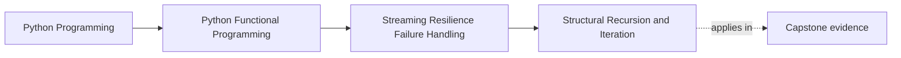
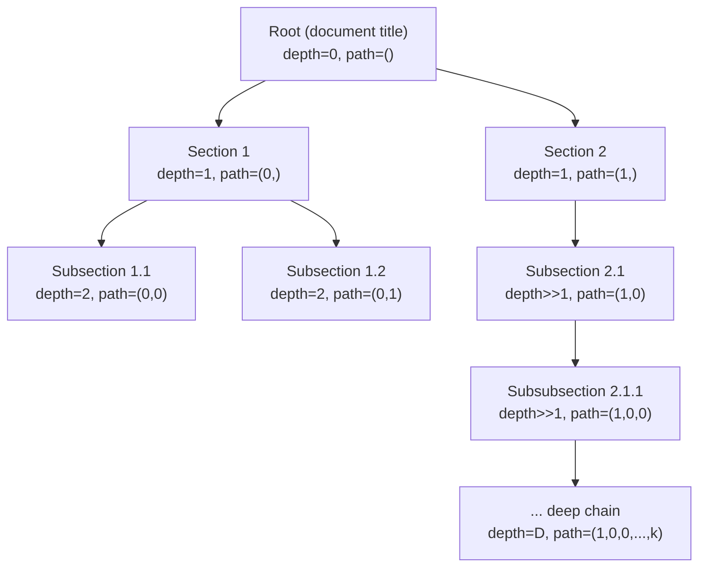

# Structural Recursion and Iteration


<!-- page-maps:start -->
## Page Maps




<!-- page-maps:end -->

Keep one tension clear from the start: the recursive version is often the best specification, but not always the safest production implementation. Treat iteration here as a way to preserve the same traversal meaning under deeper, messier inputs, not as a rejection of structural reasoning.

## Start With the Depth Problem

The first failure mode in this module is not a fancy resilience pattern. It is the basic fact that real hierarchical data can be deeper or stranger than the nicest recursive demo.

- If the input may be thousands of levels deep, a pretty recursive definition is not enough.
- If traversal order or metadata changes during the iterative rewrite, the implementation is no longer equivalent to the spec.
- If a "safe" version pre-scans the whole tree first, it has already broken the laziness contract needed later in the module.

> **Core question:**  
> When should you prefer structural recursion over iteration in Python, and how do you guarantee termination, stack-safety, **and full laziness** while preserving equational reasoning?

This lesson introduces the real design move for tree traversal:

- start from the recursive specification because it best expresses the structure
- switch to an explicit stack only when depth and call-stack limits require it
- preserve preorder, metadata, and demand behavior so the iterative version remains a faithful implementation instead of a different algorithm

The `TreeDoc` examples matter because they show a realistic hierarchy with both branching and pathological depth, which is exactly where production and specification begin to diverge.

**Concrete motivating example** (a real parsed Markdown document):



Desired lazy preorder output (only relevant fields shown):

```python
Chunk(text="Root",              depth=0, path=())
Chunk(text="Section 1",         depth=1, path=(0,))
Chunk(text="Subsection 1.1",    depth=2, path=(0, 0))
Chunk(text="Deep leaf",         depth=D, path=(1, 0, 0, ..., k))
```

The naïve recursive implementation is still worth studying because it names the traversal clearly. The lesson is not "recursion is bad." The lesson is that some inputs turn the clearest specification into an unsafe runtime strategy. The production version must therefore protect stack depth without giving up the same observable traversal behavior.

Use this when you process unpredictable document hierarchies and will not ship code that can `RecursionError` or OOM on legal input.

**Outcome:**  
1. You will be able to formally prove termination and give a machine-checked guarantee of stack-safety + full laziness in Python.  
2. You will refactor any structural-recursive function into a constant-call-stack, fully lazy version without losing clarity or equational reasoning.  
3. You will ship a public `flatten` that obeys all laws for any finite acyclic input — no matter how deep or bushy — with zero pre-scan.

This section formalises exactly what you should defend in code review: termination, stack-safety, preorder correctness, correct metadata, and true laziness where consuming `k` items does only `k` nodes of work.

---

## 1. Laws & Invariants (machine-checked where possible)

All laws assume finite, acyclic `TreeDoc` inputs.

| Law                          | Formal Statement                                                                                            | Enforcement |
|------------------------------|-------------------------------------------------------------------------------------------------------------|-------------|
| **Termination**              | Every step strictly decreases the height of the current subtree (well-founded on ℕ). For any finite acyclic tree, the iterator terminates. | Formal proof by induction on height + lazy cycle detection during traversal + Hypothesis on trees up to 5000 depth gives overwhelming evidence. |
| **Stack-Safety**             | Public API uses O(1) Python call-stack frames, independent of tree depth, even on pathological chains. | `flatten` always uses the explicit-stack iterative implementation; CI fails any test that hits recursion limit. |
| **Full Laziness (Bounded-Work)** | Consuming the first k items visits exactly k nodes — no pre-scan, no lookahead. | Property test with instrumented node visits on `islice(..., k)`. |
| **Equivalence**              | `list(recursive_flatten(t)) == list(iter_flatten(t)) == list(flatten(t))` (identical sequence + metadata) for all finite acyclic t. | Hypothesis equivalence test on random trees + 5000-depth chains. |
| **Metadata Invariant**       | `depth == len(path)` ∧ all paths unique ∧ root path == () ∧ sibling indices match enumeration order. | Dedicated property test `test_metadata_and_order_invariants`. |
| **Order Invariant**          | Strict preorder (parent before children, siblings left-to-right); paths non-decreasing lexicographically. | Property test validates full sequence and path monotonicity. |
| **Observability Neutrality** | Adding depth/path metadata does not alter `doc_id`, `text`, `start`, `end` vs a metadata-free traversal. | Property test strips metadata and compares core fields. |

These laws are either mathematically proven, runtime-enforced, or machine-checked with Hypothesis.

---

## 2. Decision Table – Which Variant Do You Actually Import?

| Max Expected Depth | Clarity Priority | Performance Critical | Recommended Variant                                |
|---------------------|------------------|----------------------|----------------------------------------------------|
| ≤ 500               | Very high        | No                   | `recursive_flatten` – perfect spec / local scripts |
| 500 – 5000          | Medium           | No                   | `iter_flatten` – simple explicit stack             |
| Arbitrary / unknown | High             | Yes                  | **Public `flatten`** → always `iter_flatten_buffered` (fully lazy + stack-safe) |
| Need monoidal fusion| Very high        | Yes                  | `fold_tree` (M04C02)                               |

**Never** call `sys.setrecursionlimit()` in library code.  
**Never** accept a pre-scan that breaks laziness in production.

---

## 3. Public API Surface (end-of-Module-04 refactor note)

Refactor note: tree traversal + folds live in `funcpipe_rag.tree` (`capstone/src/funcpipe_rag/tree/_traversal.py` and `capstone/src/funcpipe_rag/tree/folds.py`).  
`funcpipe_rag.api.core` re-exports the same names as a stable façade for the course modules.

```python
from funcpipe_rag.api.core import (
    assert_acyclic,
    flatten,  # recommended entrypoint (stack-safe + fully lazy)
    flatten_via_fold,
    iter_flatten,
    iter_flatten_buffered,
    max_depth,
    recursive_flatten,  # spec-only (may RecursionError on deep trees)
)
```

---

## 4. Reference Implementations

### 4.1 Public Production Entrypoint (Guarantees All Laws)

```python
def flatten(tree: TreeDoc) -> Iterator[ChunkWithoutEmbedding]:
    """Single recommended entrypoint – stack-safe + fully lazy + terminates on any finite acyclic TreeDoc."""
    return iter_flatten_buffered(tree)       # zero pre-scan, O(1) call-stack, O(depth) extra heap

# Note: cycle detection is done lazily inside iter_flatten*/iter_flatten_buffered via an id(node) seen-set.
# `assert_acyclic(tree)` exists as an eager validator, but calling it inside `flatten` would pre-scan the tree
# and break the “bounded-work / k-yields ⇒ k-nodes visited” law.
```

### 4.2 Recursive Specification (Didactic only – the most beautiful code)

```python
def recursive_flatten(tree: TreeDoc) -> Iterator[ChunkWithoutEmbedding]:
    """Reference spec – mirrors the inductive structure perfectly."""
    yield from _rec_flatten(tree, depth=0, path=())

def _rec_flatten(tree: TreeDoc, *, depth: int, path: Tuple[int, ...]) -> Iterator[ChunkWithoutEmbedding]:
    yield _make_chunk(tree.node, depth, path)
    for i, child in enumerate(tree.children):
        yield from _rec_flatten(child, depth=depth + 1, path=path + (i,))
```

Termination measure = subtree height → decreases by ≥1 on every call → formally proved.

### 4.3 Simple Explicit-Stack DFS (Easy to understand, O(N×depth) overhead on chains)

```python
def iter_flatten(tree: TreeDoc) -> Iterator[ChunkWithoutEmbedding]:
    seen: set[int] = set()
    stack: deque[tuple[TreeDoc, int, Tuple[int, ...]]] = deque([(tree, 0, ())])
    while stack:
        node, depth, path = stack.pop()
        nid = id(node)
        if nid in seen:
            raise ValueError("Cycle detected in TreeDoc")
        seen.add(nid)
        yield _make_chunk(node.node, depth, path)
        for i in range(len(node.children)-1, -1, -1):
            stack.append((node.children[i], depth + 1, path + (i,)))
```

### 4.4 Production Winner – Allocation-Bounded Iterative DFS (O(depth) extra heap total)

```python
def iter_flatten_buffered(tree: TreeDoc) -> Iterator[ChunkWithoutEmbedding]:
    """
    No traversal-internal path tuple allocation – only one mutable path list;
    tuples are created only for the emitted chunks’ metadata.
    
    Invariants maintained:
      • path[:depth] is always the correct full path to the current node
      • path[depth:] is garbage (truncated on backtrack)
      • sibling indices are written exactly once per descent
    """
    seen: set[int] = set()
    stack: deque[tuple[TreeDoc, int, int | None]] = deque([(tree, 0, None)])  # node, depth, sibling_idx
    path: list[int] = []
    last_depth = 0

    while stack:
        node, depth, sib_idx = stack.pop()
        nid = id(node)
        if nid in seen:
            raise ValueError("Cycle detected in TreeDoc")
        seen.add(nid)

        # Maintain mutable path prefix
        if depth < last_depth:
            del path[depth:]
        if sib_idx is not None:
            if depth > len(path):
                path.append(sib_idx)
            else:
                path[depth-1] = sib_idx
        last_depth = depth

        yield _make_chunk(node.node, depth, tuple(path[:depth]))  # only copy on yield

        # Push children reversed for correct preorder
        for i in range(len(node.children)-1, -1, -1):
            stack.append((node.children[i], depth + 1, i))
```

### 4.5 Stack-Safe Catamorphism (foundation for M04C02)

```python
def fold_tree(
    tree: TreeDoc,
    seed: R,
    visit: Callable[[R, TreeDoc, int, Tuple[int, ...]], R],
) -> R:
    acc = seed
    stack: deque[tuple[TreeDoc, int, Tuple[int, ...], int]] = deque([(tree, 0, (), 0)])
    while stack:
        node, depth, path, child_idx = stack.pop()
        if child_idx == 0:
            acc = visit(acc, node, depth, path)
        if child_idx < len(node.children):
            stack.append((node, depth, path, child_idx + 1))
            child = node.children[child_idx]
            stack.append((child, depth + 1, path + (child_idx,), 0))
    return acc
```

### 4.6 Complete Helpers (no ellipsis – everything verifiable)

```python
def _make_chunk(node: TextNode, depth: int, path: Tuple[int, ...]) -> ChunkWithoutEmbedding:
    return ChunkWithoutEmbedding(
        doc_id=node.metadata.get("id", "unknown"),
        text=node.text,
        start=0,
        end=len(node.text),
        metadata={"depth": depth, "path": path},
    )

def assert_acyclic(tree: TreeDoc) -> None:
    seen = set()
    stack = [tree]
    while stack:
        node = stack.pop()
        nid = id(node)
        if nid in seen:
            raise ValueError("Cycle detected in TreeDoc")
        seen.add(nid)
        stack.extend(node.children)

def max_depth(tree: TreeDoc) -> int:
    """Iterative depth calculation – exported only for analysis tools."""
    max_d = 0
    stack: list[tuple[TreeDoc, int]] = [(tree, 0)]
    while stack:
        node, d = stack.pop()
        max_d = max(max_d, d)
        for child in node.children:
            stack.append((child, d + 1))
    return max_d
```

---

## 5. Property-Based Proofs (`capstone/tests/test_tree_flatten.py`)

```python
from hypothesis import given, strategies as st
from itertools import islice

@given(tree=tree_strategy())
def test_equivalence_all_variants(tree):
    rec = list(recursive_flatten(tree))
    simple = list(iter_flatten(tree))
    buf = list(iter_flatten_buffered(tree))
    prod = list(flatten(tree))
    assert rec == simple == buf == prod

@given(tree=deep_chain_strategy(depth=5000))
def test_stack_safety_and_laziness_extreme(tree):
    with pytest.raises(RecursionError):
        list(recursive_flatten(tree))
    # production path survives and is lazy
    it = flatten(tree)
    assert len(list(islice(it, 100))) == 100
    assert len(list(it)) == 4900

@given(tree=tree_strategy())
def test_metadata_and_order_invariants(tree):
    chunks = list(flatten(tree))
    paths = [c.metadata["path"] for c in chunks]
    depths = [c.metadata["depth"] for c in chunks]
    assert all(d == len(p) for d, p in zip(depths, paths))
    assert len(set(paths)) == len(paths)
    assert paths == sorted(paths)   # lexicographic preorder monotonicity
    # sibling order
    for i in range(len(chunks)-1):
        if paths[i][:-1] == paths[i+1][:-1]:
            assert paths[i][-1] < paths[i+1][-1]

@given(tree=tree_strategy())
def test_full_laziness_bounded_work(tree):
    visits = 0
    def tap(it):
        nonlocal visits
        for x in it:
            visits += 1
            yield x
    list(islice(tap(flatten(tree)), 50))
    assert visits == 50
```

---

## 6. Big-O & Allocation Guarantees (precise, no overclaim)

| Variant                    | Time   | Call-stack | Extra heap overhead (beyond result tuples) | Total path allocation |
|----------------------------|--------|------------|--------------------------------------------|-----------------------|
| recursive_flatten          | O(N)   | O(depth)   | O(depth)                                   | O(N×avg_depth)        |
| iter_flatten               | O(N)   | O(1)       | O(N×depth) worst-case chains               | O(N×avg_depth)        |
| iter_flatten_buffered      | O(N)   | O(1)       | O(depth)                                   | O(N×avg_depth)        |
| fold_tree (iterative)      | O(N)   | O(1)       | user-controlled                            | user-controlled       |

Result metadata inherently costs O(N×avg_depth) path tuples – unavoidable.  
`iter_flatten_buffered` eliminates all traversal-internal tuple allocation (only one mutable list).

---

## 7. Anti-Patterns & Immediate Fixes

| Anti-Pattern                              | Symptom                     | Fix                                      |
|-------------------------------------------|-----------------------------|------------------------------------------|
| `sys.setrecursionlimit()` in library code| Works locally, dies in prod | Use `flatten` (always iterative)         |
| Pre-scanning depth → breaks laziness      | First 10 chunks scan whole tree | Never pre-scan in production path       |
| String path `"1.2.3"` concatenation        | Quadratic time on deep trees| Use tuple path, render only at sink      |
| Recursive spec in hot path                 | Random RecursionError       | Keep recursive only as test spec         |

---

## 8. Pre-Core Quiz

1. Well-founded measure? → **Subtree height**  
2. Python TCO? → **No**  
3. Public API lazy + stack-safe? → **Yes – always iterative buffered**  
4. Extra heap overhead on 5000-depth chain with `iter_flatten_buffered`? → **O(depth) total**  
5. Intrinsic path metadata cost? → **O(N×depth) – unavoidable**

## 9. Post-Core Exercise

1. Find any recursive tree function in your codebase → replace with `iter_flatten_buffered`-style explicit stack + add equivalence property.  
2. Implement human-readable section id `"1.2.3"` via a second fold pass (no quadratic allocation).  
3. Wire `flatten` into the public RAG API; verify with `islice(..., 10)` touches exactly 10 nodes.

**Continue with:** [Folds and Reductions](../module-04-streaming-resilience-failure-handling/folds-and-reductions.md)
