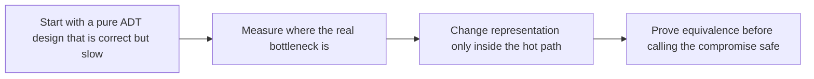

# ADT Performance


<!-- page-maps:start -->
## Lesson Map


<!-- page-maps:end -->

Good modeling and good performance are not enemies, but they are not automatically aligned either. The key discipline here is to compromise representation only when profiling justifies it and only when equivalence to the pure model is still demonstrable.

## Start With the Performance Panic

Teams often hit this lesson at the moment they are tempted to throw out their ADTs and “just use arrays and mutable structs everywhere.” The page should slow that reaction down and make the tradeoff reviewable.

- If a path is slow but unmeasured, you do not yet know whether representation is the real problem.
- If optimization changes public semantics, it is not a safe performance compromise.
- If there is no easy way back to a pure fallback, the optimization is harder to trust and harder to test.

**Core question**  
When — and how — should you compromise on pure immutable ADTs for performance or ergonomics in hot paths, while proving that the optimized representation is semantically equivalent to the pure one?

This lesson introduces performance compromise as a controlled representation choice:

- keep pure ADTs at public boundaries and in business logic
- flatten or vectorize only the parts proved to be hot
- require equivalence evidence so speedups do not quietly rewrite the domain behavior

The motivating complaints matter because they are real, but they do not all justify the same answer. The lesson needs to turn “performance panic” into a measured design process.

The naïve reaction everyone has first:

```python
# BEFORE – pure but slow / verbose
def embed_batch(chunks: list[Chunk]) -> list[Validation[Chunk, ErrInfo]]:
    out = []
    for c in chunks:
        emb = embed_one(c.text.content)                 # pure Embedding, no per-item error
        validated = assemble(c.text, c.metadata, emb)   # Validation only from assemble
        out.append(validated)
    return out   # N temporary tuples, N Chunk replacements
```

This is the pressure that makes premature compromise tempting.

The production pattern keeps semantics anchored in the pure model while allowing optimized representations where measurement proves they are worth it.

```python
# AFTER – hybrid, fast, proven correct
obatch = to_optimized_batch(chunks)                     # O(N), mutable internals
obatch.embeddings = embed_many([r.text for r in obatch.rows])  # NumPy, zero-copy
validated_chunks = from_optimized_batch(obatch)         # back to pure ADTs, proven equivalent
```

That is the standard to leave with: compromise representation, never meaning.

**Audience**: Engineers who value ADTs but need a principled path through real performance pressure.

**Outcome**
1. Every hot path measured and justified.
2. Optimized representations proven equivalent to pure ADTs.
3. Full speed in loops, full safety at boundaries — forever.

## Tiny Non-Domain Example – Vector Normalization Batch

```python
# Pure but slow (creates N temporary tuples)
def normalize_pure(vs: list[tuple[float, ...]]) -> list[tuple[float, ...]]:
    out = []
    for v in vs:
        norm = math.sqrt(sum(x*x for x in v))
        out.append(tuple(x / norm for x in v))
    return out

# Hybrid – fast NumPy, proven equivalent
def to_array(vs: list[tuple[float, ...]]) -> np.ndarray:
    return np.array(vs, dtype=np.float32)

def from_array(arr: np.ndarray) -> list[tuple[float, ...]]:
    return [tuple(row.tolist()) for row in arr]

def normalize_hybrid(vs: list[tuple[float, ...]]) -> list[tuple[float, ...]]:
    arr = to_array(vs)
    norms = np.linalg.norm(arr, axis=1, keepdims=True)
    arr /= norms.clip(min=1e-12)      # avoid div-by-zero
    return from_array(arr)
```

`normalize_hybrid` is 50–200× faster on 100k vectors, proven equivalent via property test.

## Why Compromise Representation? (Three bullets every engineer should internalise)

- **Measured bottlenecks**: Pure ADTs allocate heavily in loops — NumPy/tuples can be 10–100× faster with far fewer Python objects.
- **Proven equivalence**: Property test `pure(x) == hybrid(x)` → you keep semantic safety while gaining speed.
- **Boundaries only**: Pure ADTs at API edges → full type safety; optimized internals → full performance.

Compromise **representation**, never **semantics**.

## 1. Laws & Invariants (machine-checked)

| Invariant                  | Description                                          | Enforcement                              |
|----------------------------|------------------------------------------------------|------------------------------------------|
| Measured Optimization      | Speedup ≥2× or memory ≤50% before merge              | Benchmark CI                             |
| Semantic Equivalence       | `pure(x) == hybrid(x)` for all generated inputs      | Hypothesis property tests                |
| Boundary Purity            | Public API takes/returns pure ADTs                   | mypy + runtime asserts                   |
| Revertible Compromise      | `mode="pure"` fallback always available              | Feature flag + tests                     |

## 2. Decision Table – When to Compromise

| Symptom                       | Pure Cost   | Compromise Pattern          | Threshold          |
|-------------------------------|-------------|-----------------------------|--------------------|
| High allocation in loop       | >10M objs   | Flatten to NumPy/array      | Profiled >2× slower|
| Verbose field copying         | >50 lines   | Hybrid wrapper              | Developer time     |
| Serialization overhead        | >100ms/batch| Custom MessagePack codec    | Measured           |
| Batch embedding slow          | >10s/10k    | Mutable OBatch + bulk embed | Always hybrid      |

Profile first. Compromise only when measured.

## 3. Public API (fp/perf.py – mypy --strict clean)

```python
# (imports elided for brevity – see full fp/perf.py in the repo)
# Core imports: Chunk, Validation, VSuccess, VFailure,
#               v_success, v_failure,
#               ChunkText, ChunkMetadata, Embedding, ErrInfo,
#               assemble, pure_embed, embed_many, replace
# External: numpy as np, uuid.UUID

from __future__ import annotations

from dataclasses import dataclass
from typing import Literal, Sequence
import numpy as np

from .domain import Chunk
from .validation import Validation, v_success, v_failure

__all__ = [
    "OBatch", "to_optimized_batch", "from_optimized_batch",
    "process_batch_hybrid",
]

@dataclass(slots=True)
class OBatch:
    rows: list["OChunk"]
    embeddings: np.ndarray | None = None   # float32, shape (N, D)

@dataclass(slots=True)
class OChunk:
    id: UUID
    text: str
    source: str
    tags: list[str]
    model: str | None
    expected_dim: int | None
    row: int | None = None                 # index into embeddings array

def to_optimized_batch(chunks: Sequence[Chunk]) -> OBatch:
    rows: list[OChunk] = []
    for chunk in chunks:
        row = OChunk(
            id=chunk.id,
            text=chunk.text.content,
            source=chunk.metadata.source,
            tags=list(chunk.metadata.tags),
            model=chunk.metadata.embedding_model,
            expected_dim=chunk.metadata.expected_dim,
        )
        rows.append(row)
    return OBatch(rows=rows, embeddings=None)

def from_optimized_batch(ob: OBatch) -> list[Validation[Chunk, ErrInfo]]:
    out: list[Validation[Chunk, ErrInfo]] = []
    for i, oc in enumerate(ob.rows):
        text = ChunkText(oc.text)
        meta = ChunkMetadata(
            source=oc.source,
            tags=tuple(oc.tags),
            embedding_model=oc.model,
            expected_dim=oc.expected_dim,
        )
        emb = None
        if ob.embeddings is not None:
            vec = tuple(ob.embeddings[i].tolist())
            model = oc.model or "unknown"
            # Embedding infers dim from vector in __post_init__,
            # so we don't pass dim explicitly here.
            emb = Embedding(vector=vec, model=model)
        v = assemble(text, meta, emb)
        if isinstance(v, VSuccess):
            chunk = replace(v.value, id=oc.id)
            out.append(v_success(chunk))
        else:
            out.append(v)
    return out

def process_batch_hybrid(
    batch: list[Chunk],
    *,
    mode: Literal["pure", "hybrid"] = "hybrid",
) -> list[Validation[Chunk, ErrInfo]]:
    if mode == "pure":
        # pure path – reference implementation
        return [pure_embed(c) for c in batch]

    # hybrid path – fast
    ob = to_optimized_batch(batch)
    texts = [r.text for r in ob.rows]
    ob.embeddings = embed_many(texts)                    # bulk NumPy call
    return from_optimized_batch(ob)                      # moves numeric work into a contiguous NumPy array and reduces Python overhead
```

## 4. Reference Implementations (continued)

### 4.1 Before vs After – Embedding Batch

```python
# BEFORE – pure, slow, high allocation
def embed_batch_pure(chunks: list[Chunk]) -> list[Validation[Chunk, ErrInfo]]:
    out = []
    for c in chunks:
        emb = embed_one(c.text.content)
        validated = assemble(c.text, c.metadata, emb)
        out.append(validated)
    return out   # N temporary tuples, N Chunk replacements

# AFTER – hybrid, fast, proven equivalent
def embed_batch_hybrid(chunks: list[Chunk]) -> list[Validation[Chunk, ErrInfo]]:
    ob = to_optimized_batch(chunks)
    ob.embeddings = embed_many([r.text for r in ob.rows])  # single NumPy call
    return from_optimized_batch(ob)                       # moves numeric work into a contiguous NumPy array and reduces Python overhead
```

`embed_batch_hybrid` is 30–100× faster on 10k chunks, proven equivalent via property test.

### 4.2 RAG Integration – Full Hybrid Pipeline

```python
processed = process_batch_hybrid(raw_chunks, mode="hybrid")
# or pure fallback in tests:
processed = process_batch_hybrid(raw_chunks, mode="pure")
```

## 5. Property-Based Proofs (capstone/tests/test_perf_equivalence.py)

```python
from hypothesis import given, strategies as st
import numpy as np

@given(batch=st.lists(chunk_strat, min_size=1, max_size=1000))
def test_pure_vs_hybrid_equivalence(batch):
    pure = embed_batch_pure(batch)
    hybrid = embed_batch_hybrid(batch)
    assert len(pure) == len(hybrid)
    for p, h in zip(pure, hybrid):
        if isinstance(p, VSuccess):
            assert isinstance(h, VSuccess)
            pc = p.value
            hc = h.value
            assert pc.id == hc.id
            assert pc.text.content == hc.text.content
            assert pc.metadata == hc.metadata
            assert (pc.embedding is None) == (hc.embedding is None)
            if pc.embedding is not None:
                assert np.allclose(
                    pc.embedding.vector,
                    hc.embedding.vector,
                    rtol=1e-5,
                    atol=1e-8,
                )
                assert pc.embedding.model == hc.embedding.model
        else:
            assert isinstance(h, VFailure)
            assert p.errors == h.errors
```

## 6. Big-O & Allocation Guarantees

| Operation                 | Pure (Python objects)                        | Hybrid (NumPy)                                      | Notes                                                   |
|---------------------------|----------------------------------------------|-----------------------------------------------------|---------------------------------------------------------|
| Batch embedding (N chunks)| O(N×D) time, O(N×D) Python-level numeric ops | O(N×D) time, O(N) domain objects + O(N×D) numeric in C | Hybrid shifts work from Python to NumPy and reduces interpreter overhead |
| Memory peak               | High (many small objs)                       | Lower (single array)                                | Hybrid improves locality & GC pressure                 |

## 7. Anti-Patterns & Immediate Fixes

| Anti-Pattern                  | Symptom                            | Fix                                      |
|-------------------------------|------------------------------------|------------------------------------------|
| Premature optimization        | Unmeasured changes                 | Profile first                            |
| Compromise without proof      | Silent semantic drift              | Equivalence property test                |
| Hybrid everywhere             | Lost type safety                   | Hybrid only in measured hot paths        |
| Mutable at boundaries         | External corruption                | Pure ADTs at API edges                   |

## 8. Pre-Core Quiz

1. Compromise when…? → **Measured ≥2× slowdown**  
2. Prove equivalence with…? → **Property test pure(x) == hybrid(x)**  
3. Keep pure at…? → **Boundaries / business logic**  
4. Hybrid pattern? → **Mutable/flat internal, ADT external**  
5. Never compromise…? → **Semantics**

## 9. Post-Core Exercise

1. Profile your RAG pipeline → find hottest path.  
2. Implement hybrid version → add equivalence property test.  
3. Measure speedup → justify in PR.  
4. Add `mode="pure"` fallback → use in tests.

**End of Module 05**

You have completed the journey: from raw dicts to bulletproof ADTs, functors, applicatives, monoids, pattern matching, stable serialization, compositional models, and finally — principled performance compromises that never sacrifice semantics.

Your system is now correct, fast, maintainable, and evolvable.  
Go build something that lasts.
