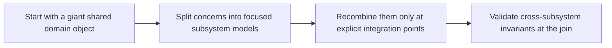

# Compositional Domain Models


<!-- page-maps:start -->
## Lesson Map


<!-- page-maps:end -->

Separate two ideas that often get blurred together: a domain can be one business concept and still be best modeled as several smaller value types. The crucial move is not just splitting. It is making recombination explicit and reviewable.

## Start With the God-Object Smell

Students usually reach this lesson after seeing a domain object that carries every concern at once. The pain is obvious in teams too: every change collides with every other change.

- If one type is imported and mutated by every subsystem, the model boundary is already too wide.
- If cross-subsystem invariants are checked everywhere, no one place owns the truth.
- If splitting the model would make integration rules disappear, the split is not yet disciplined enough.

**Core question**  
How do you split domain concepts into independent subsystem ADTs and recombine them safely — keeping subsystems loosely coupled while the overall model stays coherent, evolvable, and type-safe in every FuncPipe pipeline?

This lesson introduces compositional domain modeling as a boundary design strategy:

- give each subsystem its own focused value model
- keep cross-subsystem invariants at explicit assemblers or conversion points
- let teams and modules evolve locally until they intentionally meet

The motivating giant `Chunk` example matters because it captures both the code smell and the team smell at the same time: one type, too many reasons to change.

The naïve pattern everyone writes first:

```python
# BEFORE – monolithic, tightly coupled
@dataclass(frozen=True)
class Chunk:
    text: str
    source: str
    tags: list[str]
    embedding_model: str | None
    expected_dim: int | None
    vector: list[float] | None
    # 37 more fields...
# Every subsystem imports and mutates the same type → merge hell
```

This is the composition problem to name.

The production pattern keeps each subsystem small and then makes integration the one place where cross-cutting rules are enforced deliberately.

```python
# AFTER – split + safe recombination
text = ChunkText(content="...")
meta = ChunkMetadata(source="web", tags=("news",))
emb  = Embedding(vector=(0.1, ...), model="mini", dim=384)

chunk = assemble(text, meta, emb)   # Validation[Chunk, ErrInfo] with cross-checks
```

That separation is the core value: local evolution plus visible recombination rules.

Use this when you want independent model evolution without turning integration into schema chaos.

**Outcome**
1. Every domain concept lives in its own subsystem ADT.
2. Recombination via validated `assemble` / conversion functions.
3. Zero accidental coupling — changes stay local until explicitly integrated.

## Tiny Non-Domain Example – Order Processing Split

```python
# billing.py
@dataclass(frozen=True, slots=True)
class BillingInfo:
    amount_cents: int
    currency: str

# shipping.py
@dataclass(frozen=True, slots=True)
class ShippingAddress:
    street: str
    country: str

# order.py – integration point only
def create_order(billing: BillingInfo, shipping: ShippingAddress) -> Validation[Order, str]:
    if billing.currency != "USD" and shipping.country != "US":
        return v_failure(("international shipping only for USD",))
    return v_success(Order(billing=billing, shipping=shipping, id=uuid4()))
```

Billing and Shipping teams work independently. Order team owns the one integration check.

## Why Split & Recombine ADTs? (Three bullets every engineer should internalise)

- **Loose coupling**: Subsystem A can add fields without touching B — no merge conflicts.
- **Explicit integration**: `assemble` / conversion functions are the only place cross-cutting concerns live — single source of truth.
- **Evolvability**: Adding a new subsystem (e.g. TaxInfo) only requires updating one integration point, never touching existing ADTs.

DO have 2–4 small, focused ADTs per subsystem.  
DO enforce cross-subsystem invariants only in the assembler.  
DON’T have one giant “Everything” ADT used everywhere.

By convention, `embedding_model` and `expected_dim` set to `None` mean “no constraint”; `assemble` only checks them when they are non-`None` and an embedding is present.


## 1. Laws & Invariants (machine-checked)

| Invariant                  | Description                                          | Enforcement                              |
|----------------------------|------------------------------------------------------|------------------------------------------|
| Subsystem Isolation        | Subsystem ADTs only imported by integration layer   | Module layout + code review              |
| Recombination Validity     | `assemble` enforces cross-subsystem invariants      | Validation[Chunk, ErrInfo] return        |
| Exhaustiveness at Join     | All subsystem variants handled in integration       | `assert_never` in match                  |

## 2. Decision Table – Split vs Combine

| Concern                       | Independent evolution? | Needs cross-checks? | Split? | Combine via          |
|-------------------------------|------------------------|---------------------|--------|----------------------|
| Text processing               | Yes                    | No                  | Yes    | Product              |
| Metadata (source, tags)       | Yes                    | No                  | Yes    | Product              |
| Embedding format              | Yes                    | Yes (dim/model)     | Yes    | Validated assembler  |
| Search indexing               | Yes                    | Yes (vector norm)   | Yes    | Conversion function  |

## 3. Public API (fp/domain.py – mypy --strict clean)

```python
from __future__ import annotations

from dataclasses import dataclass, replace, field
from typing import Callable
from uuid import UUID, uuid4

from .validation import Validation, v_success, v_failure
from .error import ErrInfo, ErrorCode

# Subsystem ADTs – imported here for wiring
# Only the integration layer (this module) should use all three
from .text import ChunkText
from .metadata import ChunkMetadata
from .embedding import Embedding

__all__ = [
    "Chunk", "ChunkId",
    "assemble", "try_set_embedding", "map_metadata_checked",
    "upcast_metadata_v1",
]

ChunkId = UUID

@dataclass(frozen=True, slots=True)
class Chunk:
    id: ChunkId = field(default_factory=uuid4)
    text: ChunkText
    metadata: ChunkMetadata
    embedding: Embedding | None = None

def assemble(
    text: ChunkText,
    meta: ChunkMetadata,
    emb: Embedding | None = None,
) -> Validation[Chunk, ErrInfo]:
    errs = []
    # dedup + stable order tags
    norm_tags = tuple(dict.fromkeys(meta.tags))
    if norm_tags != meta.tags:
        meta = replace(meta, tags=norm_tags)

    if emb is not None:
        if meta.embedding_model is not None and meta.embedding_model != emb.model:
            errs.append(ErrInfo(ErrorCode.EMB_MODEL_MISMATCH, f"{emb.model} != {meta.embedding_model}"))
        if meta.expected_dim is not None and meta.expected_dim != emb.dim:
            errs.append(ErrInfo(ErrorCode.EMB_DIM_MISMATCH, f"{emb.dim} != {meta.expected_dim}"))

    return v_failure(tuple(errs)) if errs else v_success(Chunk(text=text, metadata=meta, embedding=emb))

def try_set_embedding(chunk: Chunk, emb: Embedding | None) -> Validation[Chunk, ErrInfo]:
    return assemble(chunk.text, chunk.metadata, emb)

def map_metadata_checked(
    chunk: Chunk,
    f: Callable[[ChunkMetadata], ChunkMetadata],
) -> Validation[Chunk, ErrInfo]:
    return assemble(chunk.text, f(chunk.metadata), chunk.embedding)

# Versioning example – metadata v1 → current
@dataclass(frozen=True, slots=True)
class ChunkMetadataV1:
    source: str
    tags: list[str]

def upcast_metadata_v1(v1: ChunkMetadataV1) -> ChunkMetadata:
    return ChunkMetadata(source=v1.source, tags=tuple(v1.tags))
```

## 4. Reference Implementations (continued)

### 4.1 Subsystem ADTs (split across modules)

```python
# text.py
@dataclass(frozen=True, slots=True)
class ChunkText:
    content: str

# metadata.py
@dataclass(frozen=True, slots=True)
class ChunkMetadata:
    source: str
    tags: tuple[str, ...]
    embedding_model: str | None = None
    expected_dim: int | None = None

# embedding.py
@dataclass(frozen=True, slots=True)
class Embedding:
    vector: tuple[float, ...]
    model: str
    dim: int = field(init=False)

    def __post_init__(self) -> None:
        object.__setattr__(self, "dim", len(self.vector))
```

### 4.2 RAG Integration – Safe Assembly Pipeline

```python
def ingest_chunk(
    text: ChunkText,
    meta: ChunkMetadata,
    emb: Embedding | None,
) -> Validation[Chunk, ErrInfo]:
    return assemble(text, meta, emb)
```

## 5. Property-Based Proofs (capstone/tests/test_composition.py)

```python
from dataclasses import replace
from hypothesis import given, strategies as st
from funcpipe_rag.fp.domain import assemble
from funcpipe_rag.fp.text import ChunkText
from funcpipe_rag.fp.metadata import ChunkMetadata
from funcpipe_rag.fp.embedding import Embedding
from funcpipe_rag.fp.validation import VSuccess, VFailure
from funcpipe_rag.fp.error import ErrorCode

raw_tags = st.lists(st.text(min_size=1), min_size=0, max_size=15)

@given(
    content=st.text(min_size=1),
    source=st.text(),
    raw_tags=raw_tags,
    model=st.none() | st.text(),
    dim=st.none() | st.integers(min_value=1, max_value=8192),
    vector=st.none() | st.lists(st.floats(allow_nan=False, allow_infinity=False), min_size=1, max_size=10),
)
def test_assemble_success_and_dedup(content, source, raw_tags, model, dim, vector):
    meta = ChunkMetadata(
        source=source,
        tags=tuple(raw_tags),
        embedding_model=model,
        expected_dim=dim,
    )
    emb = Embedding(vector=tuple(vector or ()), model=model or "test") if vector else None

    # Force success by matching dim/model when emb present
    if emb:
        meta = replace(meta, expected_dim=emb.dim, embedding_model=emb.model)

    v = assemble(ChunkText(content=content), meta, emb)
    assert isinstance(v, VSuccess)
    chunk = v.value

    # Round-trip core fields
    assert chunk.text.content == content
    assert chunk.metadata.source == source
    assert chunk.metadata.embedding_model == (emb.model if emb else model)
    assert chunk.metadata.expected_dim == (emb.dim if emb else dim)

    # Embedding round-trip when present
    if emb is not None:
        assert chunk.embedding is not None
        assert chunk.embedding.vector == emb.vector
        assert chunk.embedding.model == emb.model
        assert chunk.embedding.dim == emb.dim
    else:
        assert chunk.embedding is None

    # Tags are deduped and stable order
    expected_tags = tuple(dict.fromkeys(raw_tags))
    assert chunk.metadata.tags == expected_tags

@given(
    content=st.text(min_size=1),
    source=st.text(),
    tags=st.lists(st.text(), min_size=1),
    model=st.text(),
    vector=st.lists(st.floats(allow_nan=False, allow_infinity=False), min_size=1, max_size=10),
)
def test_assemble_model_mismatch_fails(content, source, tags, model, vector):
    meta = ChunkMetadata(source=source, tags=tuple(tags), embedding_model=model + "-wrong")
    emb = Embedding(vector=tuple(vector), model=model)
    v = assemble(ChunkText(content=content), meta, emb)
    assert isinstance(v, VFailure)
    assert any(e.code == ErrorCode.EMB_MODEL_MISMATCH for e in v.errors)

@given(
    content=st.text(min_size=1),
    source=st.text(),
    tags=st.lists(st.text(), min_size=1),
    model=st.text(),
    vector=st.lists(st.floats(allow_nan=False, allow_infinity=False), min_size=1, max_size=10),
)
def test_assemble_dim_mismatch_fails(content, source, tags, model, vector):
    meta = ChunkMetadata(source=source, tags=tuple(tags), embedding_model=model, expected_dim=len(vector) + 1)
    emb = Embedding(vector=tuple(vector), model=model)
    v = assemble(ChunkText(content=content), meta, emb)
    assert isinstance(v, VFailure)
    assert any(e.code == ErrorCode.EMB_DIM_MISMATCH for e in v.errors)
```

## 6. Big-O & Allocation Guarantees

| Operation            | Time               | Heap                  | Notes                                      |
|----------------------|--------------------|-----------------------|--------------------------------------------|
| assemble             | O(|tags|)          | O(|tags|)             | Dedup tags only allocation                 |
| map_metadata_checked | O(|tags|)          | O(|tags|)             | Same                                       |

## 7. Anti-Patterns & Immediate Fixes

| Anti-Pattern                  | Symptom                            | Fix                                      |
|-------------------------------|------------------------------------|------------------------------------------|
| Monolithic Chunk type         | Merge conflicts on every change    | Split into subsystem ADTs                |
| Direct field access across modules | Tight coupling                | Use `assemble` / conversion functions    |
| Circular imports              | Import hell                        | Keep subsystems independent              |
| Implicit cross-checks         | Bugs when fields diverge           | Explicit validation in `assemble`        |

## 8. Pre-Core Quiz

1. Split for…? → **Independent evolution**  
2. Combine via…? → **Validated assembler**  
3. Boundary rule? → **Explicit conversion only**  
4. Mega-ADT? → **Never**  
5. Benefit? → **Teams work in parallel forever**

## 9. Post-Core Exercise

1. Split one existing monolithic type into 2–3 subsystem ADTs.  
2. Write `assemble` with cross-checks → return Validation.  
3. Add a v1 → current upcast function for one subsystem.  
4. Verify with property test that round-trip through serialization preserves data.

**Continue with:** [ADT Performance](../module-05-algebraic-data-modelling-validation/adt-performance.md)

You now build large systems as loosely coupled subsystem ADTs recombined only at explicit, validated integration points — teams evolve independently, schema conflicts vanish, and the domain model stays coherent forever. The final core gives concrete performance guidance for when (and how) to compromise pure ADTs in hot paths.
