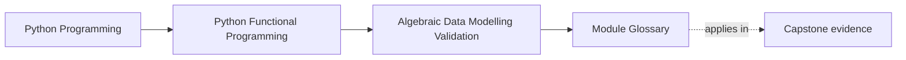
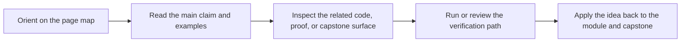

# Module Glossary

<!-- page-maps:start -->
## Page Maps

<!-- page-maps:end -->

This glossary belongs to **Module 05: Algebraic Data Modelling and Validation** in **Python Functional Programming**. It keeps the language of this directory stable so the same ideas keep the same names across reading, practice, review, and capstone proof.

## How to use this glossary

Read the directory index first, then return here whenever a page, command, or review discussion starts to feel more vague than the course intends. The goal is stable language, not extra theory.

## Terms in this directory

| Term | Meaning in this directory |
| --- | --- |
| ADT Performance | the module's treatment of adt performance, used to make the module's main design claim concrete in design work, refactoring, and capstone evidence. |
| Applicative Validation | the module's treatment of applicative validation, used to make the module's main design claim concrete in design work, refactoring, and capstone evidence. |
| Compositional Domain Models | the module's treatment of compositional domain models, used to make the module's main design claim concrete in design work, refactoring, and capstone evidence. |
| Domain State ADTs | the module's treatment of domain state adts, used to make the module's main design claim concrete in design work, refactoring, and capstone evidence. |
| Functors | the module's treatment of functors, used to make the module's main design claim concrete in design work, refactoring, and capstone evidence. |
| Module 05 Refactoring Guide | the repair route for applying the module's main design claim to existing code without losing behavior, clarity, or proof. |
| Monoids | the module's treatment of monoids, used to make the module's main design claim concrete in design work, refactoring, and capstone evidence. |
| Pattern Matching | the module's treatment of pattern matching, used to make the module's main design claim concrete in design work, refactoring, and capstone evidence. |
| Product and Sum Types | the module's treatment of product and sum types, used to make the module's main design claim concrete in design work, refactoring, and capstone evidence. |
| Pydantic Smart Constructors | the module's treatment of pydantic smart constructors, used to make the module's main design claim concrete in design work, refactoring, and capstone evidence. |
| Serialization Beyond Pydantic | the module's treatment of serialization beyond pydantic, used to make the module's main design claim concrete in design work, refactoring, and capstone evidence. |
