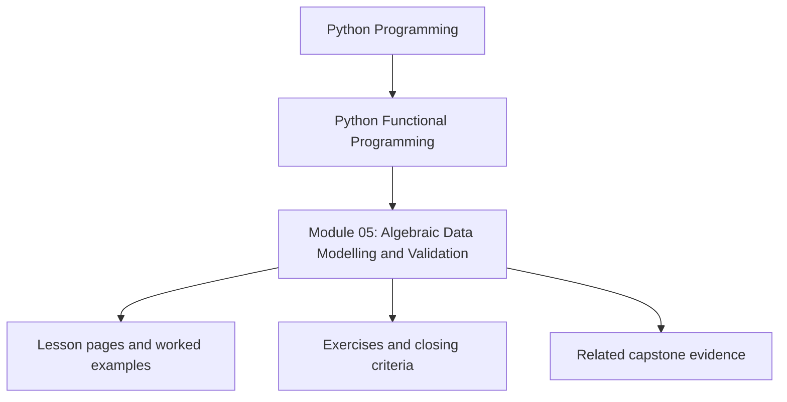
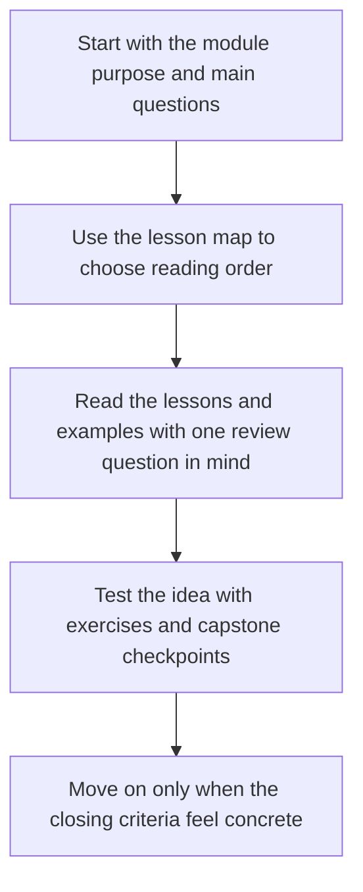

# Module 05: Algebraic Data Modelling and Validation

<!-- page-maps:start -->
## Module Position

<!-- page-maps:end -->

Read the first diagram as a placement map: this page sits between the course promise, the lesson pages listed below, and the capstone surfaces that pressure-test the module. Read the second diagram as the study route for this page, so the diagrams point you toward the `Lesson map`, `Exercises`, and `Closing criteria` instead of acting like decoration.

## Keep These Pages Open

Use these support surfaces while reading so value modelling stays connected to reviewable
domain states instead of turning into type-shape ornament:

- [Mid-Course Map](../module-00-orientation/mid-course-map.md) for the bridge through failures and modelling
- [Engineering Question Map](../guides/engineering-question-map.md) for domain-pressure routing
- [Anti-Pattern Atlas](../reference/anti-pattern-atlas.md) for symptom-first review of modelling mistakes
- [Capstone Map](../guides/capstone-map.md) for the validation and domain-state surfaces in FuncPipe

Carry this question into the module:

> Which states, failures, and construction rules deserve first-class value shapes instead of scattered conditionals?

This module gives the course a stronger modelling language. Instead of encoding domain
states and validation rules with flags, `None`, and scattered conditionals, the learner
starts using explicit data shapes that are easier to reason about and test.

## Learning outcomes

- how product and sum types clarify domain meaning in Python
- how mapping, validation, and aggregation follow stable algebraic rules
- how smart constructors and pattern matching keep invariants close to the model
- how serialization and performance pressure influence modelling choices

## Lesson map

- [Product and Sum Types](product-and-sum-types.md)
- [Domain State ADTs](domain-state-adts.md)
- [Functors](functors.md)
- [Applicative Validation](applicative-validation.md)
- [Monoids](monoids.md)
- [Pydantic Smart Constructors](pydantic-smart-constructors.md)
- [Pattern Matching](pattern-matching.md)
- [Serialization Beyond Pydantic](serialization-beyond-pydantic.md)
- [Compositional Domain Models](compositional-domain-models.md)
- [ADT Performance](adt-performance.md)
- [Refactoring Guide](refactoring-guide.md)

## Exercises

- Replace one primitive-heavy data shape with a product or sum type and explain which invalid states disappear.
- Compare fail-fast and accumulating validation for one modelling boundary and state which one matches the domain rule.
- Inspect one serialization boundary and explain whether it preserves or erodes the model’s meaning.

## Capstone checkpoints

- Inspect where FuncPipe uses richer value shapes instead of raw primitives.
- Compare fail-fast modeling with validation that accumulates multiple issues.
- Review whether serialization keeps domain intent visible or leaks transport concerns inward.

## Before moving on

You should be able to explain how algebraic modelling makes downstream composition safer,
and why explicit shapes matter before the course introduces lawful chaining patterns. Use
[Refactoring Guide](refactoring-guide.md) and compare against
`capstone/_history/worktrees/module-05` before moving forward.

## Closing criteria

- You can explain which domain distinctions deserve explicit data shapes instead of flags, `None`, or stringly typed values.
- You can review a constructor or pattern match and tell whether it keeps invariants close to the model.
- You can justify a modelling trade-off in terms of correctness, composition, and long-term maintainability.
