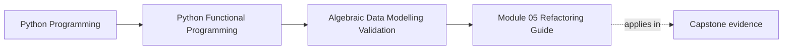
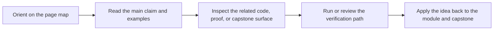

# Module 05 Refactoring Guide

<!-- page-maps:start -->
## Page Maps

<!-- page-maps:end -->

Read the first diagram as a placement map: this page is one concept inside its parent module, not a detached essay, and the capstone is the pressure test for whether the idea holds. Read the second diagram as the working rhythm for the page: name the problem, study the example, identify the boundary, then carry one review question forward.

This guide closes Module 05. The standard here is explicit modelling: the code
should tell you what states exist, what data is valid, and how transport concerns stay
outside the core model.

## Stable comparison route

1. run `make PROGRAM=python-programming/python-functional-programming history-refresh`
2. open `capstone/_history/worktrees/module-05/src/funcpipe_rag/`
3. compare `fp/`, `core/rag_types.py`, and `boundaries/serde.py`
4. read the law and validation tests under `capstone/_history/worktrees/module-05/tests/`

## What to refactor toward

- product and sum types that reveal domain meaning without extra commentary
- smart constructors that keep invariants close to the model
- validation that can accumulate multiple problems when that helps the caller
- serialization layers that adapt the model without rewriting it

## Exit standard

Before Module 06, you should be able to justify your chosen data shape and explain how a
reviewer can tell transport format from domain meaning.
