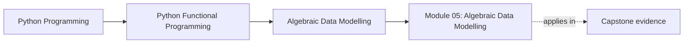
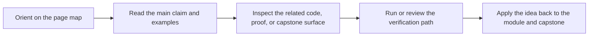

# Module 05: Algebraic Data Modelling

<!-- page-maps:start -->
## Page Maps

<!-- page-maps:end -->

This module gives the course a stronger modelling language. Instead of encoding domain
states and validation rules with flags, `None`, and scattered conditionals, the learner
starts using explicit data shapes that are easier to reason about and test.

## What this module teaches

- how product and sum types clarify domain meaning in Python
- how mapping, validation, and aggregation follow stable algebraic rules
- how smart constructors and pattern matching keep invariants close to the model
- how serialization and performance pressure influence modelling choices

## Lesson map

- [Product and Sum Types](product-and-sum-types.md)
- [Domain State ADTs](domain-state-adts.md)
- [Functors](functors.md)
- [Applicative Validation](applicative-validation.md)
- [Monoids](monoids.md)
- [Pydantic Smart Constructors](pydantic-smart-constructors.md)
- [Pattern Matching](pattern-matching.md)
- [Serialization Beyond Pydantic](serialization-beyond-pydantic.md)
- [Compositional Domain Models](compositional-domain-models.md)
- [ADT Performance](adt-performance.md)
- [Refactoring Guide](refactoring-guide.md)

## Capstone checkpoints

- Inspect where FuncPipe uses richer value shapes instead of raw primitives.
- Compare fail-fast modeling with validation that accumulates multiple issues.
- Review whether serialization keeps domain intent visible or leaks transport concerns inward.

## Before moving on

You should be able to explain how algebraic modelling makes downstream composition safer,
and why explicit shapes matter before the course introduces lawful chaining patterns. Use
[Refactoring Guide](refactoring-guide.md) and compare against
`capstone/_history/worktrees/module-05` before moving forward.
