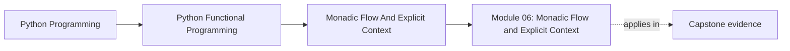
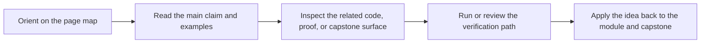

# Module 06: Monadic Flow and Explicit Context

<!-- page-maps:start -->
## Page Maps

<!-- page-maps:end -->

This module takes the data models from Module 05 and shows how dependent steps can be
chained without tangling failure handling, configuration lookup, or local state updates.
The emphasis is on readability, lawfulness, and explicit context.

## What this module teaches

- how lawful chaining removes repetitive propagation code
- how Reader, State, and Writer patterns make context explicit
- how to lift ordinary functions into container-based flows
- how to refactor ad hoc exception handling into reviewable composition

## Lesson map

- [and_then and bind](and-then-and-bind.md)
- [Law-Guided Design](law-guided-design.md)
- [Lifting Plain Functions](lifting-plain-functions.md)
- [Reader Pattern](reader-pattern.md)
- [Explicit State Threading](explicit-state-threading.md)
- [Error-Typed Flows](error-typed-flows.md)
- [Layered Containers](layered-containers.md)
- [Writer Pattern](writer-pattern.md)
- [Refactoring try/except](refactoring-try-except.md)
- [Configurable Pipelines](configurable-pipelines.md)

## Capstone checkpoints

- Inspect where dependent operations short-circuit automatically.
- Compare implicit globals with explicit context carried through the pipeline.
- Review whether logging and tracing stay data-first instead of mutating flow control.

## Before moving on

You should be able to explain why lawful composition matters for refactoring, and how
explicit context keeps abstractions honest instead of magical.
