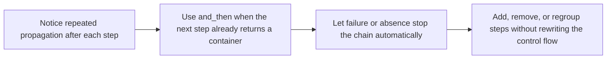

# and_then and bind

<!-- page-maps:start -->
## Lesson Map


<!-- page-maps:end -->

`and_then` is the first compositional tool in this module that changes how a pipeline
feels to read. The goal is not to introduce more terminology. The goal is to stop
rewriting the same propagation rule after every dependent step.

## Core Question

How do you replace nested `if err` or `if value is None` checks with a chain that keeps
the success path linear while still stopping on the first failure or absence?

## Start With the Propagation Smell

Students usually know the business steps they want. What slows them down is the
repeated branching around those steps.

- each new step requires another propagation branch
- the happy path is broken into fragments
- refactoring means touching control flow instead of only touching the step you changed

That smell looks like this:

```python
def embed_chunk(chunk: Chunk) -> Result[EmbeddedChunk, ErrInfo]:
    tokenized = tokenize(chunk.text.content)
    if isinstance(tokenized, Err):
        return tokenized

    encoded = model.encode(tokenized.value)
    if isinstance(encoded, Err):
        return encoded

    return Ok(replace(chunk, embedding=Embedding(encoded.value, model.name)))
```

The business story is simple: tokenize, encode, build the embedded chunk. The control
flow is what makes the function noisy.

## What `and_then` Means

Use `and_then` when the next function already returns the same kind of container.

- `map(f)`: `f` returns a plain value
- `and_then(f)`: `f` returns `Result[...]` or `Option[...]`

That single distinction removes a lot of confusion:

| You have...                     | Next function returns... | Use...       |
|---------------------------------|--------------------------|--------------|
| `Result[T, E]`                  | `U`                      | `.map`       |
| `Result[T, E]`                  | `Result[U, E]`           | `.and_then`  |
| `Option[T]`                     | `U`                      | `.map`       |
| `Option[T]`                     | `Option[U]`              | `.and_then`  |

## Worked Example

```python
def embed_chunk(chunk: Chunk) -> Result[EmbeddedChunk, ErrInfo]:
    return (
        Ok(chunk.text.content)
        .and_then(tokenize)
        .and_then(model.encode)
        .map(lambda vec: replace(chunk, embedding=Embedding(vec, model.name)))
    )
```

Read the chain in order:

1. start from the text
2. run `tokenize`, which may fail
3. run `model.encode`, which may fail
4. if both worked, build the final chunk

The container now owns the propagation rule. Each step only owns its own job.

## Tiny Option Example

`and_then` matters for absence as well, not only for errors:

```python
def get_email(user_id: int) -> Option[str]:
    return (
        option_from_nullable(db.get_user(user_id))
        .and_then(lambda user: option_from_nullable(user.get("profile")))
        .and_then(lambda profile: option_from_nullable(profile.get("email")))
    )
```

Each lookup may return nothing. The chain stops automatically at the first missing
value, and the happy path stays readable.

## Why Refactoring Gets Easier

When `and_then` is lawful, you can regroup or extract steps without changing meaning.
The associativity law is the practical reason:

```python
m.and_then(f).and_then(g) == m.and_then(lambda x: f(x).and_then(g))
```

That law says:

- you can pull part of a chain into a helper
- you can add parentheses to improve readability
- you do not have to re-check propagation logic every time you reorganize the code

## Minimal API Surface

For this lesson, the only methods you need to remember are:

```python
class Ok(Generic[T, E]):
    def map(self, f: Callable[[T], U]) -> Result[U, E]: ...
    def and_then(self, f: Callable[[T], Result[U, E]]) -> Result[U, E]: ...

class Some(Generic[T]):
    def map(self, f: Callable[[T], U]) -> Option[U]: ...
    def and_then(self, f: Callable[[T], Option[U]]) -> Option[U]: ...
```

The full implementation lives in `capstone/src/funcpipe_rag/result/types.py`, but the
teaching point is smaller than the whole source file: `map` is for plain transforms and
`and_then` is for dependent container-returning steps.

## Review Checklist

Use `and_then` when all of these are true:

- the current value is already inside `Result` or `Option`
- the next function may short-circuit in the same container
- the steps depend on each other in sequence

Do not use `and_then` when the next function is plain and independent. That is a `map`
case instead.

## Quick Property Test Reminder

```python
@given(x=st.integers())
def test_result_left_identity(x):
    f = lambda value: Ok(value * 2)
    assert Ok(x).and_then(f) == f(x)
```

The property test is not the main lesson here. Its job is to protect the refactoring
freedom that `and_then` promises.

## Practice Prompt

Take one function that repeats `if isinstance(result, Err): return result` and rewrite
it as a chain. Then explain which lines now describe the work and which lines used to
describe only propagation.

**Continue with:** [Lifting Plain Functions](lifting-plain-functions.md)
