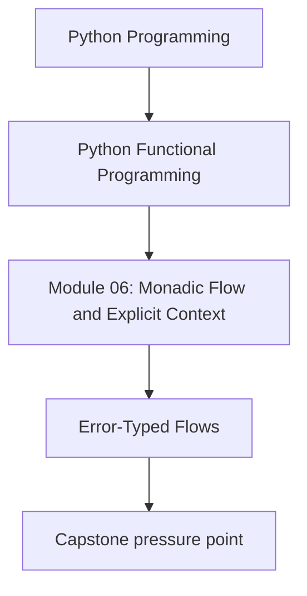
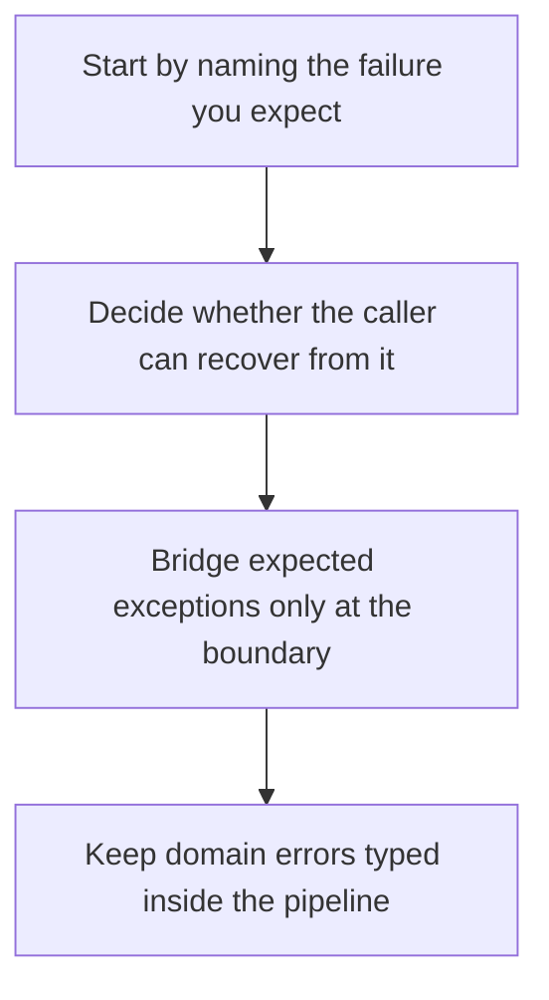

# Error-Typed Flows

<!-- page-maps:start -->
## Concept Position




<!-- page-maps:end -->

This page draws one of the most important lines in the whole module: not every failure
belongs in a `Result`, and not every exception should be swallowed into a domain error.

## Core Question

How do you keep expected, recoverable failures inside typed flows while still allowing
real bugs and unexpected failures to raise immediately?

## The Practical Test

When deciding whether something belongs in a typed error channel, ask:

> If the input were valid and the system were healthy, would I still expect this case to
> happen often enough that the caller should handle it?

If the answer is yes, it is a good candidate for `Result` or `Validation`.

If the answer is no, you may be looking at a bug, broken assumption, or unexpected
runtime failure that should raise instead of being quietly converted.

## A Useful Classification Table

| Situation | Good default | Why |
|-----------|--------------|-----|
| invalid JSON from user input | typed `Err` | caller can report it and continue |
| business rule violation | typed `Err` or `VFailure` | this is part of the domain contract |
| missing optional data | `Option` or a typed `Err`, depending on meaning | absence may be ordinary, not exceptional |
| programmer mistake or broken invariant | raise | hiding it as a domain error makes debugging harder |
| exception from an outer boundary you explicitly expect | bridge with `try_result(..., exc_type=...)` | boundary code can classify it deliberately |

The exact classification is contextual, but the review goal is stable: be explicit about
which failures are part of the contract.

## Boundary-Only Bridging

The repository helpers exist for effect boundaries:

```python
def try_result(
    thunk: Callable[[], T],
    map_exc: Callable[[Exception], E],
    exc_type: type[Exception] | tuple[type[Exception], ...] = Exception,
) -> Result[T, E]:
    try:
        return Ok(thunk())
    except exc_type as ex:
        return Err(map_exc(ex))
```

The important part is not the syntax. The important part is the discipline:

- catch only the exception types you have decided are expected
- map them into a typed error the caller can handle
- let everything else propagate as a real failure

## Before and After

```python
# BEFORE – broad except hides too much
def load_user(raw: str) -> User | None:
    try:
        data = json.loads(raw)
        return validate_user(data)
    except Exception:
        return None
```

```python
# AFTER – expected errors are typed, unexpected failures still raise
@dataclass(frozen=True)
class ParseErr:
    msg: str

def parse_json(raw: str) -> Result[dict[str, object], ParseErr]:
    return try_result(
        lambda: json.loads(raw),
        lambda ex: ParseErr(f"invalid JSON: {ex}"),
        exc_type=json.JSONDecodeError,
    )

def load_user(raw: str) -> Result[User, ParseErr | DomainErr]:
    return parse_json(raw).and_then(validate_user)
```

The public story is now clear:

- invalid JSON is expected and typed
- domain validation failures stay typed
- unexpected failures inside `validate_user` still raise instead of disappearing

## Why `exc_type` Matters

Without `exc_type`, a broad bridge can accidentally turn unrelated failures into domain
errors. That makes debugging harder and teaches students the wrong habit.

Use `exc_type` as a deliberate classification tool, not as a convenience flag.

## What the Laws and Tests Protect

The tests around `try_result`, `result_map_try`, `v_try`, and `v_map_try` protect a
smaller claim than “all error handling is solved”:

- expected exceptions become typed failures
- successful computations stay successful
- exceptions outside `exc_type` still raise

That is the right level of confidence for this page. The business meaning of the error
types still needs ordinary domain tests.

## Review Checklist

When reviewing an error-typed flow, ask:

- which failures are part of the public contract?
- where is the effect boundary that classifies raw exceptions?
- does `exc_type` match only the expected exceptions?
- could this code be hiding a bug by converting too much?

## Practice Prompt

Find one `except Exception` block in your codebase and rewrite it so that:

1. expected exceptions are mapped at the boundary
2. domain validation stays inside typed flows
3. unexpected failures still raise

Then explain which part of the old block was doing classification and which part was
doing silent suppression.

**Continue with:** [Layered Containers](layered-containers.md)
