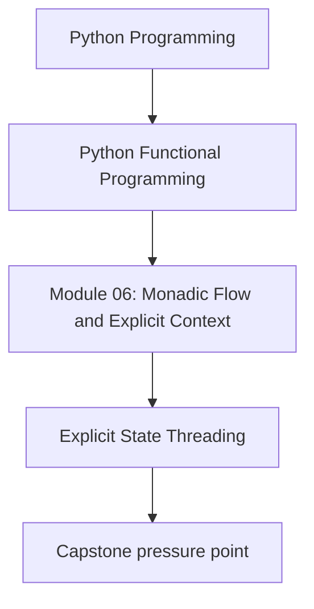
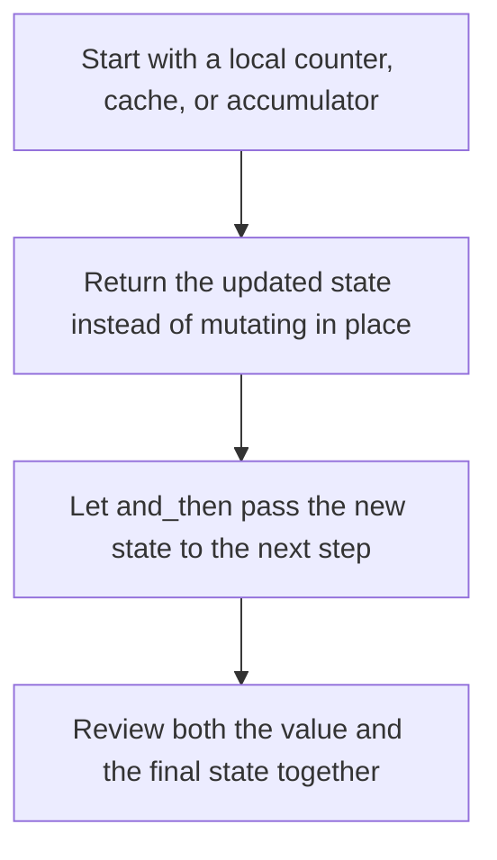

# Explicit State Threading

<!-- page-maps:start -->
## Concept Position




<!-- page-maps:end -->

State is useful when a pipeline needs local evolving data but you still want the flow to
stay pure and reviewable.

## Core Question

How do you model local state changes as explicit input and output so that counters,
accumulators, and progress updates remain easy to test?

## Start With the Real Problem

Students usually meet State after trying one of these patterns:

- a helper mutates a shared counter
- several functions pass `(value, state)` by hand
- local bookkeeping starts to overshadow the business steps

The problem is not that bookkeeping exists. The problem is that hidden mutation and
manual threading both make the pipeline harder to read.

## State in One Sentence

`State[S, T]` is a pure function `S -> tuple[T, S]`: it takes a current state, returns a
value, and also returns the next state.

```python
@dataclass(frozen=True)
class State(Generic[S, T]):
    run: Callable[[S], tuple[T, S]]

    def map(self, f: Callable[[T], U]) -> State[S, U]:
        def _run(s: S) -> tuple[U, S]:
            value, new_s = self.run(s)
            return f(value), new_s

        return State(_run)

    def and_then(self, f: Callable[[T], State[S, U]]) -> State[S, U]:
        def _run(s: S) -> tuple[U, S]:
            value, new_s = self.run(s)
            return f(value).run(new_s)

        return State(_run)
```

That is the main idea. Nothing mutates in place. The next state is just another return
value.

## The Core Helpers

These are the helpers that exist in the repository:

```python
def pure(x: T) -> State[S, T]:
    return State(lambda s: (x, s))

def get() -> State[S, S]:
    return State(lambda s: (s, s))

def put(new_s: S) -> State[S, None]:
    return State(lambda _: (None, new_s))

def modify(f: Callable[[S], S]) -> State[S, None]:
    return State(lambda s: (None, f(s)))

def run_state(p: State[S, T], initial: S) -> tuple[T, S]:
    return p.run(initial)
```

For this module, the reading is simple:

- `get()`: inspect the current state
- `put(new_s)`: replace it
- `modify(f)`: derive a new state from the old one
- `run_state(...)`: execute the whole pipeline

## Before and After

```python
# BEFORE – manual threading
def step1(x: int, total: int) -> tuple[int, int]:
    return x + 1, total + 1

def step2(y: int, total: int) -> tuple[int, int]:
    return y * 2, total + 1

def pipeline(x: int, total: int) -> tuple[int, int]:
    y, total1 = step1(x, total)
    z, total2 = step2(y, total1)
    return z, total2
```

```python
# AFTER – the state rule is carried by the container
def step1_s(x: int) -> State[int, int]:
    return modify(lambda total: total + 1).map(lambda _: x + 1)

def step2_s(y: int) -> State[int, int]:
    return modify(lambda total: total + 1).map(lambda _: y * 2)

pipeline_s = pure(10).and_then(step1_s).and_then(step2_s)
value, final_total = run_state(pipeline_s, 0)
```

The business steps are easier to see because the state-threading rule no longer appears
in every function signature.

## A More Realistic Module 06 Example

```python
@dataclass(frozen=True)
class PipelineState:
    total_tokens: int = 0
    processed_chunks: int = 0

def count_tokens(tokens: list[str]) -> State[PipelineState, list[str]]:
    return modify(
        lambda st: replace(
            st,
            total_tokens=st.total_tokens + len(tokens),
            processed_chunks=st.processed_chunks + 1,
        )
    ).map(lambda _: tokens)
```

The helper updates the bookkeeping and still returns the original payload so the rest of
the pipeline can keep working with it.

## When State Is Worth It

Use State when:

- the same local state needs to flow through several steps
- mutating in place would hide important behavior
- manual `(value, state)` plumbing is starting to dominate the code

Do not use State when a single local variable inside one function is enough. Ordinary
Python is often clearer for one small scope.

## What the Laws Buy You

The State laws matter because they protect the refactoring freedom around that threaded
state:

- you can regroup stateful steps without changing the result
- you can extract a helper that updates state and returns a value
- you can trust that the sequencing rule stays stable while the business logic evolves

## Review Checklist

When reading a State pipeline, ask:

- what information is carried as state from step to step?
- is the state genuinely shared, or would a local variable be simpler?
- can I explain the final state without mentally simulating hidden mutation?

## Practice Prompt

Take one mutable counter or accumulator from your codebase and rewrite it as explicit
state. Then explain whether the new version is better because it is shared across a
pipeline, not just because it uses a functional abstraction.

**Continue with:** [Error-Typed Flows](error-typed-flows.md)
