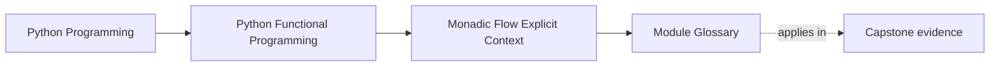
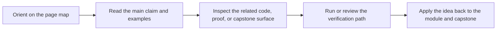

# Module Glossary

<!-- page-maps:start -->
## Page Maps

<!-- page-maps:end -->

This glossary belongs to **Module 06: Monadic Flow and Explicit Context** in **Python Functional Programming**. It keeps the language of this directory stable so the same ideas keep the same names across reading, practice, review, and capstone proof.

## How to use this glossary

Read the directory index first, then return here whenever a page, command, or review discussion starts to feel more vague than the course intends. The goal is stable language, not extra theory.

## Terms in this directory

| Term | Meaning in this directory |
| --- | --- |
| and_then and bind | the module's treatment of and_then and bind, used to make the module's main design claim concrete in design work, refactoring, and capstone evidence. |
| Configurable Pipelines | the module's treatment of configurable pipelines, used to make the module's main design claim concrete in design work, refactoring, and capstone evidence. |
| Error-Typed Flows | the module's treatment of error-typed flows, used to make the module's main design claim concrete in design work, refactoring, and capstone evidence. |
| Explicit State Threading | the module's treatment of explicit state threading, used to make the module's main design claim concrete in design work, refactoring, and capstone evidence. |
| Law-Guided Design | the module's treatment of law-guided design, used to make the module's main design claim concrete in design work, refactoring, and capstone evidence. |
| Layered Containers | the module's treatment of layered containers, used to make the module's main design claim concrete in design work, refactoring, and capstone evidence. |
| Lifting Plain Functions | the module's treatment of lifting plain functions, used to make the module's main design claim concrete in design work, refactoring, and capstone evidence. |
| Module 06 Refactoring Guide | the repair route for applying the module's main design claim to existing code without losing behavior, clarity, or proof. |
| Reader Pattern | the module's treatment of reader pattern, used to make the module's main design claim concrete in design work, refactoring, and capstone evidence. |
| Refactoring try/except | the module's treatment of refactoring try/except, used to make the module's main design claim concrete in design work, refactoring, and capstone evidence. |
| Writer Pattern | the module's treatment of writer pattern, used to make the module's main design claim concrete in design work, refactoring, and capstone evidence. |
