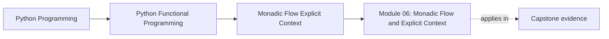
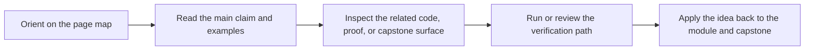

# Module 06: Monadic Flow and Explicit Context

<!-- page-maps:start -->
## Page Maps

<!-- page-maps:end -->

Read the first diagram as a placement map: this module sits between the data modelling
work from Module 05 and the boundary-focused design work in Module 07. Read the second
diagram as a study route: start from a concrete propagation or context problem, then
move through the lessons in a deliberate order instead of treating the pages as isolated
reference notes.

Module 06 is about one practical question:

> When several steps depend on each other, which parts of the flow should stay explicit
> in the code so that failure, configuration, logging, and local state remain easy to
> review?

## Keep These Pages Open

Use these pages alongside Module 06 so the new abstractions stay connected to the rest
of the course:

- [Mid-Course Map](../module-00-orientation/mid-course-map.md): where this module fits in the overall progression
- [Pressure Routes](../guides/pressure-routes.md): review questions for flow, context, and trade-offs
- [Boundary Review Prompts](../reference/boundary-review-prompts.md): prompts for deciding what belongs in a container and what belongs at a boundary
- [Capstone Map](../capstone/capstone-map.md): where the same ideas surface in FuncPipe

## What Changes In This Module

Module 05 focused on shaping data honestly. Module 06 keeps that data modelling work,
but shifts the attention to sequencing:

- dependent steps should read in the same order they execute
- failure and absence should propagate without repetitive branching
- configuration, local state, and log data should stay visible instead of leaking
  through globals or hidden mutation

The goal is not to use more container names. The goal is to make flow easier to read,
change, and test.

## Learning Outcomes

By the end of the module, you should be able to:

- explain when `map`, `and_then`, and applicative lifting solve different composition problems
- choose when Reader, State, or Writer clarifies a pipeline and when ordinary functions are still enough
- separate expected domain errors from unexpected failures at effect boundaries
- review nested container shapes without losing track of which effect dominates the flow
- refactor imperative branching into smaller, law-guided steps without changing the public behavior

## Suggested Reading Order

Use this order if you are reading the module front to back:

1. [and_then and bind](and-then-and-bind.md): remove repetitive propagation from dependent steps
2. [Lifting Plain Functions](lifting-plain-functions.md): decide when to use `map`, `and_then`, `map_err`, or `liftA2`
3. [Law-Guided Design](law-guided-design.md): understand what makes those refactors safe
4. [Reader Pattern](reader-pattern.md): make shared configuration explicit
5. [Explicit State Threading](explicit-state-threading.md): keep local updates pure and reviewable
6. [Error-Typed Flows](error-typed-flows.md): separate expected errors from bugs
7. [Layered Containers](layered-containers.md): combine effects without losing track of behavior
8. [Writer Pattern](writer-pattern.md): accumulate logs and trace data as values
9. [Refactoring try/except](refactoring-try-except.md): turn the ideas into a repeatable rewrite process
10. [Configurable Pipelines](configurable-pipelines.md): choose behavior from configuration instead of duplicating pipelines
11. [Refactoring Guide](refactoring-guide.md): compare the module ideas against the capstone surfaces

## Exercises

- Rewrite one manual propagation path with `and_then`, and name the branches you no longer have to maintain by hand.
- Find one hidden dependency and decide whether it should become a Reader input or stay as an ordinary function argument.
- Review one logging or stateful helper and explain whether Writer or State would clarify the behavior or only add ceremony.

## Capstone Checkpoints

- Trace one capstone pipeline and identify where short-circuiting happens.
- Compare one implicit dependency with an explicit context value carried through the flow.
- Inspect whether logs, metrics, or counters are treated as ordinary data or as hidden side effects.

## Closing Criteria

Before moving on, you should be able to:

- explain why lawful composition matters for refactoring, not just for theory
- point to the part of a pipeline where context is introduced, transformed, and consumed
- compare an exception-heavy path with a compositional path and explain which one is easier to review
- use [Refactoring Guide](refactoring-guide.md) together with
  `capstone/_history/worktrees/module-06` to check whether the ideas feel concrete in real code

## Directory Glossary

Use [Glossary](glossary.md) when you want the recurring terms in this module to stay
stable while you move between lessons, exercises, and capstone checkpoints.
