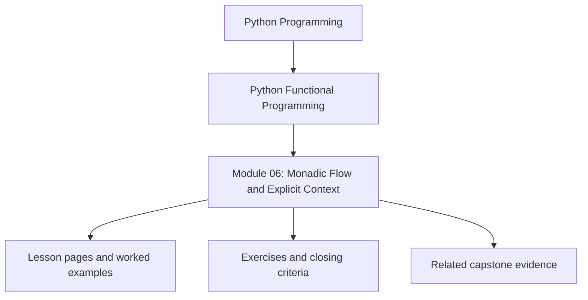
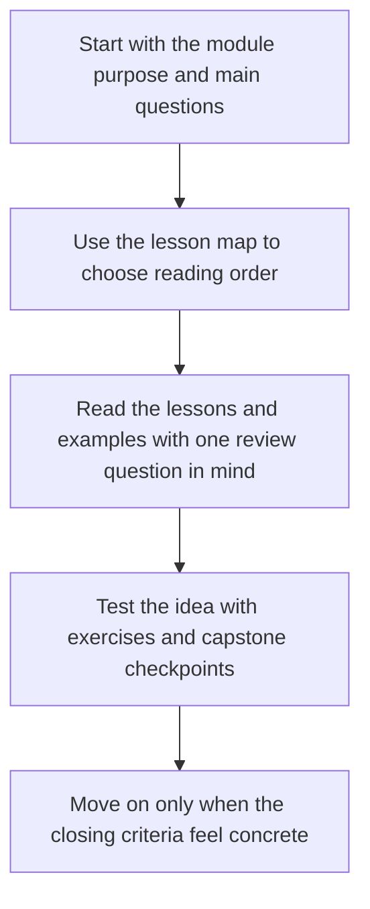

# Module 06: Monadic Flow and Explicit Context

<!-- page-maps:start -->
## Module Position

<!-- page-maps:end -->

Read the first diagram as a placement map: this page sits between the course promise, the lesson pages listed below, and the capstone surfaces that pressure-test the module. Read the second diagram as the study route for this page, so the diagrams point you toward the `Lesson map`, `Exercises`, and `Closing criteria` instead of acting like decoration.

## Keep These Pages Open

Use these support surfaces while reading so explicit context and composition stay tied to
reviewable flow rather than container jargon:

- [Mid-Course Map](../module-00-orientation/mid-course-map.md) for the bridge through failure and modelling pressure
- [Engineering Question Map](../guides/engineering-question-map.md) for flow and context questions
- [Boundary Review Prompts](../reference/boundary-review-prompts.md) for keep/change/reject pressure
- [Capstone Map](../guides/capstone-map.md) for the context, result, and pipeline surfaces in FuncPipe

Carry this question into the module:

> Which context should remain explicit in the composition itself, and which abstraction would make the flow harder to inspect than ordinary Python dataflow?

This module takes the data models from Module 05 and shows how dependent steps can be
chained without tangling failure handling, configuration lookup, or local state updates.
The emphasis is on readability, lawfulness, and explicit context.

## Learning outcomes

- how lawful chaining removes repetitive propagation code
- how Reader, State, and Writer patterns make context explicit
- how to lift ordinary functions into container-based flows
- how to refactor ad hoc exception handling into reviewable composition

## Lesson map

- [and_then and bind](and-then-and-bind.md)
- [Law-Guided Design](law-guided-design.md)
- [Lifting Plain Functions](lifting-plain-functions.md)
- [Reader Pattern](reader-pattern.md)
- [Explicit State Threading](explicit-state-threading.md)
- [Error-Typed Flows](error-typed-flows.md)
- [Layered Containers](layered-containers.md)
- [Writer Pattern](writer-pattern.md)
- [Refactoring try/except](refactoring-try-except.md)
- [Configurable Pipelines](configurable-pipelines.md)
- [Refactoring Guide](refactoring-guide.md)

## Exercises

- Rewrite one nested propagation path with lawful chaining and explain which repetition disappears.
- Identify one place where Reader, State, or Writer is warranted and one place where ordinary functions are still enough.
- Review one logging or context-carrying helper and explain whether it preserves the underlying payload contract.

## Capstone checkpoints

- Inspect where dependent operations short-circuit automatically.
- Compare implicit globals with explicit context carried through the pipeline.
- Review whether logging and tracing stay data-first instead of mutating flow control.

## Before moving on

You should be able to explain why lawful composition matters for refactoring, and how
explicit context keeps abstractions honest instead of magical. Use
[Refactoring Guide](refactoring-guide.md) and compare against
`capstone/_history/worktrees/module-06` before moving forward.

## Closing criteria

- You can explain why a lawful composition rule matters for maintenance instead of treating it as theory trivia.
- You can identify when explicit context clarifies behavior and when a container abstraction would hide too much.
- You can compare an exception-driven path with a compositional path and explain which one is easier to review.
