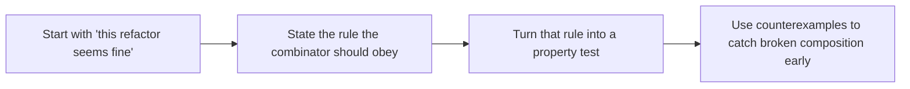

# Law-Guided Design

<!-- page-maps:start -->
## Lesson Map


<!-- page-maps:end -->

This lesson exists because elegant-looking composition is not enough. Students need a
reason to trust a refactor beyond a few example inputs.

## Core Question

How do you turn the laws behind `map` and `and_then` into executable tests so that
refactors stay reviewable instead of relying on intuition?

## Why Laws Matter in Practice

The laws are not there to decorate the code with algebra vocabulary. They answer very
practical refactoring questions:

- can I extract part of this chain into a helper?
- can I regroup the pipeline to improve readability?
- can I trust the container implementation not to invent new behavior?

If the laws hold, those changes are safer. If the laws fail, the pipeline may still pass
happy-path examples while becoming brittle in real maintenance work.

## The Three Laws Students Need First

| Law | Statement | What it buys you |
|-----|-----------|------------------|
| Left identity | `Ok(x).and_then(f) == f(x)` | lifting a value into the container does not change the next step |
| Right identity | `m.and_then(Ok) == m` | extracting a sub-pipeline and returning it unchanged is safe |
| Associativity | `m.and_then(f).and_then(g) == m.and_then(lambda x: f(x).and_then(g))` | regrouping a chain does not change the result |

For `Option`, the same laws apply with `Some` in place of `Ok`.

## What the Laws Cover and What They Do Not

The laws cover the behavior of the composition machinery.

- they tell you that the combinators behave consistently
- they protect refactors that only reorganize lawful composition
- they make regressions show up as counterexamples instead of folklore

The laws do not cover everything.

- they do not prove that your domain rule is correct
- they do not prove that the chosen error type is useful
- they do not replace example-based tests for concrete business cases

That boundary matters. A lawful pipeline can still implement the wrong business rule.

## Turning the Law Into a Property

Here is the smallest useful example:

```python
@given(x=st.integers())
def test_result_left_identity(x):
    f = lambda value: Ok(value * 2)
    assert Ok(x).and_then(f) == f(x)
```

The pattern is always the same:

1. write the law in one line
2. generate many values and function families
3. let Hypothesis search for a counterexample

## Why Function Strategies Matter

Property tests for laws are only convincing if the generated functions are varied enough
to exercise both branches of the container.

```python
@st.composite
def st_func_to_result(draw) -> Callable[[int], Result[int, str]]:
    ok_val = draw(st.integers(-20, 20))
    err_val = draw(st.text(min_size=0, max_size=8))
    threshold = draw(st.integers(-10, 10))

    def f(x: int) -> Result[int, str]:
        if x % 2 == 0:
            return Ok(ok_val if x >= threshold else x * 2)
        return Err(err_val)

    return f
```

This is the real teaching move: students see that law tests are not magic. They are
ordinary property tests aimed at the composition layer.

## A Helpful Failure Mode to Remember

If an `and_then` implementation accidentally re-wraps or drops values incorrectly,
associativity often fails first. Hypothesis then shrinks the failing case until the
problem is small enough to reason about.

That is why law tests are so useful in review:

- they fail on the contract, not only on a single example
- they produce a small witness for the bug
- they protect future edits to the container implementation

## Minimal Checklist for This Module

For Module 06, students should be able to answer these questions:

- which laws matter for `Result` and `Option`?
- which property test checks each law?
- which kinds of refactors become safer when those tests pass?

If they can answer those, the laws are doing their job.

## Practice Prompt

Take one law from this page and write the same property for `Option` instead of
`Result`. Then explain, in one sentence, what kind of refactor that law protects.

**Continue with:** [Reader Pattern](reader-pattern.md)
