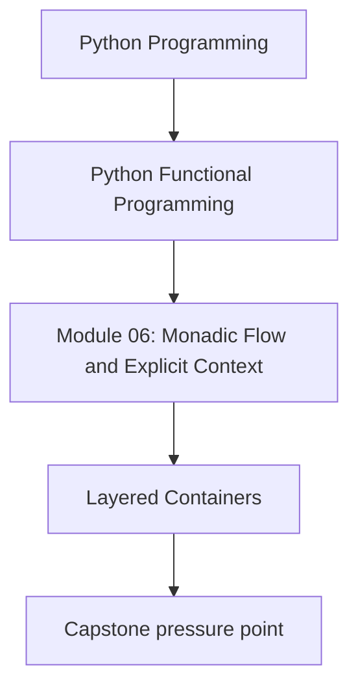
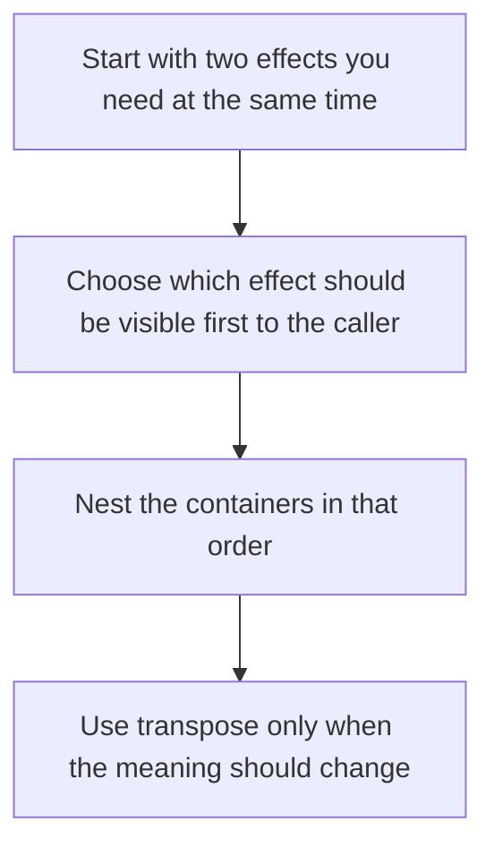

# Layered Containers

<!-- page-maps:start -->
## Concept Position




<!-- page-maps:end -->

Layering is where the module starts to feel more like real application code. A pipeline
rarely has only one concern. It may need failure, absence, config, state, or logs at the
same time.

## Core Question

How do you combine effects without losing track of which one should dominate the way the
pipeline behaves?

## Start With the Caller View

The simplest rule is this:

> Put the effect first that you want the caller to confront first.

If the caller should see failure before anything else, make `Result` outermost. If the
caller must supply configuration before anything can happen, make `Reader` outermost.

Thinking in terms of caller view is usually clearer than thinking in terms of abstract
type gymnastics.

## Common Layer Orders

| Shape | Caller experiences first | Good fit |
|-------|--------------------------|----------|
| `Result[Option[T], E]` | failure or success | network/database lookup where failure and absence mean different things |
| `Reader[Config, Result[T, E]]` | supplying config | pipelines that always need config, even on error paths |
| `State[S, Result[T, E]]` | running stateful work | bookkeeping that should still advance or be inspectable even when the work fails |
| `Writer[Result[T, E], LogEntry]` | result plus accumulated logs | reviewable logs that should survive short-circuiting |

The layer order is a design statement. It tells the reader which concern is supposed to
be most visible from the outside.

## Result and Option: the Most Common Stack

`Result[Option[T], E]` is often the best default for “failure or not found” because it
keeps two different ideas separate:

- `Err(e)`: the lookup failed
- `Ok(NoneVal())`: the lookup succeeded, but there was no value
- `Ok(Some(value))`: the lookup succeeded and found something

```python
def query_user(user_id: UserId) -> Result[Option[User], NetworkErr]:
    return try_result(
        lambda: http_get(f"/users/{user_id}"),
        map_http_exc,
    ).map(lambda body: NoneVal() if body is None else Some(parse_user(body)))
```

That shape is easy to review because each branch means something different.

## When Transpose Changes the Story

The repository includes two helpers:

```python
def transpose_result_option(ro: Result[Option[T], E]) -> Option[Result[T, E]]: ...
def transpose_option_result(or_: Option[Result[T, E]]) -> Result[Option[T], E]: ...
```

Use them only when you intentionally want to change which concern is easier to inspect
first.

For example:

- `Result[Option[T], E]`: ask “did the operation fail?”
- `Option[Result[T, E]]`: ask “is there a value here at all?”

That is not just syntax. It changes what the caller sees first.

## Reader and Result

Compare these two shapes carefully:

```python
Reader[Config, Result[T, E]]
Result[Reader[Config, T], E]
```

They are not interchangeable.

- `Reader[Config, Result[T, E]]` means you always provide config, then the work may fail
- `Result[Reader[Config, T], E]` means the very ability to obtain a config-dependent
  computation may fail before the caller can even run it

In day-to-day Python code, the first shape is usually the more teachable and more useful
one.

## State and Result

`State[S, Result[T, E]]` is a good fit when you want the final state even if the work
fails:

```python
State[PipelineState, Result[EmbeddedChunk, ErrInfo]]
```

That shape makes sense for metrics, counters, or progress data that should still be
visible after a failure.

If you instead put `Result` outside the stateful work, the failure can cut off access to
that state update story. Sometimes that is what you want. The point is to decide
deliberately.

## A Good Review Habit

When you see a nested type, read it outside in and ask:

1. what does the caller meet first?
2. which branch short-circuits the most work?
3. what information is still available when something goes wrong?

Those three questions usually clarify the right order faster than abstract debate.

## Review Checklist

- can I explain each branch of the nested type in plain language?
- does the outer layer match the concern I want the caller to notice first?
- am I using transpose because the meaning changed, or only because the type looked odd?

## Practice Prompt

Take one pipeline in your codebase that has both failure and absence. Write down its
shape as `Result[Option[T], E]` and then as `Option[Result[T, E]]`. For each version,
explain what the caller learns first and which one better matches the domain story.

**Continue with:** [Writer Pattern](writer-pattern.md)
