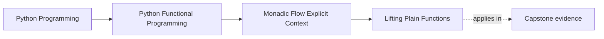
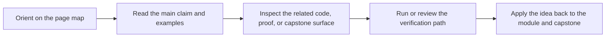

# Lifting Plain Functions


<!-- page-maps:start -->
## Page Maps




<!-- page-maps:end -->

Lifting should feel like a small practical decision rather than a pile of combinator names. You need a reliable way to look at a plain function and decide whether it belongs under `map`, `and_then`, `map_err`, or applicative lifting.

## Start With the Choice Problem

After learning `and_then`, you often hit a different kind of uncertainty: the function is plain Python, so which operation should carry it into the container flow?

- If the function transforms a successful value without changing the container type, it usually belongs under `map`.
- If the function itself returns a container, then `and_then` is usually the honest choice.
- If the function combines independent container values, applicative lifting is often the better fit than sequential chaining.

**Core question**  
How do you turn any plain Python function into a container-aware version (`map`, `ap`, `and_then`) so that your pipelines become completely linear on the happy path and never require another manual error check again?

This lesson introduces lifting as the bridge between ordinary functions and container-based flow:

- preserve the behavior of plain functions instead of rewriting them around containers
- choose the smallest combinator that matches the dependency structure
- keep the resulting pipeline readable by making the lifting rule obvious at the call site

## The First Decision To Make

Before picking a combinator, ask one question about the next piece of work:

- does the next step depend on the previous successful value, or
- are you combining two independent container values that can be computed separately?

That split removes most of the confusion:

- dependent next step -> usually `.and_then`
- independent combination -> usually `liftA2` or `v_liftA2`

Use this when you are done writing `if isinstance(x, Err): return x` 47 times and want a small, reliable decision framework for container-aware composition.

**Outcome**
1. You will reach for `.map`, `.map_err`, `.and_then`, or `liftA2` instinctively.
2. You will know exactly when to pick fail-fast `Result` vs accumulating `Validation`.
3. You will have Hypothesis-backed proof that all lifting combinators satisfy functor/applicative/monad laws.

## The Four Operations To Reach For First

| Operation      | Method                  | Use when                                                   | Container     |
|----------------|-------------------------|------------------------------------------------------------|---------------|
| Transform success | `.map(f)`             | Independent post-processing                                | All           |
| Transform error   | `.map_err(g)`         | Error enrichment / normalisation                           | Result        |
| Chain dependent   | `.and_then(f)`        | Sequential steps, parsing, API calls (fail-fast)           | Result / Option |
| Parallel independent | `liftA2(f, a, b)`      | Multi-field validation (accumulate or fail-fast)           | Result / Validation |

The only Tier-2 helper you’ll occasionally need is `try_result` (exception bridging). Everything else lives in reference appendices.

## 1. Laws & Invariants (machine-checked in CI)

| Law                           | Formal Statement                                                            | Why it matters                                            |
|-------------------------------|-----------------------------------------------------------------------------|-----------------------------------------------------------|
| Functor Identity              | `m.map(id) == m`                                                            | Mapping identity is a no-op                               |
| Functor Composition           | `m.map(f).map(g) == m.map(g ∘ f)`                                           | Mapping composes predictably                              |
| Applicative Identity          | `Ok(lambda x: x).ap(m) == m`                                                | Pure identity function does nothing                       |
| Applicative Homomorphism      | `Ok(f).ap(Ok(x)) == Ok(f(x))`                                               | Lifting pure functions preserves meaning                  |
| Applicative Interchange       | `u.ap(Ok(y)) == Ok(lambda f: f(y)).ap(u)`                                   | Order of pure arguments doesn't matter                    |
| Applicative Composition       | `Ok(compose).ap(u).ap(v).ap(m) == u.ap(v.ap(m))`                            | Applicative composition is associative                     |
| Monad Laws                    | Left/right identity, associativity (M06C02)                                  | Refactor-safe chaining                                    |
| Validation Accumulation       | `v_ap(VFailure(e1), VFailure(e2)) == VFailure(e1 + e2)`                     | All errors are always collected                           |

All laws are verified with Hypothesis. A single counterexample breaks CI.

## 2. Public API – End-of-Module-06 code locations

- `Result` / `Option`: `capstone/src/funcpipe_rag/result/types.py`
- `Validation` applicative helpers (`v_ap`, `v_liftA2`): `capstone/src/funcpipe_rag/fp/validation.py`
- Exception bridging (boundary-only): `capstone/src/funcpipe_rag/boundaries/adapters/exception_bridge.py`

```python
from funcpipe_rag.result.types import Err, NoneVal, Ok, Option, Result, Some, liftA2
from funcpipe_rag.fp.validation import v_ap, v_liftA2
```

## 3. Real-World Examples

### 3.1 Fail-Fast Pipeline (Result)
```python
safe_int = try_result(int, lambda e: ErrInfo("PARSE", str(e)))

def parse_port(s: str) -> Result[int, ErrInfo]:
    return Ok(s).and_then(safe_int).and_then(ensure(in_range(1, 65536)))

parse_port("abc")   # Err(...)
parse_port("80")    # Ok(80)
```

### 3.2 Parallel Validation (Validation)
```python
validate_user = v_liftA2(
    User,
    parse_name(data.get("name")),
    parse_age(data.get("age"))
)

# → VFailure(("name missing", "bad age"))
```

This example is intentionally different from `and_then`: neither validation depends on
the other. Both feed the same constructor, which is why applicative lifting is the
honest fit here.

### 3.3 Before → After
```python
# BEFORE – manual propagation
def validate_cfg(cfg: dict) -> Result[Config, ErrInfo]:
    if "name" not in cfg or not isinstance(cfg["name"], str):
        return Err(ErrInfo("NAME", "..."))
    if "port" not in cfg or not isinstance(cfg["port"], int):
        return Err(ErrInfo("PORT", "..."))
    return Ok(Config(cfg["name"], cfg["port"]))

# AFTER – linear happy path
validate_cfg = lambda cfg: (
    Ok(cfg)
    .and_then(require("name", ErrInfo("NAME", "missing")))
    .and_then(ensure(is_str, ErrInfo("NAME", "not str")))
    .and_then(require("port", ErrInfo("PORT", "missing")))
    .and_then(ensure(is_int, ErrInfo("PORT", "not int")))
    .map(lambda _: Config(cfg["name"], cfg["port"]))
)
```

This last example stays sequential on purpose: each step depends on the same evolving
`Result` context. It complements the previous validation example instead of replacing it.
The key point is that lifting is not one single pattern. The dependency shape tells
you whether to chain or combine.

## 4. Property-Based Proofs (selected)

```python
@given(m=st_result())
def test_result_applicative_identity(m):
    assert Ok(lambda x: x).ap(m) == m

@given(e1=st_errors(), e2=st_errors())
def test_validation_accumulates(e1, e2):
    # In the codebase: VFailure is in funcpipe_rag.fp.core; v_ap is in funcpipe_rag.fp.validation.
    assert v_ap(VFailure((e1,)), VFailure((e2,))) == VFailure((e1, e2))
```

## 5. Anti-Patterns & Immediate Fixes

| Anti-Pattern                        | Symptom                              | Fix                              |
|-------------------------------------|--------------------------------------|----------------------------------|
| Manual propagation                  | `if isinstance(x, Err): return x`    | Use `.map` / `.and_then` / `liftA2` |
| Using `and_then` for parallel validation | Only first error reported            | Use `liftA2` + `Validation`      |
| Raw exceptions inside pipeline      | Unhandled crashes                    | Wrap with `try_result`           |

## 6. Pre-Core Quiz

1. Use `.map` when…? → **Independent success transform**  
2. Use `.and_then` when…? → **Dependent/sequential step**  
3. Use `liftA2` when…? → **Independent parallel validation**  
4. Validation vs Result? → **Accumulate all vs stop on first**  
5. The golden rule? → **Never write manual error propagation again**

## 7. Post-Core Exercise

1. Take the most nested validation function in your codebase and rewrite it with `v_liftA2` — verify all errors are reported.
2. Convert a real `try/except` chain to `and_then` + `try_result`.
3. Add a new field to an existing validation — confirm it’s a single-line change.

**Continue with:** [Reader Pattern](../module-06-monadic-flow-explicit-context/reader-pattern.md)

You have now reached the point where every pipeline you write is **linear on the happy path**, **automatically propagates every error**, and is **mathematically proven correct** by Hypothesis. The remaining cores remove the last bits of friction.
