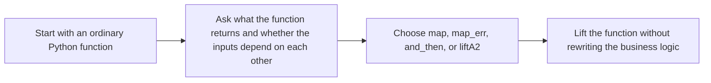

# Lifting Plain Functions

<!-- page-maps:start -->
## Lesson Map


<!-- page-maps:end -->

After `and_then`, students often hit a new kind of friction: the next function is just a
plain Python function, so which combinator should carry it into the pipeline?

This lesson is about making that choice routine instead of mysterious.

## Core Question

How do you take an ordinary function and place it into a container-based pipeline without
rewriting the function just to satisfy the container?

## The Decision Ladder

Start with two questions:

1. Does the function return a plain value or another container?
2. Are the inputs sequentially dependent or independent?

That gives you the main choices:

| Situation                                      | Use              | Why it fits |
|------------------------------------------------|------------------|-------------|
| Transform the success value                    | `.map(f)`        | `f` is plain and depends on one successful value |
| Transform the error value                      | `.map_err(g)`    | you want to normalize or enrich the error branch |
| Run the next dependent step                    | `.and_then(f)`   | `f` already returns `Result` or `Option` |
| Combine independent container values           | `liftA2(f, a, b)` or `v_liftA2(f, a, b)` | both inputs matter and neither has to wait for the other |

If you remember only one sentence, remember this one:

> Choose the smallest combinator that matches the real dependency shape of the work.

## One Plain Function, Three Different Lifts

```python
def normalize(name: str) -> str:
    return name.strip().title()

def parse_port(raw: str) -> Result[int, ErrInfo]:
    ...

def combine_host_port(host: str, port: int) -> Endpoint:
    return Endpoint(host=host, port=port)
```

Those functions enter pipelines in different ways:

```python
clean_name = Ok("  bijan ").map(normalize)

validated_port = Ok("8080").and_then(parse_port)

endpoint = liftA2(
    combine_host_port,
    Ok("api.internal"),
    Ok(8080),
)
```

The function bodies stay ordinary. The combinator explains how the container should
carry them.

## When `liftA2` Matters

Students often overuse `and_then` because it feels familiar after the previous lesson.
That works for dependent steps, but it is the wrong mental model for independent
validation.

Use `liftA2` or `v_liftA2` when:

- both inputs can be computed separately
- the final function needs both values together
- you care about the difference between fail-fast `Result` and accumulating `Validation`

```python
validate_user = v_liftA2(
    User,
    validate_name(data.get("name")),
    validate_age(data.get("age")),
)
```

That example is different from sequential chaining. Neither validation depends on the
other; they are peers that feed the same constructor.

## A Better Before and After

```python
# BEFORE – manual propagation mixed with business rules
def validate_cfg(cfg: dict[str, object]) -> Result[Config, ErrInfo]:
    name = cfg.get("name")
    if not isinstance(name, str):
        return Err(ErrInfo("NAME", "missing or invalid"))

    port = cfg.get("port")
    if not isinstance(port, int):
        return Err(ErrInfo("PORT", "missing or invalid"))

    return Ok(Config(name=name, port=port))
```

```python
# AFTER – plain constructors, clear lifting choices
def require_str(field: str) -> Callable[[dict[str, object]], Result[str, ErrInfo]]:
    def step(cfg: dict[str, object]) -> Result[str, ErrInfo]:
        value = cfg.get(field)
        return Ok(value) if isinstance(value, str) else Err(ErrInfo(field.upper(), "missing or invalid"))

    return step

def require_int(field: str) -> Callable[[dict[str, object]], Result[int, ErrInfo]]:
    def step(cfg: dict[str, object]) -> Result[int, ErrInfo]:
        value = cfg.get(field)
        return Ok(value) if isinstance(value, int) else Err(ErrInfo(field.upper(), "missing or invalid"))

    return step

def validate_cfg(cfg: dict[str, object]) -> Result[Config, ErrInfo]:
    return liftA2(
        lambda name, port: Config(name=name, port=port),
        require_str("name")(cfg),
        require_int("port")(cfg),
    )
```

The improvement is not that the code became more abstract. The improvement is that the
dependency story became honest:

- field checks are independent, so they are lifted independently
- the constructor is plain, so it stays plain
- the container only handles propagation

## What the Laws Buy You

The functor and applicative laws matter here because they let you trust the lifting:

- `m.map(lambda x: x) == m`: mapping identity does nothing
- `Ok(f).ap(Ok(x)) == Ok(f(x))`: lifting a pure function preserves its meaning

Those laws do not prove the business rule is correct. They prove that the combinator
machinery is not secretly changing the meaning of your function.

## Common Mistakes

| Mistake                                 | What it looks like | Better move |
|-----------------------------------------|--------------------|-------------|
| Using `and_then` for a plain transform  | chaining a function that returns `U` | use `.map` |
| Using `and_then` for peer validations   | validating field A only to reach field B | use `liftA2` or `v_liftA2` |
| Rewriting a pure function around `Ok`   | returning containers from a function that should stay plain | keep the function plain and lift it at the call site |
| Mapping the wrong branch                | changing errors with `.map` | use `.map_err` |

## Practice Prompt

Take one plain helper from your codebase and place it under:

1. `.map`
2. `.and_then`
3. `liftA2` or `v_liftA2`

Then explain why only one of those choices matches the real dependency structure.

**Continue with:** [Reader Pattern](reader-pattern.md)
