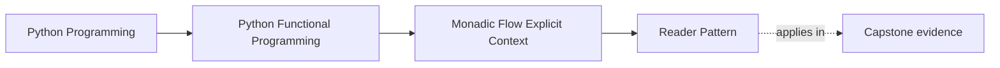
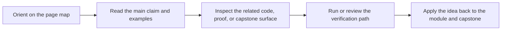

# Reader Pattern


<!-- page-maps:start -->
## Page Maps




<!-- page-maps:end -->

Reader should feel like a dependency-visibility tool, not a clever container. The real gain is simple: configuration and services stop hiding in globals and closures and become explicit in the compositional shape of the pipeline.

## Start With the Hidden Dependency Problem

By this point you can chain fallible steps well, but you may still be smuggling models, tokenizers, or config through closure capture. Reader matters when that hidden context starts making tests and reviews harder.

- If dependencies are captured invisibly, the call site no longer tells the truth about what the pipeline needs.
- If swapping one config or service requires rebuilding a whole chain manually, the dependency story is too implicit.
- If you cannot tell which parts of the environment a step actually reads, the abstraction is still hiding too much.

**Core question**  
How do you completely eliminate closure-captured variables and globals from monadic pipelines by making configuration an explicit, typed, injectable dependency — giving you pure, testable, refactor-safe code that scales from 3 lines to 300 without ever hiding a dependency again?

This lesson introduces Reader as the explicit-context version of patterns you have already seen:

- keep the pipeline pure while still depending on shared configuration
- expose the environment in the type and combinator structure
- make swapping environments a call-site concern instead of a hidden construction trick

The earlier closure examples matter because Reader is easiest to understand as a disciplined replacement for patterns you already use.

Use this when you have tasted the power of `.and_then` chains but are still fighting hidden dependencies that break tests and refactors.

**Outcome**
1. You will write every config-dependent pipeline as a pure `Reader[Config, T]`.
2. You will swap entire configurations (dev/prod/debug) at the call-site with `.run(new_config)`.
3. You will have mechanical proof that your Reader compositions satisfy the monad laws — meaning refactoring is always safe.

## Why Reader Is the Final Piece – Three Patterns Compared

| Pattern                  | Visibility | Testability | Reconfigurability | Refactor Safety | Verdict                  |
|--------------------------|------------|-------------|-------------------|-----------------|--------------------------|
| Manual threading         | Explicit   | Good        | Poor              | Poor            | Verbose, error-prone     |
| Closure capture          | Hidden     | Bad         | Bad               | Bad             | Works until it doesn't   |
| Reader (this core)       | Explicit   | Strong      | Strong            | Strong          | Best fit for this core   |

Reader is best understood here as “explicit, lawful closure capture” rather than as a mysterious new runtime mechanism.

## A Quick Warrant Check

Reader is worth the extra structure when the same environment is shared across several
steps and you want that dependency to stay visible at the call site. If one ordinary
function argument is enough, pass the argument directly. The goal is clearer dependency
surfaces, not container ceremony.

## 1. Laws & Invariants (machine-checked in CI)

| Law                 | Formal Statement                                                            | Why it matters                                            |
|---------------------|-----------------------------------------------------------------------------|-----------------------------------------------------------|
| Left Identity       | `pure(x).and_then(f) == f(x)`                                               | Safe to lift plain values                                 |
| Right Identity      | `r.and_then(pure) == r`                                                     | Safe to extract sub-pipelines                             |
| Associativity       | `r.and_then(f).and_then(g) == r.and_then(lambda x: f(x).and_then(g))`       | Grouping never changes meaning                            |
| Ask Identity        | `ask().map(lambda c: c) == ask()`                                           | Reading config is a no-op                                 |
| Local Composition   | `local(f, local(g, r)) == local(lambda c: f(g(c)), r)`                      | Local modifications compose predictably                    |

All laws verified with Hypothesis. A single counterexample breaks CI.

## 2. Public API – Reader is a one-field dataclass (mypy --strict clean)

```python
# capstone/src/funcpipe_rag/fp/effects/reader.py – end-of-Module-06 (mypy --strict clean target)

from __future__ import annotations
from dataclasses import dataclass
from typing import Generic, Callable, TypeVar

C = TypeVar("C")   # Config / Environment
T = TypeVar("T")
U = TypeVar("U")

@dataclass(frozen=True)
class Reader(Generic[C, T]):
    run: Callable[[C], T]

    def map(self, f: Callable[[T], U]) -> "Reader[C, U]":
        return Reader(lambda cfg: f(self.run(cfg)))

    def and_then(self, f: Callable[[T], "Reader[C, U]"]) -> "Reader[C, U]":
        return Reader(lambda cfg: f(self.run(cfg)).run(cfg))

# Core primitives
def pure(x: T) -> Reader[C, T]:
    return Reader(lambda _: x)

def ask() -> Reader[C, C]:
    return Reader(lambda cfg: cfg)

def asks(selector: Callable[[C], T]) -> Reader[C, T]:
    return Reader(lambda cfg: selector(cfg))

def local(modify: Callable[[C], C], r: Reader[C, T]) -> Reader[C, T]:
    return Reader(lambda cfg: r.run(modify(cfg)))
```

That's it. No more primitives needed.

## 3. Canonical Style – The Way You Will Actually Write 99% of Reader Pipelines

```python
@dataclass(frozen=True)
class Config:
    model_name: str
    chunk_size: int
    temperature: float = 0.0

def embed_chunk(chunk: Chunk) -> Reader[Config, Result[EmbeddedChunk, ErrInfo]]:
    def run(cfg: Config) -> Result[EmbeddedChunk, ErrInfo]:
        # NOTE: get_tokenizer / load_model are impure boundaries.
        # They will be pushed behind ports in Module 7.
        tokenizer = get_tokenizer(cfg.model_name)
        model     = load_model(cfg.model_name)

        tokens = tokenizer(chunk.text.content)[:cfg.chunk_size]
        vec    = model.encode(tokens, temperature=cfg.temperature)

        # Real failures (e.g. OOM, network) will be added later.
        # We use Result now so the type is stable when we do.
        return Ok(replace(chunk, embedding=Embedding(vec, cfg.model_name)))
    return Reader(run)

# Usage – swap entire behaviour with one line
dev_result  = embed_chunk(chunk).run(dev_config)
prod_result = embed_chunk(chunk).run(prod_config)
test_result = embed_chunk(chunk).run(mock_config)  # perfect for unit tests
```

This is the style you will use every day.  
Pure, linear, no closures, no globals, instantly testable.

## 4. Composition When You Need It (optional, for reusable steps)

```python
def get_tokenizer_r() -> Reader[Config, Tokenizer]:
    # Wrap the existing impure get_tokenizer(model_name) in a Reader
    return asks(lambda cfg: get_tokenizer(cfg.model_name))

def get_model() -> Reader[Config, Model]:
    return asks(lambda cfg: load_model(cfg.model_name))

def embed_chunk_composed(chunk: Chunk) -> Reader[Config, EmbeddedChunk]:
    return (
        pure(chunk.text.content)
        .and_then(lambda text: get_tokenizer_r().map(lambda tok: tok(text)))
        .and_then(lambda tokens: get_model().map(lambda model: model.encode(tokens)))
        .and_then(
            lambda vec: ask().map(
                lambda cfg: replace(chunk, embedding=Embedding(vec, cfg.model_name))
            )
        )
    )
```

Both styles are valid. The `def run(cfg):` version is the daily driver; the composed
version is for when the sub-steps are reusable enough to justify their own Reader
helpers.

## 5. Before → After – The Same Pipeline

```python
# BEFORE – closure soup (from earlier cores)
def embed_chunk(chunk: Chunk) -> Result[EmbeddedChunk, ErrInfo]:
    text = chunk.text.content[:config.chunk_size]      # config from where?
    tokens = tokenizer(text)                           # tokenizer from where?
    vec = model.encode(tokens, temperature=config.temperature)
    return Ok(replace(chunk, embedding=Embedding(vec, config.model_name)))

# AFTER – pure, explicit, testable
def embed_chunk(chunk: Chunk) -> Reader[Config, Result[EmbeddedChunk, ErrInfo]]:
    def run(cfg: Config) -> Result[EmbeddedChunk, ErrInfo]:
        tokenizer = get_tokenizer(cfg.model_name)
        model     = load_model(cfg.model_name)
        tokens    = tokenizer(chunk.text.content)[:cfg.chunk_size]
        vec       = model.encode(tokens, temperature=cfg.temperature)
        return Ok(replace(chunk, embedding=Embedding(vec, cfg.model_name)))
    return Reader(run)
```

Zero closures. Zero globals. Full type safety. Instant testability.

## 6. Property-Based Proofs (capstone/tests/test_reader_laws.py)

```python
from hypothesis import given
import strategies as st  # your Hypothesis strategies for Readers

@given(x=st.integers())
def test_reader_left_identity(x):
    f = lambda n: Reader(lambda cfg: n + cfg.inc)
    cfg = test_config()
    assert pure(x).and_then(f).run(cfg) == f(x).run(cfg)

@given(r=st.readers())
def test_reader_associativity(r):
    f = lambda a: Reader(lambda cfg: a + cfg.inc)
    g = lambda b: Reader(lambda cfg: b * cfg.mul)
    cfg = test_config()
    assert r.and_then(f).and_then(g).run(cfg) == r.and_then(lambda x: f(x).and_then(g)).run(cfg)
```

## 7. Anti-Patterns & Immediate Fixes

| Anti-Pattern              | Symptom                           | Fix                          |
|---------------------------|-----------------------------------|------------------------------|
| Closure-captured config   | Hidden dependencies, untestable   | Use `def run(cfg):` + Reader |
| Global config             | Impossible to mock/swap           | Inject via `.run(cfg)`       |
| Manual config threading   | Signatures explode                | Reader composes automatically |

## 8. Pre-Core Quiz

1. Reader replaces…? → **Closure-captured dependencies**  
2. You read config with…? → **ask() or asks(selector)**  
3. You temporarily override config with…? → **local**  
4. You run a Reader with…? → **.run(config)**  
5. The golden rule? → **Never capture config in a closure again**

## 9. Post-Core Exercise

1. Take your largest closure-heavy pipeline and rewrite it using the `def run(cfg):` style inside a Reader.
2. Add a debug flag that enables extra validation — implement with `local`.
3. Write a test that runs the same pipeline with two different configs and asserts different behaviour.

**Continue with:** [Explicit State Threading](../module-06-monadic-flow-explicit-context/explicit-state-threading.md)

You have now completely eliminated closure-captured variables from your monadic pipelines. Configuration is now a **first-class, typed, injectable dependency** — and your pipelines are pure, composable, and proven correct by Hypothesis. The final core removes the last remaining effect: local mutable state.
