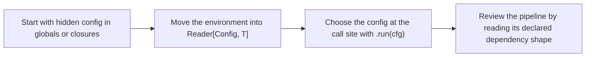

# Reader Pattern

<!-- page-maps:start -->
## Lesson Map


<!-- page-maps:end -->

Reader is useful when the code still works but the dependency story is hard to see.
Students usually feel that pain when a pipeline depends on configuration, services, or
policies that are captured somewhere off-screen.

## Core Question

How do you make shared configuration explicit in the shape of the pipeline so that the
call site tells the truth about what the pipeline needs?

## Start With the Hidden Dependency Problem

These are the usual warning signs:

- a function reads `config`, `model`, or `tokenizer` without taking them as arguments
- changing one environment means rebuilding or patching several helpers
- tests need monkeypatching or globals because the dependency is not visible in the type

The problem is not that closures are bad. The problem is that hidden dependencies are
harder to review than explicit ones.

## Reader in One Sentence

`Reader[Config, T]` is just a pure function `Config -> T` wrapped in a small API that
makes mapping and chaining consistent.

```python
@dataclass(frozen=True)
class Reader(Generic[C, T]):
    run: Callable[[C], T]

    def map(self, f: Callable[[T], U]) -> Reader[C, U]:
        return Reader(lambda cfg: f(self.run(cfg)))

    def and_then(self, f: Callable[[T], Reader[C, U]]) -> Reader[C, U]:
        return Reader(lambda cfg: f(self.run(cfg)).run(cfg))
```

That is the whole mental model for this lesson.

## Before and After

```python
# BEFORE – dependencies are real, but hidden
def embed_chunk(chunk: Chunk) -> Result[EmbeddedChunk, ErrInfo]:
    tokens = tokenizer(chunk.text.content)[:config.chunk_size]
    vec = model.encode(tokens, temperature=config.temperature)
    return Ok(replace(chunk, embedding=Embedding(vec, config.model_name)))
```

```python
# AFTER – the dependency is visible at the call site
@dataclass(frozen=True)
class Config:
    model_name: str
    chunk_size: int
    temperature: float = 0.0

def embed_chunk(chunk: Chunk) -> Reader[Config, Result[EmbeddedChunk, ErrInfo]]:
    def run(cfg: Config) -> Result[EmbeddedChunk, ErrInfo]:
        tokenizer = get_tokenizer(cfg.model_name)
        model = load_model(cfg.model_name)
        tokens = tokenizer(chunk.text.content)[: cfg.chunk_size]
        vec = model.encode(tokens, temperature=cfg.temperature)
        return Ok(replace(chunk, embedding=Embedding(vec, cfg.model_name)))

    return Reader(run)

dev_result = embed_chunk(chunk).run(dev_config)
prod_result = embed_chunk(chunk).run(prod_config)
```

The improvement is not hidden cleverness. The improvement is that the environment moved
to a single, explicit place.

## When Reader Is Worth It

Use Reader when:

- many steps depend on the same environment
- you want to swap that environment at the boundary
- keeping the dependency explicit helps review and testing

Do not reach for Reader when one plain argument is enough. A direct parameter is often
clearer than a container.

## Small Building Blocks

The helper functions are deliberately small:

```python
def pure(x: T) -> Reader[C, T]:
    return Reader(lambda _: x)

def ask() -> Reader[C, C]:
    return Reader(lambda cfg: cfg)

def asks(selector: Callable[[C], T]) -> Reader[C, T]:
    return Reader(lambda cfg: selector(cfg))

def local(modify: Callable[[C], C], r: Reader[C, T]) -> Reader[C, T]:
    return Reader(lambda cfg: r.run(modify(cfg)))
```

Students usually need only this reading of them:

- `ask()`: give me the whole config
- `asks(f)`: give me one selected part
- `local(...)`: run the same pipeline under a temporary modified config

## Reusable Composition Example

When the steps themselves are reusable, you can stay inside Reader all the way:

```python
def tokenizer_r() -> Reader[Config, Tokenizer]:
    return asks(lambda cfg: get_tokenizer(cfg.model_name))

def model_r() -> Reader[Config, Model]:
    return asks(lambda cfg: load_model(cfg.model_name))

def embed_chunk_composed(chunk: Chunk) -> Reader[Config, EmbeddedChunk]:
    return (
        tokenizer_r()
        .and_then(
            lambda tokenizer: model_r().and_then(
                lambda model: ask().map(
                    lambda cfg: replace(
                        chunk,
                        embedding=Embedding(
                            model.encode(
                                tokenizer(chunk.text.content)[: cfg.chunk_size],
                                temperature=cfg.temperature,
                            ),
                            cfg.model_name,
                        ),
                    )
                )
            )
        )
    )
```

This style is useful when the sub-steps are worth reusing. If not, the `def run(cfg):`
style is usually easier to teach and easier to read.

## What the Laws Buy You

The Reader laws matter for the same reason the earlier monad laws mattered:

- you can extract environment-dependent helpers safely
- you can regroup the pipeline without changing how config flows through it
- you can review dependency use from the shape of the composition

## Review Checklist

Ask these questions when reading a Reader pipeline:

- what part of the environment is actually needed?
- is Reader clarifying the dependency, or hiding a plain argument?
- would swapping the config at `.run(cfg)` change behavior in an understandable way?

## Practice Prompt

Take one closure-captured dependency from your codebase and rewrite it either as:

1. a direct function parameter, or
2. a Reader input

Then explain why the second option is better only if the dependency is shared across a
pipeline rather than local to one function.

**Continue with:** [Explicit State Threading](explicit-state-threading.md)
