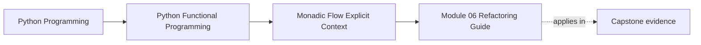
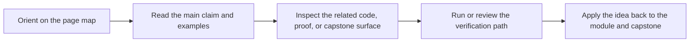

# Module 06 Refactoring Guide

<!-- page-maps:start -->
## Page Maps

<!-- page-maps:end -->

Read the first diagram as a placement map: this page is one concept inside its parent module, not a detached essay, and the capstone is the pressure test for whether the idea holds. Read the second diagram as the working rhythm for the page: name the problem, study the example, identify the boundary, then carry one review question forward.

This guide closes Module 06. The point is not to admire monadic vocabulary. The point is
to make sequencing, context, and failure propagation easier to read and safer to change.

## Stable comparison route

1. run `make PROGRAM=python-programming/python-functional-programming history-refresh`
2. open `capstone/_history/worktrees/module-06/src/funcpipe_rag/fp/`
3. compare the chaining and context helpers with the configured pipeline surface
4. read `capstone/_history/worktrees/module-06/tests/test_monad_laws.py`, `test_reader_laws.py`, `test_state_laws.py`, and `test_writer_laws.py`

## What to refactor toward

- dependent steps composed without repetitive propagation code
- context passed explicitly instead of read from globals
- logs and side information carried as data when that keeps the flow honest
- exception-heavy code rewritten into reviewable containers and laws

## Exit standard

Before Module 07, you should be able to say which context travels through the flow, how
failure propagates, and what tests prove the composition rules still hold.
