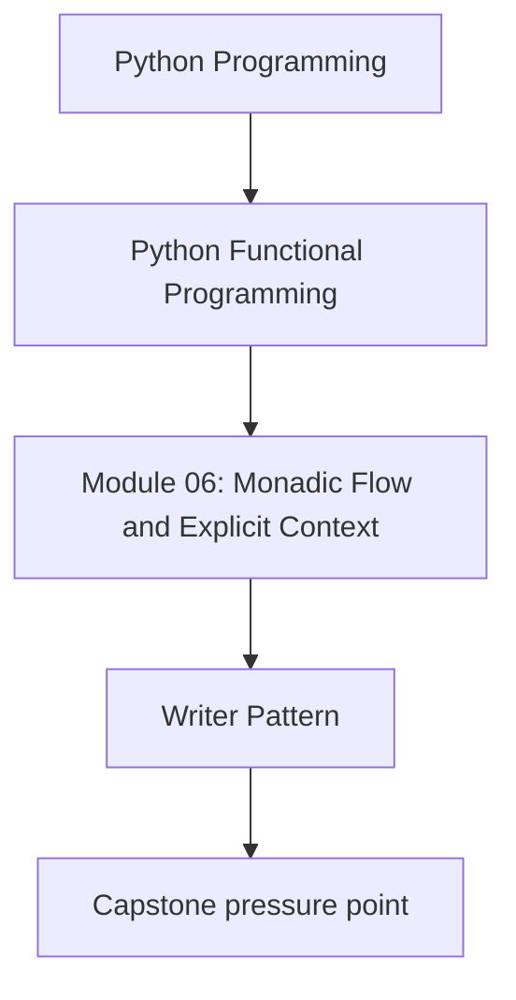
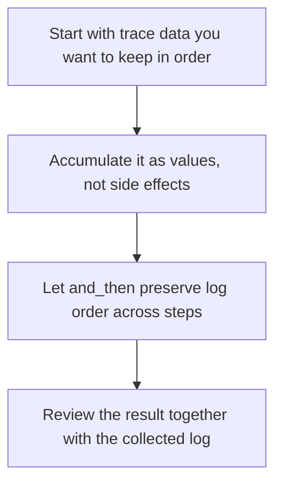

# Writer Pattern

<!-- page-maps:start -->
## Concept Position




<!-- page-maps:end -->

Writer is useful when trace data matters to the correctness or reviewability of the
pipeline itself. It lets you treat that trace as part of the returned value rather than
as something emitted out-of-band.

## Core Question

How do you keep ordered trace or log data alongside a pipeline result without reaching
for hidden side effects?

## What Writer Is Good At

Writer is a good fit when:

- the pipeline should return both a result and a stable ordered trace
- tests need to assert on the collected messages or events
- you want the log to follow the same composition rules as the computation

Writer is not automatically the best choice for every logging problem. Ordinary boundary
logging is still fine when you do not need the log as part of the pipeline contract.

## Writer in One Sentence

`Writer[T, LogEntry]` is a computation that returns both a value and an accumulated log.

```python
@dataclass(frozen=True)
class Writer(Generic[T, LogEntryT]):
    run: Callable[[], tuple[T, tuple[LogEntryT, ...]]]

    def map(self, f: Callable[[T], U]) -> Writer[U, LogEntryT]:
        ...

    def and_then(self, f: Callable[[T], Writer[U, LogEntryT]]) -> Writer[U, LogEntryT]:
        ...
```

The repository later generalizes the log entry type, but the Module 06 mental model is
simple: a Writer run produces a value and an ordered collection of trace entries.

## Before and After

```python
# BEFORE – trace data disappears into side effects
def embed_chunk(chunk: Chunk) -> Result[EmbeddedChunk, ErrInfo]:
    print(f"start embed chunk_id={chunk.id}")
    tokens = tokenize(chunk.text.content)
    print(f"tokenized count={len(tokens)}")
    vec = model.encode(tokens)
    print(f"encoded dim={len(vec)}")
    return Ok(replace(chunk, embedding=Embedding(vec, current_model)))
```

```python
# AFTER – trace data becomes reviewable output
def embed_chunk(chunk: Chunk) -> Writer[Result[EmbeddedChunk, ErrInfo], str]:
    return (
        tell(f"start embed chunk_id={chunk.id}")
        .and_then(lambda _: pure(tokenize(chunk.text.content)))
        .and_then(lambda tokens: tell(f"tokenized count={len(tokens)}").map(lambda _: tokens))
        .and_then(lambda tokens: pure(model.encode(tokens)))
        .and_then(lambda vec: tell(f"encoded dim={len(vec)}").map(lambda _: vec))
        .map(lambda vec: Ok(replace(chunk, embedding=Embedding(vec, current_model))))
    )
```

The benefit is not that the code became more functional-looking. The benefit is that the
trace is now deterministic, testable, and local to the pipeline.

## The Core Helpers

```python
def pure(x: T) -> Writer[T, LogEntryT]: ...
def tell(entry: LogEntryT) -> Writer[None, LogEntryT]: ...
def tell_many(entries: tuple[LogEntryT, ...]) -> Writer[None, LogEntryT]: ...
def listen(p: Writer[T, LogEntryT]) -> Writer[tuple[T, tuple[LogEntryT, ...]], LogEntryT]: ...
def censor(f: Callable[[tuple[LogEntryT, ...]], tuple[LogEntryT, ...]], p: Writer[T, LogEntryT]) -> Writer[T, LogEntryT]: ...
```

Read them this way:

- `tell(...)`: append one entry
- `listen(...)`: inspect the accumulated entries without discarding them
- `censor(...)`: transform the log after the fact, for example to remove sensitive data

## What the Laws Buy You

The Writer laws matter because they protect log order during refactors.

- left and right identity protect harmless wrapping and extraction
- associativity protects regrouping of logged steps
- tell-append behavior protects the order in which entries accumulate

That matters because logs are only useful if the sequence still means what readers think
it means.

## When Writer Is Better Than Boundary Logging

Prefer Writer when the collected trace is part of what you want to inspect, compare, or
test.

Prefer ordinary logging at the boundary when:

- the trace does not need to be returned
- the main consumer is an operations system rather than a unit test
- carrying the log through the pipeline would add ceremony without helping review

This distinction helps students avoid forcing Writer into places where plain logging is
simpler.

## Review Checklist

- is the accumulated data part of the pipeline contract, or only a side channel?
- would a test benefit from asserting on the log order directly?
- are the log entries describing meaningful steps rather than repeating obvious noise?

## Practice Prompt

Choose one pipeline that currently prints or logs intermediate values. Rewrite it with
Writer only if the trace needs to be returned or asserted on. If it does not, explain
why a boundary logger is the better fit.

**Continue with:** [Refactoring try/except](refactoring-try-except.md)
