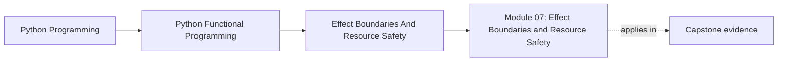

# Module 07: Effect Boundaries and Resource Safety

<!-- page-maps:start -->
## Page Maps

<!-- page-maps:end -->

This module is where the course stops talking only about pure internals and starts asking
how real systems touch files, clocks, databases, logs, and transactions without losing
clarity. The emphasis is on explicit boundaries rather than wishful purity.

## What this module teaches

- how ports and adapters keep the core insulated from infrastructure details
- how capability protocols define what effectful code is allowed to do
- how cleanup, idempotency, and transactions become design contracts
- how to migrate an existing codebase without pretending it can be rewritten overnight

## Lesson map

- [Ports and Adapters](ports-and-adapters.md)
- [Effect Interfaces](effect-interfaces.md)
- [Capability Protocols](capability-protocols.md)
- [Resource Safety](resource-safety.md)
- [Functional Logging](functional-logging.md)
- [Effect Capabilities and Static Checking](effect-capabilities-and-static-checking.md)
- [Composing Effects](composing-effects.md)
- [Idempotent Effects](idempotent-effects.md)
- [Sessions and Transactions](sessions-and-transactions.md)
- [Incremental Migration](incremental-migration.md)

## Capstone checkpoints

- Inspect which interfaces define capabilities and which files provide concrete adapters.
- Review how cleanup and retries are enforced instead of implied.
- Compare the migration guidance with the current boundaries in FuncPipe.

## Before moving on

You should be able to explain where the pure core ends, how effects are introduced, and
why capability discipline matters before async coordination enters the picture.
