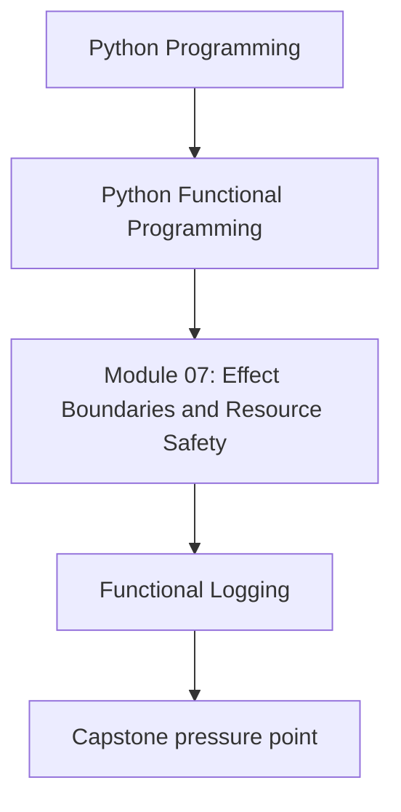
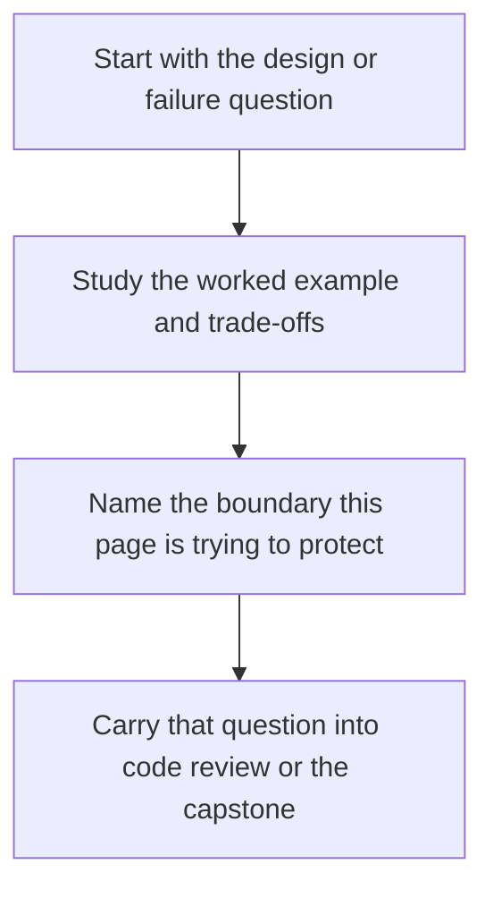

# Functional Logging


<!-- page-maps:start -->
## Concept Position




<!-- page-maps:end -->

Read the first diagram as a placement map: this page is one concept inside its parent module, not a detached essay, and the capstone is the pressure test for whether the idea holds. Read the second diagram as the working rhythm for the page: name the problem, study the example, identify the boundary, then carry one review question forward.

**Module 07 – Main Track Core**

> **Main track**: Cores 1, 3–10 (Ports & Adapters + Capability Protocols → Production).  
> This is a **required** core. Writer-based logging is the default pure-core pattern in
> this course when logs need to stay reviewable as data.

## Progression Note
Module 7 takes the lawful containers and pipelines from Module 6 and puts all effects behind explicit boundaries.

| Module | Focus                                   | Key Outcomes                                                                 |
|--------|-----------------------------------------|-------------------------------------------------------------------------------|
| 6      | Monadic Flows as Composable Pipelines   | Lawful `and_then`, Reader/State/Writer patterns, error-typed flows          |
| 7      | Effect Boundaries & Resource Safety     | Ports & adapters, capability protocols, resource-safe IO, idempotency       |
| 8      | Async / Concurrent Pipelines            | Backpressure, timeouts, resumability, fairness (built on 6–7)               |

**Core question**  
How do you treat logging and tracing as **pure data accumulation** using the Writer monad and monoidal logs, enabling side-effect-free instrumentation in cores while deferring all output to shells?

**What you now have after M07C01–M07C04 + this core**
- Pure domain core  
- Zero direct I/O in domain code  
- All I/O behind swappable ports  
- Effectful operations described as pure data (`IOPlan`)  
- Typed capability protocols for every common effect  
- Reliable resource cleanup  
- **Pure, composable, testable logging** via Writer – logs are data, never side effects in cores

**What the rest of Module 7 adds**
- Idempotent effect design  
- Transaction/session patterns  
- Incremental migration playbook  
- Production story: CI, golden tests, shadow traffic

You are now four steps away from a complete production-grade functional architecture.

## 1. Laws & Invariants (machine-checked in CI)

| Law / Invariant            | Description                                                                                  | Enforcement          |
|----------------------------|----------------------------------------------------------------------------------------------|----------------------|
| Monoid Identity            | `mappend(empty(), logs) == logs == mappend(logs, empty())`                                   | Hypothesis           |
| Monoid Associativity       | `mappend(mappend(a, b), c) == mappend(a, mappend(b, c))`                                     | Hypothesis           |
| Writer Neutrality          | Logging does not alter the primary computation value (Writer is transparent to the carried value). | Equivalence tests    |
| Order Preservation         | Accumulated logs exactly match the semantic execution order of traced stages.               | Property tests       |
| Purity                     | No side effects (print, file writes, etc.) occur during core execution – logs are pure data. | Code review + no-eagerness mocks |
| Amortized Efficiency       | Per-log-entry cost is amortized O(1) via Writer's internal list buffer.                     | Instrumented benchmarks |

These laws make logging **composable, predictable, and zero-cost in terms of purity**.

## 2. Decision Table – When to Use Which Logging Style?

| Style                      | Side Effects | Testable/Replayable | Production Use | Recommended For          |
|----------------------------|--------------|---------------------|----------------|--------------------------|
| `print` / `tap(print)`     | Yes          | No                  | Debugging only | Quick local checks       |
| `Logger` capability (direct) | Yes        | No                  | Simple scripts | Minimal overhead         |
| **Writer[Value, Logs]**    | No           | Yes                 | All cores      | **Canonical – pure, composable, testable** |

**Verdict**: Default to **Writer** for the pure core surfaces in this course when logs
are part of the review or test story. Drain to a concrete `Logger` adapter (or file,
Prometheus, etc.) in the shell, and treat direct logging inside domain code as a
conscious exception rather than the baseline.

## 3. Public API – Structured Logging Helpers (`capstone/src/funcpipe_rag/domain/logging.py`)

```python
# capstone/src/funcpipe_rag/domain/logging.py – mypy --strict clean (full file in repo)
from __future__ import annotations

from dataclasses import dataclass
from typing import Literal, TypeAlias, TypeVar

from funcpipe_rag.fp.effects.writer import Writer, tell

Level: TypeAlias = Literal["INFO", "DEBUG", "TRACE", "ERROR"]

@dataclass(frozen=True, slots=True)
class LogEntry:
    level: Level
    msg: str

Logs: TypeAlias = tuple[LogEntry, ...]
T = TypeVar("T")

class LogMonoid:
    @staticmethod
    def empty() -> Logs:
        return ()

    @staticmethod
    def append(left: Logs, right: Logs) -> Logs:
        return left + right

def log_tell(entry: LogEntry) -> Writer[None, LogEntry]:
    return tell(entry)

def trace_stage(msg: str, level: Level = "INFO") -> Writer[None, LogEntry]:
    return log_tell(LogEntry(level=level, msg=msg))

def trace_value(name: str, value: object, level: Level = "DEBUG") -> Writer[None, LogEntry]:
    return log_tell(LogEntry(level=level, msg=f"{name}={value!r}"))
```

**Performance note**: In this repo the Writer log is a `tuple`, so concatenation is
`O(n + m)`. This keeps the implementation tiny and predictable for teaching; if you need
very high-volume logging, use a list-backed accumulator in the shell or a different
Writer representation.

## 4. Reference Implementations

### 4.1 Pure Logging with Writer (no side effects)

```python
# Illustrative example (not a repo file): pure stage with Writer logging.
def embed_chunk_with_logging(chunk: Chunk) -> Writer[Result[EmbeddedChunk, ErrInfo], Logs]:
    return (
        trace_stage(f"start embedding chunk_id={chunk.id}")
        .bind(lambda _: pure(tokenize(chunk.text.content)))
        .bind(lambda tokens: trace_value("token count", len(tokens)).map(lambda _: tokens))
        .bind(lambda tokens: pure(model.encode(tokens)))
        .bind(lambda vec: trace_stage("embedding complete").map(lambda _: vec))
        .map(lambda vec: Ok(replace(chunk, embedding=Embedding(vec, model.name))))
    )
```

### 4.2 Full RAG Pipeline with Logging

```python
# Illustrative example (not a repo file): composing a Writer-instrumented pipeline.
def rag_core_with_logging(docs: Iterator[RawDoc]) -> Writer[Iterator[Chunk], Logs]:
    return (
        trace_stage("RAG pipeline start")
        .bind(lambda _: pure(gen_clean_docs(docs)))
        .bind(lambda cleaned: trace_stage("cleaning complete").map(lambda _: cleaned))
        .bind(lambda cleaned: pure(gen_chunks(cleaned)))
        .bind(lambda chunks: trace_stage("chunking complete").map(lambda _: chunks))
    )
```

### 4.3 Shell – Drain Logs to a Real Logger Adapter

```python
# Illustrative shell sketch (not a repo file): drain Writer logs to a Logger adapter.
from funcpipe_rag.domain.capabilities import Logger, StorageRead

def run_rag_with_logging(
    storage: StorageRead,
    logger: Logger,
    input_path: str,
    output_path: str,
    env: RagEnv,
) -> Result[None, ErrInfo]:
    docs_stream = storage.read_docs(input_path)
    writer_chunks, logs = run_writer(rag_core_with_logging(filter_ok(docs_stream)))
    
    for entry in logs:
        logger.log(entry)                 # only side effects here
    
    return storage.write_chunks(output_path, writer_chunks)
```

### 4.4 Before → After

```python
# Before – impure prints scattered everywhere
def old_embed(chunk: Chunk):
    print(f"start {chunk.id}")
    tokens = tokenize(chunk.text.content)
    print(f"tokens: {len(tokens)}")
    vec = model.encode(tokens)
    print("embed done")
    return replace(chunk, embedding=Embedding(vec, model.name))

# After – pure Writer, logs as data
# (see embed_chunk_with_logging above)
```

**Connection to `IOPlan`**: Logging composes naturally with effects – use `Writer[IOPlan[T], Logs]` when you need both logging and deferred I/O in the same pipeline.

## 5. Property-Based Proofs

```python
File references in this repo:
- Writer laws: `capstone/tests/unit/fp/laws/test_writer.py`
- Structured logging helpers: `capstone/tests/unit/domain/test_logging.py`
@given(
    a=st.lists(log_entry_strategy()),  # strategy → LogEntry
    b=st.lists(log_entry_strategy()),
    c=st.lists(log_entry_strategy()),
)
def test_monoid_laws(a, b, c):
    empty = LogMonoid.empty()
    append = LogMonoid.append
    assert append(empty, tuple(a)) == tuple(a) == append(tuple(a), empty)
    assert append(append(tuple(a), tuple(b)), tuple(c)) == append(tuple(a), append(tuple(b), tuple(c)))

def pure_compute(x: int) -> Result[int, ErrInfo]:
    return Ok(x * 2) if x > 0 else Err(ErrInfo("NEG", "Negative input"))

def logged_compute(x: int) -> Writer[Result[int, ErrInfo], Logs]:
    # log input, then compute in the Writer context (logs as data)
    return trace_value("input", x).bind(lambda _: pure(pure_compute(x)))

@given(x=st.integers())
def test_writer_neutrality(x):
    res, logs = run_writer(logged_compute(x))
    assert res == pure_compute(x)   # logs don't change the primary value

@given(entries=st.lists(log_entry_strategy(), min_size=3))
def test_order_preservation(entries):
    def stage(i: int) -> Writer[int, Logs]:
        return log_tell(entries[i]).map(lambda _: i)
    
    w = stage(0).bind(lambda _: stage(1)).bind(lambda _: stage(2))
    _, logs = run_writer(w)
    assert [e for e in logs] == entries[:3]
```

## 6. Big-O & Allocation Guarantees

| Operation           | Time       | Heap             | Notes                                                  |
|---------------------|------------|------------------|--------------------------------------------------------|
| `tell` / `log_tell` | O(1)       | O(1) per entry   | Creates a one-entry tuple-backed Writer                |
| `and_then`          | O(n + m)   | O(n + m)         | Concatenates tuple logs from left and right branches   |
| `run_writer`        | O(1)`*`    | O(1)`*`          | `*` beyond whatever log accumulation already occurred  |

That is a good teaching trade-off for this repository. If a production pipeline needs
extremely high-volume logging, the representation should be revisited deliberately rather
than assumed to be free.

## 7. Anti-Patterns & Immediate Fixes

| Anti-Pattern              | Symptom                              | Fix                                      |
|---------------------------|--------------------------------------|------------------------------------------|
| `print` / `logger.info` in core | Impure, untestable logs         | Use `Writer` + `tell`                    |
| Global mutable log buffer | Hidden state, races                  | Pure monoidal accumulation               |
| Logging in adapters only  | Lost context from pure stages        | Log in core via Writer                   |
| Over-logging              | Memory blowup in long streams        | Configurable levels + sampling           |

## 8. Pre-Core Quiz

1. Logs in cores are…? → **Pure data (Writer[_, Logs])**  
2. Accumulation uses…? → **Monoid (tuple concatenation)**  
3. Side effects happen…? → **Only when draining Writer in shell**  
4. Writer neutrality means…? → **Primary value unchanged by logging**  
5. Real power comes from…? → **Testable, composable, replayable logs**

## 9. Post-Core Exercise

1. Add stage-level tracing to your real embedding pipeline using `trace_stage`.  
2. Add value-level tracing (token count, vector norm) via `trace_value`.  
3. Write a property test that proves log order matches execution order for a chained pipeline.  
4. Implement a `CollectingLogger` shell that asserts expected log entries in tests.

**Continue with:** [Effect Capabilities and Static Checking](../module-07-effect-boundaries-resource-safety/effect-capabilities-and-static-checking.md)

You now have **pure, composable, testable logging** in every pipeline. Logs are data – accumulated monoidally, composable and replayable, and never side effects in cores. Combined with ports, capability protocols, `IOPlan`, and resource safety, your system is finally ready for serious production use. The remaining cores are specialisations and deployment patterns.
