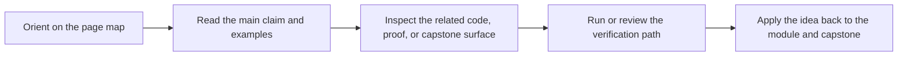

# Module Glossary

<!-- page-maps:start -->
## Page Maps

<!-- page-maps:end -->

This glossary belongs to **Module 07: Effect Boundaries and Resource Safety** in **Python Functional Programming**. It keeps the language of this directory stable so the same ideas keep the same names across reading, practice, review, and capstone proof.

## How to use this glossary

Read the directory index first, then return here whenever a page, command, or review discussion starts to feel more vague than the course intends. The goal is stable language, not extra theory.

## Terms in this directory

| Term | Meaning in this directory |
| --- | --- |
| Capability Protocols | the module's treatment of capability protocols, used to make the module's main design claim concrete in design work, refactoring, and capstone evidence. |
| Composing Effects | the module's treatment of composing effects, used to make the module's main design claim concrete in design work, refactoring, and capstone evidence. |
| Effect Capabilities and Static Checking | the module's treatment of effect capabilities and static checking, used to make the module's main design claim concrete in design work, refactoring, and capstone evidence. |
| Effect Interfaces | the module's treatment of effect interfaces, used to make the module's main design claim concrete in design work, refactoring, and capstone evidence. |
| Functional Logging | the module's treatment of functional logging, used to make the module's main design claim concrete in design work, refactoring, and capstone evidence. |
| Idempotent Effects | the module's treatment of idempotent effects, used to make the module's main design claim concrete in design work, refactoring, and capstone evidence. |
| Incremental Migration | the module's treatment of incremental migration, used to make the module's main design claim concrete in design work, refactoring, and capstone evidence. |
| Module 07 Refactoring Guide | the repair route for applying the module's main design claim to existing code without losing behavior, clarity, or proof. |
| Ports and Adapters | the module's treatment of ports and adapters, used to make the module's main design claim concrete in design work, refactoring, and capstone evidence. |
| Resource Safety | the module's treatment of resource safety, used to make the module's main design claim concrete in design work, refactoring, and capstone evidence. |
| Sessions and Transactions | the module's treatment of sessions and transactions, used to make the module's main design claim concrete in design work, refactoring, and capstone evidence. |
