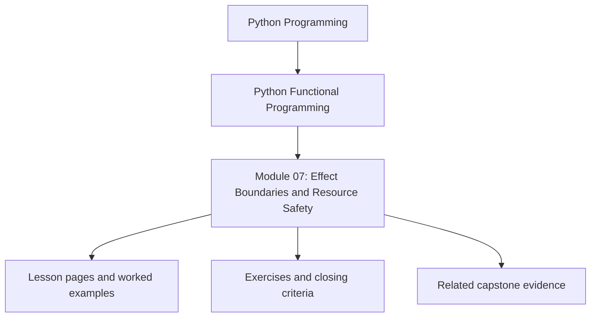
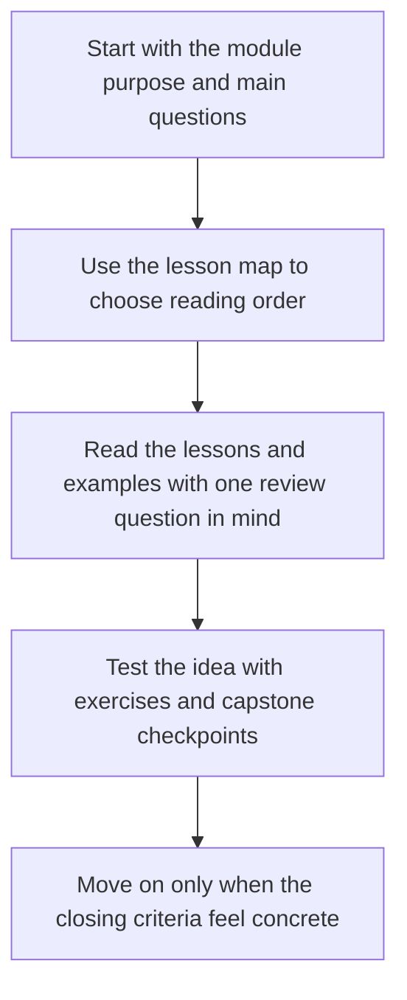

# Module 07: Effect Boundaries and Resource Safety

<!-- page-maps:start -->
## Module Position

<!-- page-maps:end -->

Read the first diagram as a placement map: this page sits between the course promise, the lesson pages listed below, and the capstone surfaces that pressure-test the module. Read the second diagram as the study route for this page, so the diagrams point you toward the `Lesson map`, `Exercises`, and `Closing criteria` instead of acting like decoration.

## Keep These Pages Open

Use these support surfaces while reading so effect boundaries remain architectural
contracts instead of turning into scattered adapter folklore:

- [Mid-Course Map](../module-00-orientation/mid-course-map.md) for the move from modelling into system pressure
- [Review Checklist](../reference/review-checklist.md) for the engineering bar around boundaries
- [Topic Boundaries](../reference/topic-boundaries.md) for the scope line around functional technique versus infrastructure design
- [Capstone Map](../capstone/capstone-map.md) for the boundaries, capabilities, and domain effect surfaces in FuncPipe

Carry this question into the module:

> Where should effects begin so the core remains testable and the boundary remains obvious to another reviewer?

This module is where the course stops talking only about pure internals and starts asking
how real systems touch files, clocks, databases, logs, and transactions without losing
clarity. The emphasis is on explicit boundaries rather than wishful purity.

## Learning outcomes

- how ports and adapters keep the core insulated from infrastructure details
- how capability protocols define what effectful code is allowed to do
- how cleanup, idempotency, and transactions become design contracts
- how to migrate an existing codebase without pretending it can be rewritten overnight

## Lesson map

- [Ports and Adapters](ports-and-adapters.md)
- [Effect Interfaces](effect-interfaces.md)
- [Capability Protocols](capability-protocols.md)
- [Resource Safety](resource-safety.md)
- [Functional Logging](functional-logging.md)
- [Effect Capabilities and Static Checking](effect-capabilities-and-static-checking.md)
- [Composing Effects](composing-effects.md)
- [Idempotent Effects](idempotent-effects.md)
- [Sessions and Transactions](sessions-and-transactions.md)
- [Incremental Migration](incremental-migration.md)
- [Refactoring Guide](refactoring-guide.md)

## Exercises

- Draw one boundary between pure logic and infrastructure, then name the port or capability that keeps it honest.
- Review one cleanup or transaction path and explain where failure handling must live for the contract to remain explicit.
- Pick one migration step and justify why it is incremental enough to ship without rewriting the whole system.

## Capstone checkpoints

- Inspect which interfaces define capabilities and which files provide concrete adapters.
- Review how cleanup and retries are enforced instead of implied.
- Compare the migration guidance with the current boundaries in FuncPipe.

## Before moving on

You should be able to explain where the pure core ends, how effects are introduced, and
why capability discipline matters before async coordination enters the picture. Use
[Refactoring Guide](refactoring-guide.md) and compare against
`capstone/_history/worktrees/module-07` before moving forward.

## Closing criteria

- You can point to the exact boundary where infrastructure enters the system and explain why that boundary is narrow enough.
- You can explain how idempotency, cleanup, and transaction handling are enforced rather than assumed.
- You can judge whether a migration plan preserves the core contracts while reality is still messy.
