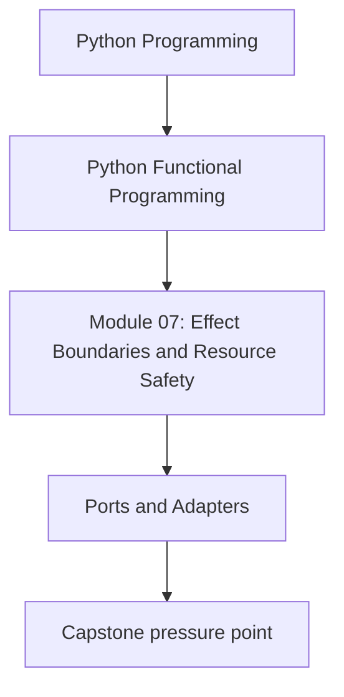
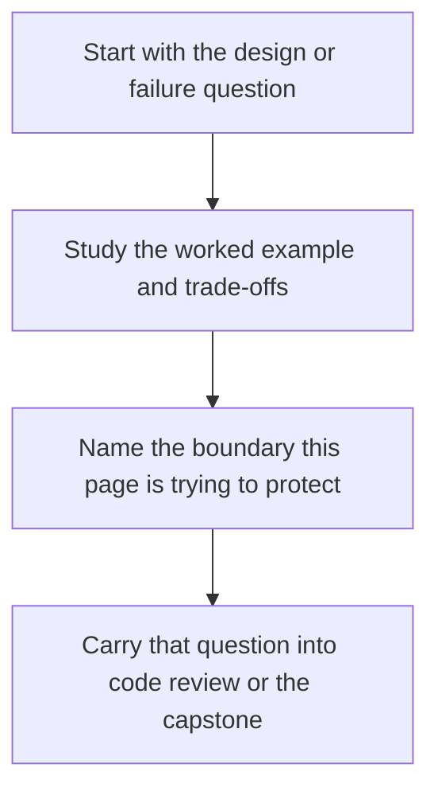

# Ports and Adapters


<!-- page-maps:start -->
## Concept Position




<!-- page-maps:end -->

Read the first diagram as a placement map: this page is one concept inside its parent module, not a detached essay, and the capstone is the pressure test for whether the idea holds. Read the second diagram as the working rhythm for the page: name the problem, study the example, identify the boundary, then carry one review question forward.

## Progression Note
Module 7 moves from pure effect-aware composition to **real-world architecture**.

We now isolate the pure domain core from all effectful infrastructure, making the core fully testable, composable, and independent of concrete I/O, logging, or external services.

| Module | Focus                                 | Key Outcomes                                                                 |
|--------|---------------------------------------|-------------------------------------------------------------------------------|
| 6      | Monadic Flows as Composable Pipelines | `bind`/`and_then`, Reader/State-like patterns, configurable error-typed flows |
| 7      | Effect Boundaries & Resource Safety   | Ports & adapters, capability interfaces, resource-safe effect isolation       |
| 8      | Async FuncPipe & Backpressure         | Async streams, bounded queues, timeouts/retries, fairness & backpressure      |

## Why this module matters in the course

This is where the course turns from "functional style" into architecture. Earlier
modules teach how to preserve local reasoning. Module 07 teaches how not to lose that
reasoning the moment filesystems, databases, clocks, and logging enter the picture.

If this module is weak, the rest of the course collapses into theory because the pure
core never survives contact with real infrastructure.

## Questions this module should answer

By the end of the module, you should be able to answer:

- What belongs in the pure core and what belongs in an adapter?
- How do capability protocols differ from ordinary helper wrappers?
- Which failures should be mapped at the edge instead of leaking inward?
- How do you keep infrastructure swappable without hiding operational behavior?

Those answers are what make async work in Module 08 manageable instead of magical.

## What to inspect in the capstone

Keep the FuncPipe capstone open while reading this module and inspect:

- capability protocols in the domain boundary
- concrete adapters under infrastructure packages
- tests that compare in-memory and real adapter behavior
- places where resource cleanup and error mapping are made explicit

The capstone should make one point concrete: architecture is the continuation of purity under pressure.

**Core question**  
How do you structure a real production system so that the pure domain core depends **only** on abstract ports while concrete effects live in swappable adapters — making the core testable, keeping dependencies explicit, and reducing infrastructure coupling under change?

This is the architectural pattern that finally lets you ship the beautiful monadic pipelines from Module 6 to production **without compromise**.

Use this when you love the purity of Module 6 but need to integrate with the real world without polluting the core.

**Outcome**  
1. You will define narrow, pure ports (protocols) for every external dependency.  
2. You will implement adapters in infrastructure that satisfy those ports.  
3. You will inject adapters via Reader — keeping the core pure and the shell effectful.  
4. You will have mechanical proof (via swappable in-memory adapters) that the core behaves identically regardless of infrastructure.

## The Golden Rule of Ports & Adapters
The pure core must depend **only** on abstract ports and explicit inputs (`Reader[Env]`).

Everything else — concrete files, HTTP clients, loggers, databases — lives in adapters.

## 1. Laws & Invariants (machine-checked in CI)

| Law                    | Description                                                                                     | Enforcement                  |
|------------------------|-------------------------------------------------------------------------------------------------|------------------------------|
| Purity Law             | Core functions depend only on explicit inputs and ports; no direct effects or globals           | mypy --strict + review       |
| Swappability Law       | Equivalent adapters yield identical core outputs (same order, same values) for same inputs     | Hypothesis (in-memory vs real) |
| Resource Safety        | Adapters guarantee cleanup when iterator is exhausted or explicitly closed; consumers must not leak iterators | Context manager + tests      |
| Error Mapping          | Infra exceptions → typed domain `ErrInfo`; unexpected bugs propagate                            | Runtime contract             |
| Laziness Preservation  | Streaming ports (`Iterator[Result[...]]`) never materialise unless explicitly forced            | Property tests               |

*Note*: The Laziness Preservation law applies strictly to production adapters. Test doubles are explicitly permitted to materialise streams for convenient assertion and inspection.

All laws are verified with Hypothesis. Behavioural laws (purity, swappability, error mapping) use both real and in-memory adapters; laziness/resource laws are checked against production adapters only. A single divergence breaks CI.

## 2. Decision Table – Where Does Code Belong?

| Code Does                  | Layer      | Reason                                      |
|----------------------------|------------|---------------------------------------------|
| Business rules, validation | Core       | Pure, testable, composable                  |
| Abstract interfaces        | Ports      | Domain boundary, pure protocols             |
| Concrete I/O, logging, HTTP| Adapters   | Effectful, swappable                        |
| Orchestration, error policy| Shell      | Effectful, depends on adapters              |

If it’s effectful or concrete → it does **not** belong in core.

## 3. Public API – Capability Protocols (domain boundary)

```python
# capstone/src/funcpipe_rag/domain/capabilities.py – mypy --strict clean
from __future__ import annotations
from collections.abc import Iterator
from datetime import datetime
from typing import Protocol

from funcpipe_rag.core.rag_types import Chunk, RawDoc
from funcpipe_rag.domain.logging import LogEntry
from funcpipe_rag.result.types import ErrInfo, Result

class StorageRead(Protocol):
    def read_docs(self, path: str) -> Iterator[Result[RawDoc, ErrInfo]]: ...

class StorageWrite(Protocol):
    def write_chunks(self, path: str, chunks: Iterator[Chunk]) -> Result[None, ErrInfo]: ...

class Storage(StorageRead, StorageWrite, Protocol):
    """Composed capability: full read/write access."""

class Clock(Protocol):
    def now(self) -> datetime: ...

class Logger(Protocol):
    def log(self, entry: LogEntry) -> None: ...
```

Note: earlier drafts of Module 07 used `domain/ports.py` with `StoragePort`/`LoggerPort`. In the
refactored codebase, these were consolidated into the capability protocols above to avoid overlap.

## 4. Reference Implementations – Adapters (infra layer)

### 4.1 FileStorageAdapter (real I/O)

```python
# capstone/src/funcpipe_rag/infra/adapters/file_storage.py
#
# Full implementation lives in the repo (CSV-in / JSONL-out, resource-safe reads,
# atomic writes via temp+fsync+replace).
from funcpipe_rag.domain.capabilities import Storage

class FileStorage(Storage):
    def read_docs(self, path: str): ...
    def write_chunks(self, path: str, chunks): ...
```

### 4.2 InMemoryStorageAdapter (test double)

```python
# capstone/src/funcpipe_rag/infra/adapters/memory_storage.py
#
# Full implementation lives in the repo (preload docs, collect written chunks).
from funcpipe_rag.domain.capabilities import Storage

class InMemoryStorage(Storage):
    def __init__(self, *, preload=None) -> None: ...
    def read_docs(self, path: str): ...
    def write_chunks(self, path: str, chunks): ...
```

*The in-memory adapter deliberately materialises all successful chunks for easy inspection in tests. This is the only permitted violation of strict laziness — and only in test doubles.*

### 4.3 ConsoleLoggerAdapter

```python
# capstone/src/funcpipe_rag/infra/adapters/logger.py
from funcpipe_rag.domain.capabilities import Logger
from funcpipe_rag.domain.logging import LogEntry

class ConsoleLogger(Logger):
    def log(self, entry: LogEntry) -> None: ...
```

## 5. Repo Alignment Note (end-of-Module-07)

This repo’s end-of-Module-07 codebase provides the ports/adapters building blocks:
- Capability protocols: `capstone/src/funcpipe_rag/domain/capabilities.py`
- Structured log entries: `capstone/src/funcpipe_rag/domain/logging.py`
- Deferred IO (`IOPlan`) + wrappers: `capstone/src/funcpipe_rag/fp/effects/io_plan.py`, `capstone/src/funcpipe_rag/fp/effects/io_retry.py`, `capstone/src/funcpipe_rag/fp/effects/tx.py`
- Concrete adapters: `capstone/src/funcpipe_rag/infra/adapters/file_storage.py`, `capstone/src/funcpipe_rag/infra/adapters/memory_storage.py`, `capstone/src/funcpipe_rag/infra/adapters/logger.py`, `capstone/src/funcpipe_rag/infra/adapters/clock.py`, `capstone/src/funcpipe_rag/infra/adapters/atomic_storage.py`

The RAG pipeline surface itself remains the Module 02–06 config-as-data API in `capstone/src/funcpipe_rag/rag/`
(it is not yet fully migrated to capability protocols + `IOPlan`).

## 6. Tests (selected)

- File storage resource-safety + parse errors: `capstone/tests/unit/infra/adapters/test_file_storage.py`
- File vs in-memory swappability (Hypothesis): `capstone/tests/unit/infra/adapters/test_storage_swappability.py`
- IOPlan monad laws + laziness: `capstone/tests/unit/domain/test_io_plan_laws.py`
- Migration equivalence (legacy call vs IOPlan): `capstone/tests/unit/domain/test_io_plan_migration_equivalence.py`
- Idempotent writes, retry, tx bracketing: `capstone/tests/unit/domain/test_idempotent.py`, `capstone/tests/unit/domain/test_retry.py`, `capstone/tests/unit/domain/test_session.py`
- Structured logging helpers: `capstone/tests/unit/domain/test_logging.py`

## 7. Review Questions

Use this page as a review aid, not only as a definition page:

- can I point to the seam where infrastructure enters the system?
- does the core depend on a capability shape or on a concrete adapter detail?
- would swapping the adapter change business behavior, or only the way effects are performed?

## 8. Anti-Patterns & Immediate Fixes

| Anti-Pattern              | Symptom                     | Fix                          |
|---------------------------|-----------------------------|------------------------------|
| Direct I/O in core        | Untestable, coupled         | Extract to port/adapter      |
| Global/singleton services | Hidden dependencies         | Inject via Reader            |
| Fat "god" ports           | Bloated interfaces          | Keep ports narrow and focused|

## 9. Pre-Core Quiz
1. Ports live in…? → **Domain boundary**  
2. Adapters live in…? → **Infra layer**  
3. Core depends on…? → **Only ports and explicit inputs**  
4. Where do you put `try/except` for infra errors? → **Only in adapters or shell**  
5. The golden rule? → **Core must remain pure and independent of concrete infrastructure**

## 10. Post-Core Exercise
1. Take one impure function from your codebase and extract a port for its external dependency.  
2. Implement both a real and an in-memory adapter.  
3. Write a Hypothesis test that proves swappability (same inputs → same core outputs).

**Continue with:** [Effect Interfaces](../module-07-effect-boundaries-resource-safety/effect-interfaces.md)

You have now reached production-grade functional architecture: fully pure core, mechanically proven swappability, atomic writes, resource safety, lazy streaming, and graceful typed error handling — all while preserving the beauty of the Module 6 monadic pipelines. This is the real-world pattern that scales.
